# eslint-hardcode-detect-plugin

<p align="center">
  Hardcoded value detection and remediation workflows for ESLint 9+.
</p>

<p align="center">
  <a href="https://www.npmjs.com/package/eslint-plugin-hardcode-detect"></a>
  <a href="https://www.npmjs.com/package/eslint-plugin-hardcode-detect"></a>
  <a href="https://github.com/malnati/eslint-hardcode-detect-plugin/actions/workflows/ci.yml"></a>
  <a href="LICENSE"></a>
  <a href="https://github.com/malnati/eslint-hardcode-detect-plugin/issues"></a>
</p>

## Why this project exists

Most teams want to remove hardcoded strings, but migration is painful when lint only says "don't do that". This project is built to help you **detect**, **prioritize**, and **remediate** with practical tracks:

- **R1**: local constant extraction in the same file.
- **R2**: duplicate detection across files in the same lint execution.
- **R3**: optional write/merge into JSON/YAML data files.

Core package: [`packages/eslint-plugin-hardcode-detect`](packages/eslint-plugin-hardcode-detect).

## Quickstart (5 minutes)

```bash
npm i -D eslint eslint-plugin-hardcode-detect
```

```js
// eslint.config.js
import { defineConfig } from "eslint/config";
import hardcodeDetect from "eslint-plugin-hardcode-detect";

export default defineConfig([
  {
    plugins: { "hardcode-detect": hardcodeDetect },
    extends: ["hardcode-detect/recommended"],
  },
]);
```

Then run:

```bash
npx eslint .
```

## Adoption flow



<details>
<summary>Fonte Mermaid</summary>

```text
flowchart TD
  installStep[Install plugin] --> configStep[Apply recommended config]
  configStep --> detectStep[Run eslint]
  detectStep --> decisionNode{Need remediation?}
  decisionNode -->|Yes| remediationStep[Choose R1 R2 or R3 mode]
  decisionNode -->|No| keepStep[Keep detection-only baseline]
  remediationStep --> ciStep[Gate with CI and tests]
  keepStep --> ciStep
```

</details>

## Monorepo map

| Path | Purpose |
|------|---------|
| [`packages/eslint-plugin-hardcode-detect`](packages/eslint-plugin-hardcode-detect) | Publishable ESLint plugin (`src/`, `tests/`, `e2e/`). |
| [`packages/e2e-fixture-nest`](packages/e2e-fixture-nest) | Real NestJS fixture workspace for e2e smoke. |
| [`specs/plugin-contract.md`](specs/plugin-contract.md) | Public rule contract and behavior guarantees. |
| [`docs/`](docs/) | Supporting docs and architectural decisions. |
| [`reference/Clippings`](reference/Clippings) | Official external doc excerpts used for decision traceability. |

## Community

- Social preview (branding / partilha): [`docs/social-preview-image.md`](docs/social-preview-image.md) e [`docs/assets/social-preview.png`](docs/assets/social-preview.png)
- Start here: [`packages/eslint-plugin-hardcode-detect/README.md`](packages/eslint-plugin-hardcode-detect/README.md)
- Contributing guide: [`CONTRIBUTING.md`](CONTRIBUTING.md)
- Code of conduct: [`CODE_OF_CONDUCT.md`](CODE_OF_CONDUCT.md)
- Security policy: [`SECURITY.md`](SECURITY.md)
- Support channels: [`SUPPORT.md`](SUPPORT.md)
- Bug report: [open a bug issue](https://github.com/malnati/eslint-hardcode-detect-plugin/issues/new?template=bug_report.yml)
- Feature request: [open a feature request](https://github.com/malnati/eslint-hardcode-detect-plugin/issues/new?template=feature_request.yml)
- Docs improvement: [open a docs issue](https://github.com/malnati/eslint-hardcode-detect-plugin/issues/new?template=docs_improvement.yml)

## Developer commands (monorepo root)

- `npm run lint` — lint plugin sources.
- `npm test` — build + RuleTester + e2e smoke on plugin workspace.
- `npm run release:npm:precheck` — release preflight validation.

## Docker and CI parity

Normative Docker profile details: [`specs/agent-docker-compose.md`](specs/agent-docker-compose.md).

```bash
npm ci
docker build -t malnati-ops-eslint:local -f .docker/Dockerfile .
bash .github/actions/ops-eslint/assets/run.sh \
  --path packages/eslint-plugin-hardcode-detect \
  --build-image false
```

## Deep-dive documentation

- [`AGENTS.md`](AGENTS.md) — governance entrypoint for contributors and AI agents.
- [`docs/README.md`](docs/README.md) — docs index.
- [`docs/repository-tree.md`](docs/repository-tree.md) — repository graph.
- [`docs/hardcoding-map.md`](docs/hardcoding-map.md) — conceptual taxonomy and levels.
- [`specs/vision-hardcode-plugin.md`](specs/vision-hardcode-plugin.md) — roadmap.

## License

MIT — see [`LICENSE`](LICENSE).
