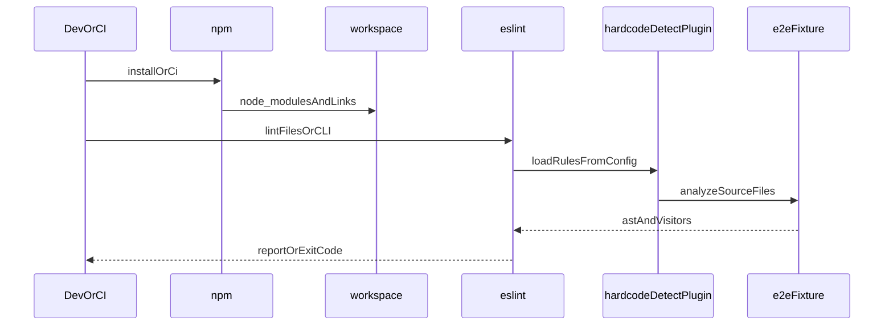
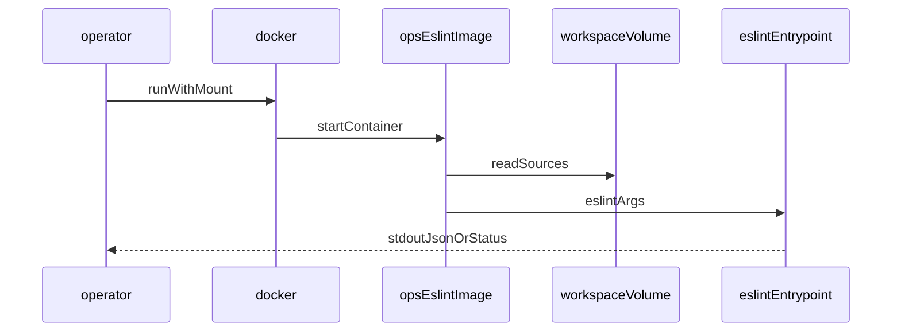
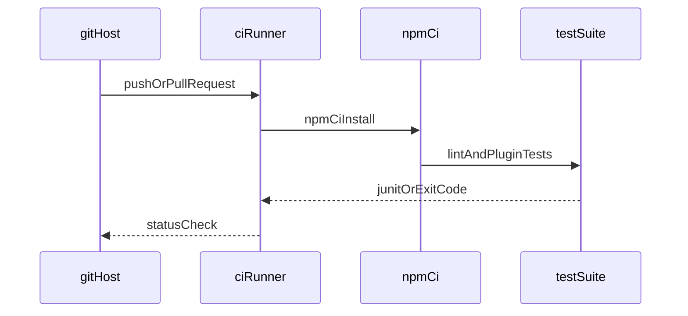
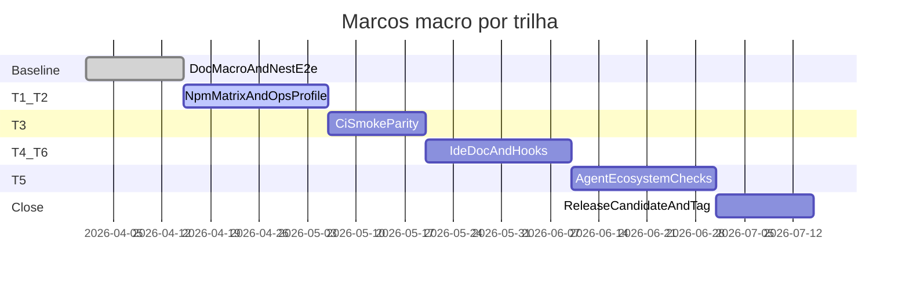
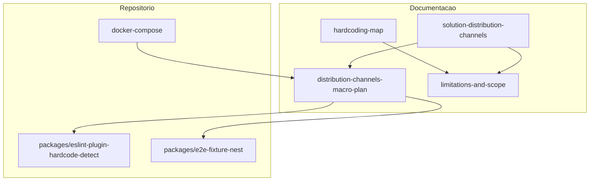

# Plano macro: canais de distribuição, e2e e marcos

Este documento é o **roadmap macro** para validar e operacionalizar a solução descrita em [`solution-distribution-channels.md`](solution-distribution-channels.md), com **trilhas de teste** (agrupamento DRY de canais com a mesma superfície mecânica), proposta de massas `packages/e2e-fixture-*`, perfis Docker Compose futuros, diagramas (sequência, Gantt), ciclo de vida por trilha e organização de **PRs/milestones** no GitHub. Não substitui o contrato das regras em [`specs/plugin-contract.md`](../specs/plugin-contract.md) nem a taxonomia em [`hardcoding-map.md`](hardcoding-map.md).

**Fontes técnicas:** decisões sobre ESLint, npm, Cursor e MCP devem alinhar-se a [`reference/Clippings/`](../reference/Clippings/) (índice em [`reference/Clippings/README.md`](../reference/Clippings/README.md)) e [`specs/agent-reference-clippings.md`](../specs/agent-reference-clippings.md). Versionamento Git: [`versioning-for-agents.md`](versioning-for-agents.md), [`specs/agent-git-workflow.md`](../specs/agent-git-workflow.md).

## Princípios

1. **Contrato antes do código** — comportamento público em [`specs/plugin-contract.md`](../specs/plugin-contract.md); visão macro em [`specs/vision-hardcode-plugin.md`](../specs/vision-hardcode-plugin.md).
2. **`reference/`** — somente leitura para o pacote publicável; não importar Clippings em `packages/`.
3. **Massas e2e** — workspaces auxiliares `packages/e2e-fixture-*` (não publicáveis como o plugin), espelhando o papel de [`specs/e2e-fixture-nest.md`](../specs/e2e-fixture-nest.md).
4. **Trilhas** — vários **canais** da tabela mestre mapeiam para uma **trilha** quando a automação testável é a mesma (ex.: npm projeto e workspaces → mesma trilha T1 com matriz documentada).

## Trilhas de validação

| Trilha | Âmbito | Foco da validação |
|--------|--------|-------------------|
| **T1** | Consumidor Node/npm | Dependência no manifesto, flat config, `eslint` / API ESLint, monorepo opcional, `npx` / `npm exec`, registry (público ou privado), `bin` global se existir. |
| **T2** | Container / OCI | Imagem [`.docker/Dockerfile`](../.docker/Dockerfile), Compose, paridade com [`specs/agent-docker-compose.md`](../specs/agent-docker-compose.md) e [`ops-eslint`](../.github/actions/ops-eslint/). |
| **T3** | CI/CD | Workflow que instala dependências e executa lint/teste de fumaça reprodutível (ex.: GitHub Actions em [`.github/workflows/`](../.github/workflows/)). |
| **T4** | IDE / LSP | Extensão ESLint + `eslint.config`; validação mista (documentada + script opcional). |
| **T5** | Ecossistema agente | Cursor (rules, skills, hooks, CLI, marketplace), Copilot (`.github/agents/`, instructions), MCP — **indireto** (presença, smoke, política; não substituem o pacote npm). |
| **T6** | Git hooks | Husky/Lefthook ou hooks nativos acionando `eslint`; política local e reprodutibilidade limitada em CI. |

## Rastreabilidade: canal → trilha → massa → Compose / automação → estado

Cada linha corresponde à tabela mestre em [`solution-distribution-channels.md`](solution-distribution-channels.md).

| Canal | Trilha | Massa / projeto de teste (proposto ou existente) | Compose / automação | Estado |
|-------|--------|---------------------------------------------------|----------------------|--------|
| npm (projeto) | T1 | `e2e-fixture-nest` + futuro `e2e-fixture-consumer-minimal` | Perfil `e2e` existente; futuro `e2e-npm-matrix` | Parcial (Nest em uso) |
| npm workspaces / monorepo | T1 | Mesmo que T1 (cwd em pacote filho) | `docker compose --profile e2e` | Parcial |
| npm global + `bin` | T1 | Smoke documentado ou script em `packages/eslint-plugin-hardcode-detect/e2e/` | CI ou job manual | Planejado |
| `npm exec` / `npx` | T1 | Job que roda `npx eslint` ou `npm exec` com pacote linkado | Workflow dedicado ou step em CI | Planejado |
| Registries privados / `publishConfig` | T1 | Matriz `.npmrc` de exemplo **sem segredos**; teste em registry simulado ou stub | Opcional perfil `e2e-registry` | Planejado |
| Docker / OCI | T2 | Imagem `malnati-ops-eslint` + volume do repo | Novo perfil `e2e-ops` (planejado) | Parcial (imagem + action existentes) |
| CI/CD | T3 | Repositório consumidor mínimo ou reuse do monorepo | [`ci.yml`](../.github/workflows/) + paridade `prod` Compose | Parcial |
| Git hooks | T6 | Fixture com script `prepare` / doc de Husky | Não típico em Docker; validação local/CI opcional | Planejado |
| Cursor: regras e skills | T5 | Verificação de árvore `.cursor/` + lint de docs | N/A ou job `verify-agent-files` | Planejado |
| Cursor: hooks | T5 | Presença `hooks.json` + teste de schema se existir | N/A | Planejado |
| Cursor: Marketplace Plugin | T5 | Documentação + checklist release marketplace | Fora do npm do plugin | Planejado |
| Cursor CLI / headless | T5 | Script que invoca CLI se disponível no runner | CI condicional | Planejado |
| MCP | T5 | Smoke “servidor stub” ou documentação de integração | N/A | Planejado |
| GitHub Copilot agents/instructions | T5 | `.github/agents/`, `.github/instructions/` | Workflow de verificação de ficheiros | Parcial |
| Editores com ESLint / LSP | T4 | Mesma massa T1; guia de `settings.json` / workspace | Documentação + teste opcional | Planejado |

## Diagramas de sequência

### T1 — Consumidor npm (motor ESLint + plugin)

### T2 — Container ops-eslint (lint sobre volume)

### T3 — CI (pipeline)

## Timeline: Gantt (ilustrativo)

Datas de exemplo para alinhar marcos e PRs (ajustar a calendário real do projeto).

## Proposta de workspaces e perfis Docker

| Trilha | Workspace auxiliar sugerido | Notas |
|--------|----------------------------|--------|
| T1 | `packages/e2e-fixture-nest` (existente); `packages/e2e-fixture-consumer-minimal` (futuro) | Consumidor mínimo reduz tempo de CI para matrizes npm. |
| T2 | Reuso do monorepo montado em volume | Perfil proposto **`e2e-ops`**: `docker compose --profile e2e-ops run --rm e2e-ops` executando ESLint via imagem ops-eslint (alteração futura a [`docker-compose.yml`](../docker-compose.yml) e a [`specs/agent-docker-compose.md`](../specs/agent-docker-compose.md)). |
| T3 | N/A (usa raiz do repo ou subdir fixture) | Paridade: [`docker-compose.yml`](../docker-compose.yml) perfil `prod` ≈ pipeline CI. |
| T4 | Documentação em `docs/` + opcional fixture T1 | Sem serviço HTTP obrigatório no Compose (ver spec Docker). |
| T5 | Verificação por ficheiros sob `.cursor/`, `.github/agents/` | Sem novo pacote obrigatório. |
| T6 | `packages/e2e-fixture-git-hooks-sample` (futuro) | Cuidado com hooks que alterem git em CI. |

Perfis **atuais** na raiz: `dev`, `e2e`, `prod` ([`specs/agent-docker-compose.md`](../specs/agent-docker-compose.md)). Novos perfis exigem atualização do spec e de [`docs/repository-tree.md`](repository-tree.md).

## Ciclo de vida por trilha

Para cada entrega de trilha (ou sub-marco), repetir o ciclo abaixo e arquivar evidências no PR.

| Fase | Atividades |
|------|------------|
| Desenvolvimento | Spec ou contrato atualizado se comportamento mudar; código ou fixture no caminho `packages/` correto. |
| Testes | `npm test` no pacote do plugin; jobs CI adicionais quando existirem. |
| Análise de resultados | Comparar saída ESLint esperada (contagens, regras); falhas categorizadas (config vs regra vs infra). |
| Logs e artefatos | Guardar saída JSON ou texto em anexos de CI; não commitar segredos. |
| Documentação | Atualizar [`docs/repository-tree.md`](repository-tree.md), specs e2e e este plano quando o estado mudar. |
| Correções | Commits focados; Conventional Commits. |
| Deploy | `npm publish` do pacote publicável quando o marco incluir release; imagem ops-eslint / tags conforme pipeline; canais indiretos (marketplace Cursor) como checklists separados. |
| Validação pós-deploy | Smoke em consumidor limpo; tag Git e notas de release. |

## Plano no GitHub: milestones e PRs

| Marco | Conteúdo típico do PR | Milestone sugerido |
|-------|------------------------|-------------------|
| M0 | Baseline: documentação macro + e2e Nest existente | `macro-baseline` |
| M1 | T1/T2: matriz npm ampliada; rascunho perfil `e2e-ops` ou script ops-eslint | `channel-t1-t2` |
| M2 | T3: job CI explícito para fumaça reprodutível | `channel-t3-ci` |
| M3 | T4/T6: guias IDE; fixture ou doc hooks | `channel-t4-t6` |
| M4 | T5: verificações `.cursor/` e `.github/agents/` | `channel-t5-agents` |
| M5 | Release: versão semver do plugin, tag, notas | `release-candidate` |

**Práticas:** uma **pull request** por marco (ou por trilha quando o escopo for grande); **labels** `area/channel-Tn`; **Conventional Commits**; push na branch atual conforme [`versioning-for-agents.md`](versioning-for-agents.md).

## Visão geral (diagrama)

## Variante: um workspace e2e por linha da tabela

Duplicar pacotes `e2e-fixture-*` para cada linha da tabela mestre **aumenta** custo de manutenção e pode violar DRY quando o runner é idêntico. Esta variante só deve ser adotada por **decisão explícita** de produto (ex.: SLAs distintos por canal corporativo).

## Versão do documento

- **1.0.0** — Plano macro inicial: trilhas T1–T6, rastreabilidade de canais, sequência, Gantt ilustrativo, ciclo de vida, Compose, milestones GitHub.
