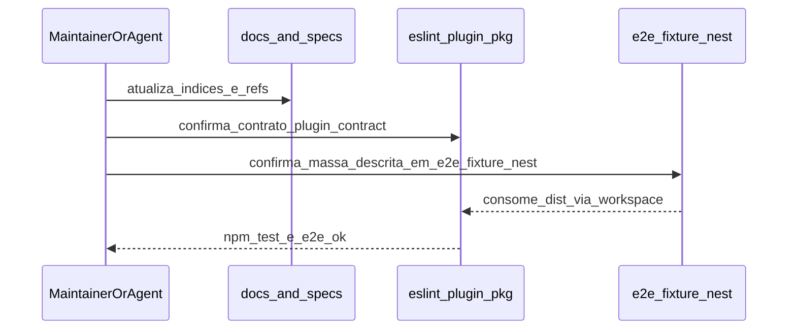
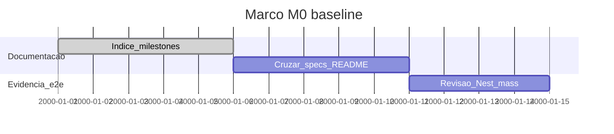

# Marco M0: baseline (`macro-baseline`)

Plano detalhado alinhado a [`../distribution-channels-macro-plan.md`](../distribution-channels-macro-plan.md) e [`../solution-distribution-channels.md`](../solution-distribution-channels.md). A M0 **prepara** a cadeia T1→T6: contrato, documentação macro e massa e2e mínima existente, sem exigir ainda matriz npm completa nem perfis Compose novos.

**Milestone GitHub sugerido:** `macro-baseline`  
**Labels:** `area/channel-T1` (preparação), `type/docs`

---

## 1. Objetivo e escopo (trilhas e canais)

- **Foco:** alinhar documentação, grafo do repositório e evidência de que o consumidor e2e Nest + pacote do plugin são o **alicerce** para T1.
- **Trilhas:** pré-T1 (nenhuma trilha Tn encerrada aqui como “canal distribuído” completo).
- **Canais (tabela mestre):** leitura transversal; estado “Parcial” para npm/Docker/CI conforme [`../distribution-channels-macro-plan.md`](../distribution-channels-macro-plan.md).

---

## 2. Dependências e handoff (cadeia T1→T6)

| | Conteúdo |
|---|-----------|
| **Entrada (consome)** | Estado atual do repositório (`packages/eslint-plugin-hardcode-detect`, `packages/e2e-fixture-nest`), specs e `docs/`. |
| **Saída (entrega)** | Baseline documental e referências estáveis para **T1**: prova de que `npm test` + e2e Nest estão descritos e rastreáveis; macro-plan e canais atualizados com índice dos planos por marco. |
| **Risco se handoff falhar** | T1 não tem “linha de base” clara (versão do plugin, comando de teste, fixture), aumentando retrabalho nas trilhas seguintes. |

---

## 3. Diagrama de sequência (Mermaid)

Baseline documental e massa e2e (encadeamento para T1).

---

## 4. Ordem, dependências e durações

| Ordem | Subtarefa | Duração estimada | Depende de | “Pronto para PR” quando |
|-------|-----------|------------------|------------|-------------------------|
| 1 | Índice `docs/distribution-milestones/` + links no macro-plan | 5d | — | README + macro-plan atualizados |
| 2 | Revisão cruzada `plugin-contract` vs README do plugin | 5d | 1 | Sem divergências óbvias listadas ou issues abertas |
| 3 | Confirmar massa Nest + e2e `nest-workspace.e2e.mjs` documentados | 4d | 2 | Referências em specs e docs coerentes |

**Duração total do marco (sequencial):** 14d.

---

## 5. Composição temporal (durações)

Eixo **`2000-01-01` = T0 fictício** (Mermaid); **só as durações são normativas.**

---

## 6. Matriz e2e × Docker Compose

| Massa / projeto | Trilha | Perfil Compose | Serviços / volumes | Comando ou job CI |
|-----------------|--------|----------------|--------------------|-------------------|
| `packages/e2e-fixture-nest` | pré-T1 | `e2e` | Serviço `e2e`: montagem `.:/workspace`, `npm ci` + `npm test -w eslint-plugin-hardcode-detect` | `docker compose --profile e2e run --rm e2e` |
| Monorepo raiz | pré-T1 | `prod` | Serviço `prod`: paridade “lint + test” local | `docker compose --profile prod run --rm prod` |
| *Futuro* `e2e-fixture-consumer-minimal` | T1 (M1) | *planejado* `e2e-npm-matrix` | A definir no M1 | Job futuro em `.github/workflows/` |

---

## 7. Camada A — Tarefas e orçamento de tokens (pré-execução de agentes)

| ID | Tarefa | Inputs | Outputs | Teto (tokens) estimado | Critério de conclusão |
|----|--------|--------|---------|------------------------|----------------------|
| A1 | Criar/atualizar índice `distribution-milestones/README.md` | macro-plan | README com links M0–M5 | 12 000 | Índice navegável |
| A2 | Atualizar `distribution-channels-macro-plan.md` (índice + versão + cadeia T1→T6) | README novo | Macro-plan coerente | 18 000 | Secção índice e bump de versão doc |
| A3 | Atualizar `docs/repository-tree.md` para pasta `distribution-milestones/` | Estrutura nova | Árvore atualizada | 10 000 | Grafo reflete `docs/` |
| A4 | Revisão cruzada `specs/plugin-contract.md` × docs do plugin | Contrato | Lista de gaps ou “OK” | 25 000 | Registo em PR ou doc |

---

## 8. Camada B — Execução de agentes por fase

| Fase | O que executar (agente) | Evidência / artefato | Ligação ao handoff |
|------|---------------------------|----------------------|--------------------|
| Desenvolvimento | Edits em `docs/`, opcionalmente `docs/README.md` | Ficheiros Markdown | Prepara entrada de T1 |
| Testes | `npm test -w eslint-plugin-hardcode-detect` (validação de não regressão) | Exit 0 | Baseline técnica intacta |
| Análise de resultados | Comparar saída com esperado | Notas no PR | Confirma baseline |
| Logs e documentos | Atualizar índices e versões de documento | Commits docs | Rastreabilidade |
| Correções | Commits focados | Histórico git | Linearidade |
| Deploy / releasing | N/A típico na M0 | N/A | — |
| Validações | Revisão humana dos links relativos | Checklist | Done M0 |
| Distribuições | N/A (sem publish) | N/A | — |

---

## 9. Plano GitHub (PR, branch, semver)

- **PR sugerida:** `docs(channel): milestone M0 — distribution milestones baseline`
- **Branch:** `milestone/m0-baseline`
- **Semver:** sem bump do pacote publicável salvo correção contratual simultânea.
- **Referências:** [`../versioning-for-agents.md`](../versioning-for-agents.md), [`../../specs/agent-git-workflow.md`](../../specs/agent-git-workflow.md).

---

## 10. Riscos e critérios de “done”

- **Riscos:** links quebrados entre docs; esquecimento de atualizar `repository-tree.md`.
- **Done:** índice em `docs/distribution-milestones/README.md`; `distribution-channels-macro-plan.md` com remissão aos planos M0–M5 e nota sobre cadeia T1→T6; `docs/repository-tree.md` atualizado; testes do plugin passam.
