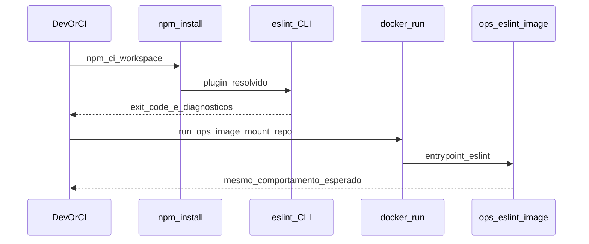
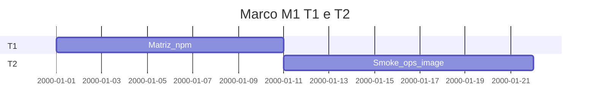

# Marco M1: T1 + T2 (`channel-t1-t2`)

Plano para validar **consumidor npm (T1)** e **container/OCI (T2)** com handoff: **T2 consome o pacote e a flat config já provados em T1** (mesmo commit/versão, nova superfície Docker).

**Milestone GitHub sugerido:** `channel-t1-t2`  
**Labels:** `area/channel-T1`, `area/channel-T2`, `type/ci` ou `type/build` se tocar imagem/Compose.

---

## 1. Objetivo e escopo (trilhas e canais)

- **T1:** matriz npm (`npm ci`, workspaces, `npx`/`npm exec` onde aplicável), API ESLint e e2e em massa consumidora; evidências em CI ou scripts documentados.
- **T2:** imagem [`../../.docker/Dockerfile`](../../.docker/Dockerfile), Compose, paridade com [`../../specs/agent-docker-compose.md`](../../specs/agent-docker-compose.md) e [`../../.github/actions/ops-eslint/`](../../.github/actions/ops-eslint/).
- **Canais:** linhas “npm (projeto)”, workspaces, Docker/OCI na tabela mestre de [`../solution-distribution-channels.md`](../solution-distribution-channels.md).

---

## 2. Dependências e handoff (cadeia T1→T6)

| | Conteúdo |
|---|-----------|
| **Entrada (consome)** | **M0:** baseline doc + e2e Nest + plugin instalável. |
| **Saída (entrega)** | **Para T3:** mesma versão do plugin e comandos de lint **reprodutíveis**, mais evidência de execução em **imagem** (tag/digest ou action) quando T2 for exercitada. |
| **Risco se handoff falhar** | CI ou Docker não repetem o mesmo conjunto de regras/config que o consumidor npm; paridade T1/T2 quebrada. |

---

## 3. Diagrama de sequência (Mermaid)

Handoff T1 → T2 (mesmo pacote, nova superfície).

---

## 4. Ordem, dependências e durações

| Ordem | Subtarefa | Duração estimada | Depende de | “Pronto para PR” quando |
|-------|-----------|------------------|------------|-------------------------|
| 1 | Matriz T1 documentada + jobs/scripts | 10d | M0 | Matriz ou backlog explícito com critérios |
| 2 | Smoke ops-eslint / Dockerfile | 11d | 1 | Comando reprodutível documentado |
| 3 | Rascunho perfil `e2e-ops` (se aplicável) | *incl. em 1–2 / opcional* | 2 | Issue ou secção no spec Docker com próximos passos |

**Duração total do marco (T1 → T2 em sequência):** 21d (10d + 11d).

---

## 5. Composição temporal (durações)

Eixo **`2000-01-01` = T0 fictício** (Mermaid); **só as durações são normativas.**

---

## 6. Matriz e2e × Docker Compose

| Massa / projeto | Trilha | Perfil Compose | Serviços / volumes | Comando ou job CI |
|-----------------|--------|----------------|--------------------|-------------------|
| `packages/e2e-fixture-nest` | T1 | `e2e` | `e2e`: `.:/workspace` | `docker compose --profile e2e run --rm e2e` |
| Monorepo (lint parity) | T1/T3 | `prod` | `prod`: `npm ci` + lint + test | `docker compose --profile prod run --rm prod` |
| Volume + imagem ops-eslint | T2 | *planejado* `e2e-ops` | Montagem repo → ESLint na imagem [`../../.docker/Dockerfile`](../../.docker/Dockerfile) | `docker compose --profile e2e-ops run --rm e2e-ops` (quando existir) |
| Action CI | T2 | N/A | Composite [`ops-eslint`](../../.github/actions/ops-eslint/) | Pendente no repo: [`ci.yml`](../../.github/workflows/ci.yml) ainda não invoca `ops-eslint`; smoke documentado em [`specs/agent-docker-compose.md`](../../specs/agent-docker-compose.md) e [`README.md`](../../README.md); T3 em [`m2-channel-t3-ci.md`](m2-channel-t3-ci.md). |

---

## 7. Camada A — Tarefas e orçamento de tokens (pré-execução de agentes)

Índice dos ficheiros por tarefa: [`tasks/m1-channel-t1-t2/README.md`](tasks/m1-channel-t1-t2/README.md).

| ID | Tarefa | Inputs | Outputs | Teto (tokens) estimado | Critério de conclusão | Ficheiro de tarefa |
|----|--------|--------|---------|------------------------|----------------------|-------------------|
| A1 | Definir matriz npm (workspaces, npx) | Handoff M0 | Tabela em doc ou spec | 20 000 | Critérios de sucesso por linha | [`tasks/m1-channel-t1-t2/A1-npm-matrix-t1.md`](tasks/m1-channel-t1-t2/A1-npm-matrix-t1.md) |
| A2 | Plano smoke imagem ops-eslint | Dockerfile, action | Script ou doc | 22 000 | Comando único reprodutível | [`tasks/m1-channel-t1-t2/A2-smoke-ops-eslint-image.md`](tasks/m1-channel-t1-t2/A2-smoke-ops-eslint-image.md) |
| A3 | Alinhar `agent-docker-compose` se novo perfil | compose atual | PR de spec | 25 000 | Spec e árvore coerentes | [`tasks/m1-channel-t1-t2/A3-docker-compose-e2e-ops-draft.md`](tasks/m1-channel-t1-t2/A3-docker-compose-e2e-ops-draft.md) |

---

## 8. Camada B — Execução de agentes por fase

| Fase | O que executar | Evidência | Handoff |
|------|----------------|-----------|---------|
| Desenvolvimento | Scripts e2e, workflow, compose | PR | Artefato T1/T2 |
| Testes | `npm test`, e2e, job CI | Logs CI | Valida paridade |
| Análise de resultados | Diff config vs infra | Notas | Evita regressão T1 |
| Logs e documentos | Atualizar macro-plan, specs | Commits | |
| Correções | Commits focados | | |
| Deploy / releasing | Opcional: tag imagem | Registo | Entrada T3 |
| Validações | Smoke manual Docker | Captura saída | |
| Distribuições | npm pré-release se política exigir | Versão | |

---

## 9. Plano GitHub (PR, branch, semver)

- **PR:** `feat(channel): milestone M1 — npm matrix and container parity` (ajustar tipo ao diff real).
- **Branch:** `milestone/m1-channel-t1-t2`
- **Semver:** possível **minor/patch** do plugin se regras ou empacotamento mudarem; imagem com nova tag se rebuild.

---

## 10. Riscos e critérios de “done”

- **Riscos:** drift entre `e2e` local e imagem ops-eslint; tempo de CI na matriz npm.
- **Done:** T1 com evidência reprodutível; T2 com caminho documentado (imagem + volume ou action) alinhado ao mesmo commit do plugin usado em T1.
