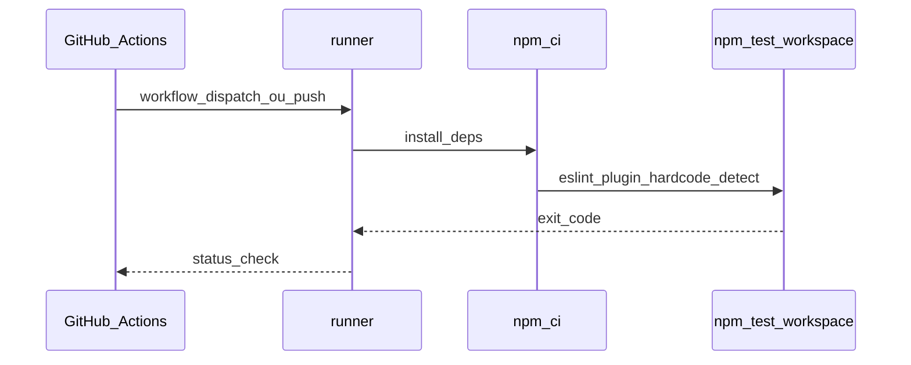
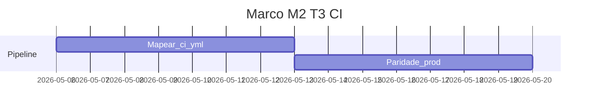

# Marco M2: T3 — CI/CD (`channel-t3-ci`)

Plano para **pipeline reprodutível (T3)** que consome o handoff de **T2**: mesma instalação e comando de lint/teste que em container/local, refletido em [`.github/workflows/`](../../.github/workflows/) e, quando aplicável, paridade com perfil `prod` do [`../../docker-compose.yml`](../../docker-compose.yml).

**Milestone GitHub sugerido:** `channel-t3-ci`  
**Labels:** `area/channel-T3`, `type/ci`

---

## 1. Objetivo e escopo (trilhas e canais)

- **T3:** fumaça reprodutível em runner (instalação + `npm test` / lint); artefatos de falha legíveis.
- **Canais:** “CI/CD” na tabela mestre; alinhamento com “paridade prod Compose ≈ pipeline” do macro-plan.

---

## 2. Dependências e handoff (cadeia T1→T6)

| | Conteúdo |
|---|-----------|
| **Entrada (consome)** | **T2:** imagem/volume ou action validada; **T1:** pacote + config provados no monorepo. |
| **Saída (entrega)** | **Para T4:** regras e config **já comprovadas em CI** para documentar consumo IDE/LSP sem ambiguidade. |
| **Risco se handoff falhar** | IDE ou docs referem comandos que o CI não executa; divergência “passa local / falha CI”. |

---

## 3. Diagrama de sequência (Mermaid)

---

## 4. Timelining

| Ordem | Subtarefa | Depende de | “Pronto para PR” quando |
|-------|-----------|------------|-------------------------|
| 1 | Mapear jobs atuais `ci.yml` | M1 | Matriz de passos vs Compose `prod` |
| 2 | Definir critério de paridade prod ↔ CI | 1 | Tabela comparativa no doc ou spec |
| 3 | Anexos de log / artefatos (política) | 2 | Secção “Logs” no plano ou CONTRIBUTING |

---

## 5. Gantt (janela do marco)

---

## 6. Matriz e2e × Docker Compose

| Massa / projeto | Trilha | Perfil Compose | Serviços / volumes | Comando ou job CI |
|-----------------|--------|----------------|--------------------|-------------------|
| Raiz monorepo | T3 | `prod` | `prod`: `npm ci`, `npm run lint`, `npm test -w eslint-plugin-hardcode-detect` | Espelhar em `ci.yml` |
| Plugin + fixtures | T3 | `e2e` | `e2e`: teste workspace | Opcional job paralelo ou mesma sequência |

---

## 7. Camada A — Tarefas e orçamento de tokens (pré-execução de agentes)

| ID | Tarefa | Inputs | Outputs | Teto (tokens) estimado | Critério de conclusão |
|----|--------|--------|---------|------------------------|----------------------|
| A1 | Auditar `ci.yml` vs `prod` | docker-compose, workflow | Tabela paridade | 18 000 | Gaps listados |
| A2 | Definir política de artefatos CI | AGENTS / specs | Secção em doc | 12 000 | O que anexar em falha |
| A3 | Atualizar CONTRIBUTING se fluxo mudar | A1 | PR | 15 000 | Contribuidores informados |

---

## 8. Camada B — Execução de agentes por fase

| Fase | O que executar | Evidência | Handoff |
|------|----------------|-----------|---------|
| Desenvolvimento | Edits em `.github/workflows/`, docs | PR | Pipeline T3 |
| Testes | CI verde em branch | Checks | |
| Análise de resultados | Falhas categorizadas | Issue/comment | |
| Logs e documentos | Atualizar macro-plan / limitations | Commits | |
| Correções | Commits focados | | |
| Deploy / releasing | N/A | | |
| Validações | PR obrigatório com checks | | |
| Distribuições | N/A | | |

---

## 9. Plano GitHub (PR, branch, semver)

- **PR:** `ci(channel): milestone M2 — reproducible smoke parity`
- **Branch:** `milestone/m2-channel-t3-ci`
- **Semver:** geralmente sem bump do plugin; `ci` scope no commit.

---

## 10. Riscos e critérios de “done”

- **Riscos:** secrets em workflow; flakiness de rede no `npm ci`.
- **Done:** job(s) documentados; paridade `prod` vs CI explícita; handoff para T4 claro (“o que o CI garante”).
