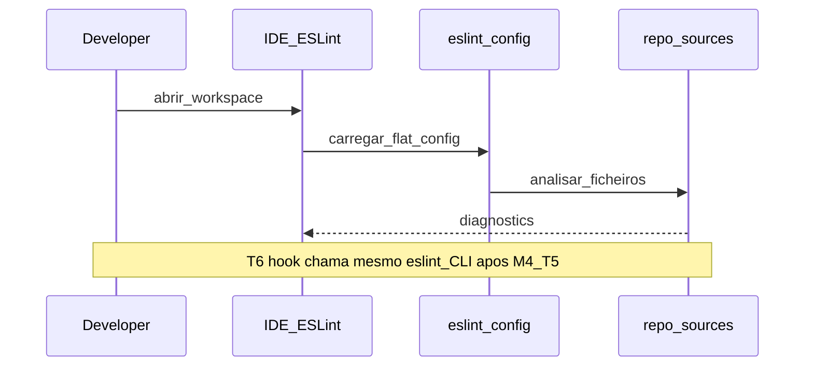
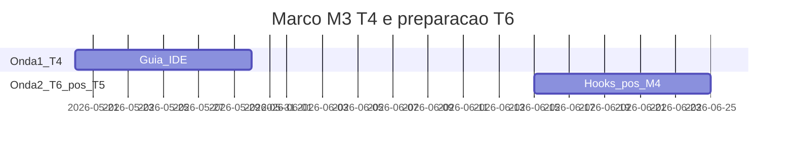

# Marco M3: T4 + T6 (`channel-t4-t6`)

Plano para **IDE/LSP (T4)** e preparação de **Git hooks (T6)**. A **cadeia normativa T1→…→T6** exige **T5 antes de T6**; o macro-plan agrupa T4 e T6 no mesmo milestone **M3**. **Política adotada (Opção A recomendada):** neste marco, entregar **T4 completo**; T6 fica **preparado** (docs, esboço de fixture) até existir handoff de **M4 (T5)** — PRs que **fechem** T6 devem abrir **após** os entregáveis de T5, ou usar **Opção B:** duas ondas no Gantt (T4 primeiro; T6 após merge M4).

**Milestone GitHub sugerido:** `channel-t4-t6`  
**Labels:** `area/channel-T4`, `area/channel-T6`, `type/docs`

---

## 1. Objetivo e escopo (trilhas e canais)

- **T4:** guia reprodutível para extensão ESLint + `eslint.config` (workspace/settings); mesma massa T1 onde aplicável.
- **T6 (escopo fechado pós-T5):** política para Husky/Lefthook/hooks nativos acionando `eslint`; fixture futura `packages/e2e-fixture-git-hooks-sample` (ver macro-plan).
- **Canais:** “Editores com ESLint/LSP” e “Git hooks” na tabela mestre.

---

## 2. Dependências e handoff (cadeia T1→T6)

| | Conteúdo |
|---|-----------|
| **Entrada (consome)** | **T3:** o que o CI garante sobre regras e config. |
| **Saída (entrega)** | **Para T5:** instruções IDE e limites claros; **para T6 final:** somente após **T5** — hooks que chamam o **mesmo** caminho de lint validado (documentado neste marco como alvo). |
| **Risco se handoff falhar** | Hooks ou IDE referem comandos divergentes do CI; agentes (T5) herdam ambiguidade. |

---

## 3. Diagrama de sequência (Mermaid)

Onda T4 (IDE); T6 “forte” após T5 (ver nota).

---

## 4. Timelining

| Onda | Subtarefa | Depende de | “Pronto para PR” quando |
|------|-----------|------------|-------------------------|
| 1 | Guia IDE + settings exemplo | M2 | Doc em `docs/` com paths relativos à raiz |
| 2 | Backlog T6: doc Husky/Lefthook | 1 | Sem declarar T6 “done” sem M4 |
| 3 | Fechar T6 (hooks + fixture) | **M4 (T5)** | Após handoff agente |

---

## 5. Gantt (janela do marco — duas ondas)

*A data `m3b` deve situar-se **após** o marco M4 no calendário real se T6 for “done”.*

---

## 6. Matriz e2e × Docker Compose

| Massa / projeto | Trilha | Perfil Compose | Serviços / volumes | Comando ou job CI |
|-----------------|--------|----------------|--------------------|-------------------|
| Mesma massa T1 / Nest | T4 | *N/A típico* | IDE local | Documentação; sem serviço HTTP obrigatório no Compose |
| Fixture hooks (futura) | T6 | *N/A típico* | Validação local; CI opcional | Job manual ou documentado |

---

## 7. Camada A — Tarefas e orçamento de tokens (pré-execução de agentes)

| ID | Tarefa | Inputs | Outputs | Teto (tokens) estimado | Critério de conclusão |
|----|--------|--------|---------|------------------------|----------------------|
| A1 | Redigir guia IDE | Handoff T3 | `docs/*.md` | 28 000 | Passos reprodutíveis |
| A2 | Esboço política hooks | A1 | Secção ou ADR curto | 20 000 | Riscos CI citados |
| A3 | *Opcional pós-M4* Implementar fixture T6 | M4 | Pacote `e2e-fixture-git-hooks-sample` | 35 000 | README com limites |

---

## 8. Camada B — Execução de agentes por fase

| Fase | O que executar | Evidência | Handoff |
|------|----------------|-----------|---------|
| Desenvolvimento | Docs; opcional fixture após M4 | PR | T4 → T5 |
| Testes | N/A ou manual IDE | Notas | |
| Análise | Revisão de consistência com CI | Checklist | |
| Logs e documentos | Atualizar índices | | |
| Correções | Commits | | |
| Deploy | N/A | | |
| Validações | Leitura humana guia | | |
| Distribuições | N/A | | |

---

## 9. Plano GitHub (PR, branch, semver)

- **PR(s):** pode dividir: `docs(channel): milestone M3 — IDE guide` e depois `feat(channel): git hooks fixture` após M4.
- **Branch:** `milestone/m3-channel-t4-t6`
- **Semver:** docs apenas em T4; fixture pode não publicar pacote novo na raiz sem decisão de workspace.

---

## 10. Riscos e critérios de “done”

- **Riscos:** fechar T6 antes de T5 quebra a cadeia; hooks que alteram git em CI.
- **Done (mínimo M3):** T4 documentado e alinhado ao CI; T6 completo apenas se política Opção A/B cumprida e M4 satisfeito quando aplicável.
