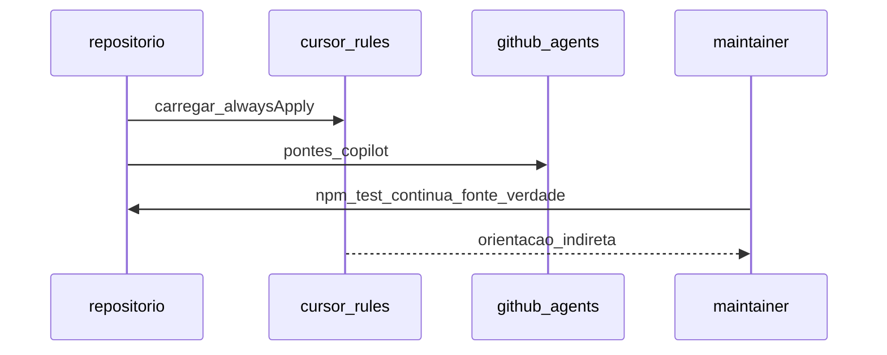
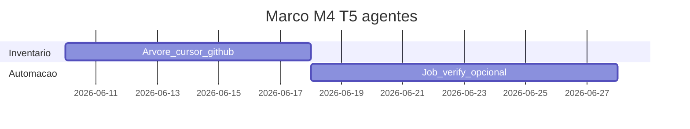

# Marco M4: T5 — ecossistema agente (`channel-t5-agents`)

Plano para **Cursor, Copilot, MCP** (T5): superfícies **indiretas** que **preservam** o fluxo normativo já verificado em T3/T4 — sem substituir o pacote npm. **Entrada:** handoff de **T4** (guia IDE + contrato claro do que o CI executa).

**Milestone GitHub sugerido:** `channel-t5-agents`  
**Labels:** `area/channel-T5`, `type/docs`, `type/ci` se houver job de verificação de ficheiros.

---

## 1. Objetivo e escopo (trilhas e canais)

- Verificação de árvore [`.cursor/rules/`](../../.cursor/rules/), [`.cursor/skills/`](../../.cursor/skills/), [`.github/agents/`](../../.github/agents/), [`.github/instructions/`](../../.github/instructions/); smoke MCP opcional; política em [`../../specs/agent-tooling-ecosystem-map.md`](../../specs/agent-tooling-ecosystem-map.md).
- **Canais:** linhas Cursor/Copilot/MCP na tabela mestre.

---

## 2. Dependências e handoff (cadeia T1→T6)

| | Conteúdo |
|---|-----------|
| **Entrada (consome)** | **T4:** guia IDE e mesmas regras; **T3:** expectativa de CI. |
| **Saída (entrega)** | **Para T6:** política de agente alinhada ao lint **real** do repo (comandos e paths normativos em `AGENTS.md` / specs). |
| **Risco se handoff falhar** | Hooks (T6) ou humanos seguem instruções de agente desalinhadas do `npm test` / CI. |

---

## 3. Diagrama de sequência (Mermaid)

---

## 4. Timelining

| Ordem | Subtarefa | Depende de | “Pronto para PR” quando |
|-------|-----------|------------|-------------------------|
| 1 | Inventário `.cursor/` e `.github/agents/` | M3 | Lista + gaps |
| 2 | Job opcional `verify-agent-files` | 1 | Workflow ou issue |
| 3 | Cruzamento com `agent-tooling-ecosystem-map` | 2 | Tabela remissões |

---

## 5. Gantt (janela do marco)

---

## 6. Matriz e2e × Docker Compose

| Massa / projeto | Trilha | Perfil Compose | Comando ou job CI |
|-----------------|--------|----------------|-------------------|
| N/A (ficheiros normativos) | T5 | N/A | Workflow que valida presença/schema opcional |
| Monorepo | T5 | `e2e` / `prod` | Garantir que agentes não quebram testes existentes |

---

## 7. Camada A — Tarefas e orçamento de tokens (pré-execução de agentes)

| ID | Tarefa | Teto (tokens) estimado | Critério de conclusão |
|----|--------|------------------------|----------------------|
| A1 | Inventário + checklist | 22 000 | Tabela de ficheiros |
| A2 | Propor job verify | 25 000 | YAML ou backlog |
| A3 | Atualizar docs limites MCP | 18 000 | Link Clippings se necessário |

---

## 8. Camada B — Execução de agentes por fase

| Fase | O que executar | Evidência | Handoff |
|------|----------------|-----------|---------|
| Desenvolvimento | Edits `.cursor/`, `.github/`, docs | PR | Política T5 |
| Testes | `npm test` obrigatório | Verde | Não regredir T3 |
| Análise | Diffs grandes em rules | Revisão | |
| Logs e documentos | Atualizar macro-plan | | |
| Correções | Commits | | |
| Deploy | N/A | | |
| Validações | Checklist Copilot/Cursor | | |
| Distribuições | Marketplace Cursor = checklist separado | Doc | Fora npm plugin |

---

## 9. Plano GitHub (PR, branch, semver)

- **PR:** `docs(channel): milestone M4 — agent ecosystem checks`
- **Branch:** `milestone/m4-channel-t5-agents`
- **Semver:** sem bump salvo mudança de empacotamento.

---

## 10. Riscos e critérios de “done”

- **Riscos:** duplicação normativa vs `AGENTS.md`; drift de globs em `instructions`.
- **Done:** inventário atualizado; testes passam; handoff explícito para **fecho T6** em M3/M5 conforme política de ondas.
