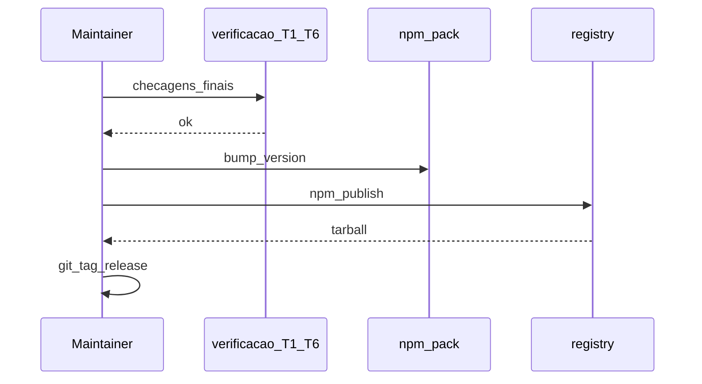
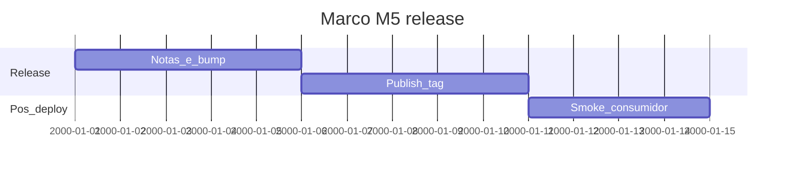

# Marco M5: release (`release-candidate`)

Plano para **congelar versão semver**, **tag Git**, **notas de release** e **validação pós-deploy** da **cadeia completa T1→T6**. Inclui **aceite final de T6** se ainda estiver em aberto após M4 (hooks alinhados ao lint validado).

**Milestone GitHub sugerido:** `release-candidate`  
**Labels:** `area/channel-T1` … `area/channel-T6` (release transversal), `type/chore` ou release tooling.

---

## 1. Objetivo e escopo (trilhas e canais)

- Bump em [`../../packages/eslint-plugin-hardcode-detect/package.json`](../../packages/eslint-plugin-hardcode-detect/package.json), changelog ou notas; tag; smoke em consumidor limpo opcional.
- **Distribuições:** npm; imagem ops-eslint se política de tag; canais indiretos (marketplace) como checklist **fora** do tarball principal.

---

## 2. Dependências e handoff (cadeia T1→T6)

| | Conteúdo |
|---|-----------|
| **Entrada (consome)** | **T1–T6:** artefatos e documentação dos marcos anteriores; **M4** concluído para política de agente; **T6** fechado conforme política M3/M4. |
| **Saída (entrega)** | Versão publicada ou tag RC; evidências de smoke; documentação de suporte. |
| **Risco se handoff falhar** | Tag sem testes verdes; consumidores quebrados; docs desatualizados. |

---

## 3. Diagrama de sequência (Mermaid)

---

## 4. Ordem, dependências e durações

| Ordem | Subtarefa | Duração estimada | Depende de | “Pronto para PR” quando |
|-------|-----------|------------------|------------|-------------------------|
| 1 | Congelar escopo release | 5d | M4 + T6 | Lista de PRs merged |
| 2 | Changelog / notas | 5d | 1 | Texto revisado |
| 3 | Publish + tag | 4d | 2 | Artefato verificável |

**Duração total do marco (sequencial):** 14d.

---

## 5. Composição temporal (durações)

Eixo **`2000-01-01` = T0 fictício** (Mermaid); **só as durações são normativas.**

---

## 6. Matriz e2e × Docker Compose

| Massa / projeto | Trilha | Perfil | Comando ou job |
|-----------------|--------|--------|----------------|
| Consumidor limpo (opcional) | T1 | `e2e` ou host | `npm pack` / install em temp | 
| Paridade local | T3 | `prod` | Última verificação antes de tag |

---

## 7. Camada A — Tarefas e orçamento de tokens (pré-execução de agentes)

Índice dos ficheiros por tarefa: [`tasks/m5-release-candidate/README.md`](tasks/m5-release-candidate/README.md).

| ID | Tarefa | Inputs | Outputs | Teto (tokens) estimado | Critério de conclusão | Ficheiro de tarefa |
|----|--------|--------|---------|------------------------|----------------------|-------------------|
| A1 | Definir semver (major/minor/patch) | `specs/plugin-contract.md`; `docs/versioning-for-agents.md`; `package.json` do plugin; histórico desde último release | Decisão major/minor/patch + justificativa; [`tasks/m5-release-candidate/evidence/M5-semver-decision.md`](tasks/m5-release-candidate/evidence/M5-semver-decision.md) | 15 000 | Justificativa alinhada a contrato e Conventional Commits | [`tasks/m5-release-candidate/A1-definir-semver-major-minor-patch.md`](tasks/m5-release-candidate/A1-definir-semver-major-minor-patch.md) |
| A2 | Rascunho notas release | A1; issues/PRs; CHANGELOG se existir | Texto de release com links; [`tasks/m5-release-candidate/evidence/M5-release-notes-draft.md`](tasks/m5-release-candidate/evidence/M5-release-notes-draft.md) | 20 000 | Links issues/PRs; revisável | [`tasks/m5-release-candidate/A2-rascunho-notas-release.md`](tasks/m5-release-candidate/A2-rascunho-notas-release.md) |
| A3 | Plano smoke pós-publish | A2; matriz §6; `docs/solution-distribution-channels.md` | Passos reprodutíveis; [`tasks/m5-release-candidate/evidence/M5-smoke-post-publish.md`](tasks/m5-release-candidate/evidence/M5-smoke-post-publish.md) | 18 000 | Passos reprodutíveis | [`tasks/m5-release-candidate/A3-plano-smoke-pos-publish.md`](tasks/m5-release-candidate/A3-plano-smoke-pos-publish.md) |

---

## 8. Camada B — Execução de agentes por fase

| Fase | O que executar | Evidência | Handoff |
|------|----------------|-----------|---------|
| Desenvolvimento | Ajustes finais código/docs se necessário | PR | |
| Testes | `npm test` completo; CI verde | Logs | |
| Análise | Comparar com roadmap | | |
| Logs e documentos | CHANGELOG, GitHub Release | | |
| Correções | Hotfix se necessário | | |
| Deploy / releasing | `npm publish`, tag | Artefatos | |
| Validações | Smoke consumidor | Captura | |
| Distribuições | Registries privados / imagem | Checklists | |

---

## 9. Plano GitHub (PR, branch, semver)

- **PR:** `chore(release): milestone M5 — version bump and notes` (ajustar)
- **Branch:** `milestone/m5-release-candidate` ou `release/x.y.z`
- **Semver:** **obrigatório** alinhar tipo de bump ao contrato e breaking changes; seguir Conventional Commits e [`../versioning-for-agents.md`](../versioning-for-agents.md).

---

## 10. Riscos e critérios de “done”

- **Riscos:** secret leak em CI; tag em commit errado.
- **Done:** versão publicada (ou RC documentada); tag; notas; smoke documentado; cadeia T1→T6 referenciada como validada.
