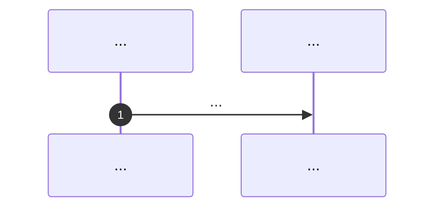
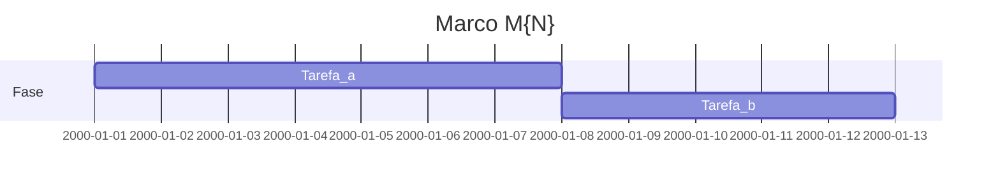

# Marco M{N}: {título}

Plano detalhado alinhado a [`../distribution-channels-macro-plan.md`](../distribution-channels-macro-plan.md), [`../solution-distribution-channels.md`](../solution-distribution-channels.md) e à **cadeia de handoff T1→T6**. Normas: [`../../specs/plugin-contract.md`](../../specs/plugin-contract.md), [`../../specs/e2e-fixture-nest.md`](../../specs/e2e-fixture-nest.md), [`../../specs/agent-docker-compose.md`](../../specs/agent-docker-compose.md), [`../../specs/agent-git-workflow.md`](../../specs/agent-git-workflow.md), [`../../specs/agent-session-workflow.md`](../../specs/agent-session-workflow.md).

**Milestone GitHub sugerido:** `{nome-milestone}`  
**Labels:** `area/channel-T*` (ajustar), `type/docs` ou `type/ci` conforme entrega.

---

## 1. Objetivo e escopo (trilhas e canais)

- Trilhas em foco:
- Linhas relevantes da tabela mestre em `solution-distribution-channels.md`:

---

## 2. Dependências e handoff (cadeia T1→T6)

| | Conteúdo |
|---|-----------|
| **Entrada (consome)** | Artefatos da trilha/marco anterior |
| **Saída (entrega)** | O que fica congelado para a próxima trilha |
| **Risco se handoff falhar** | |

---

## 3. Diagrama de sequência (Mermaid)

---

## 4. Ordem, dependências e durações

| Ordem | Subtarefa | Duração estimada | Depende de | Dono (opcional) | “Pronto para PR” quando |
|-------|-----------|------------------|------------|-----------------|-------------------------|
| 1 | | *ex.: 7d* | | | |

**Duração total do marco (soma sequencial das subtarefas, salvo paralelismo explícito):** *preencher (ex.: 14d).*

---

## 5. Composição temporal (durações)

Diagrama opcional: eixo **`2000-01-01` = T0 fictício** (Mermaid); **só as durações (`Xd`) e dependências `after` são normativas**, não o calendário civil.

---

## 6. Matriz e2e × Docker Compose

| Massa / projeto | Trilha | Perfil Compose | Serviços / volumes | Comando ou job CI |
|-----------------|--------|----------------|--------------------|-------------------|
| | | `dev` / `e2e` / `prod` / *planejado* | Ver [`../../docker-compose.yml`](../../docker-compose.yml) | |

Perfis atuais na raiz: `dev`, `e2e`, `prod`. Perfis planejados no macro-plan (ex.: `e2e-ops`, `e2e-npm-matrix`, `e2e-registry`) exigem alteração futura a `docker-compose.yml` e a `specs/agent-docker-compose.md`.

---

## 7. Camada A — Tarefas e orçamento de tokens (pré-execução de agentes)

*Antes de invocar agentes de IA para cada entrega, preencher. “Teto (tokens)” é estimativa ou limite máximo acordado; ultrapassar exige nova linha ou revisão documentada.*

| ID | Tarefa | Inputs (incl. handoff) | Outputs | Teto (tokens) estimado | Critério de conclusão |
|----|--------|------------------------|---------|-------------------------|----------------------|
| A1 | | | | | |

**Gate:** só avançar para a Camada B com todas as linhas necessárias preenchidas ou marcadas N/A com justificativa.

---

## 8. Camada B — Execução de agentes por fase

| Fase | O que executar (agente) | Evidência / artefato | Ligação ao handoff |
|------|---------------------------|----------------------|--------------------|
| Desenvolvimento | | | |
| Testes | | | |
| Análise de resultados | | | |
| Logs e documentos | | | |
| Correções | | | |
| Deploy / releasing | | | |
| Validações | | | |
| Distribuições | | | |

---

## 9. Plano GitHub (PR, branch, semver)

- **PR principal:** uma PR por marco quando possível; título sugerido: `docs(channel): milestone M{N} — …`
- **Branch sugerida:** `milestone/m{N}-{slug}`
- **Semver / artefatos:** indicar se o marco altera `packages/eslint-plugin-hardcode-detect` (bump), imagem `.docker/Dockerfile`, ou apenas docs/fixtures.
- **Referências:** [`../versioning-for-agents.md`](../versioning-for-agents.md), [`../../specs/agent-git-workflow.md`](../../specs/agent-git-workflow.md).

---

## 10. Riscos e critérios de “done”

- Riscos:
- **Done** do marco quando:
