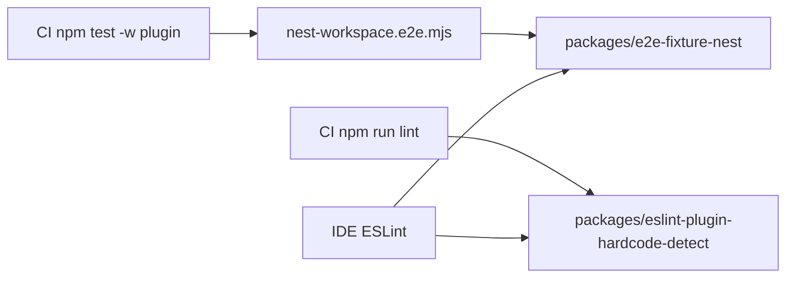

# M3-A1-03: Cross-check massa Nest e consumo do handoff T3

| Campo | Valor |
|-------|--------|
| parent_task | A1 |
| micro_id | M3-A1-03 |
| milestone | M3 |
| depends_on | M3-A1-02 |
| blocks | M3-A2-01 |
| plan_requirements | `m3-sec4-order-1`, `m3-sec6-matrix`, `m3-sec7-A1`, `m3-sec2-handoff` |

## Objetivo

Validar que o guia IDE cobre, onde aplicável, a mesma massa **T1** usada em e2e (ex.: workspace Nest) e que os diagnostics esperados são coerentes com o que **T3** garante (lint/testes no CI).

## Definition of done

- Nota explícita: massa [`packages/e2e-fixture-nest/`](../../../../../packages/e2e-fixture-nest/) e [`specs/e2e-fixture-nest.md`](../../../../../specs/e2e-fixture-nest.md); bullets do handoff M2→T4 reutilizados ou referenciados.

## Paths principais

- [`packages/eslint-plugin-hardcode-detect/e2e/nest-workspace.e2e.mjs`](../../../../../packages/eslint-plugin-hardcode-detect/e2e/nest-workspace.e2e.mjs)
- [`docs/distribution-milestones/tasks/m2-channel-t3-ci/micro/M2-A3-02-handoff-t4-o-que-ci-garante.md`](../../m2-channel-t3-ci/micro/M2-A3-02-handoff-t4-o-que-ci-garante.md)

---

## Cross-check massa Nest × IDE × T3 (entregável)

### Âncoras à massa T1 / e2e

- Workspace auxiliar (massa realista para fumaça e2e): [`packages/e2e-fixture-nest/`](../../../../../packages/e2e-fixture-nest/).
- Norma, layout, contagens canónicas e fluxo de reprodução: [`specs/e2e-fixture-nest.md`](../../../../../specs/e2e-fixture-nest.md).
- Prova automatizada no CI (via `npm test -w eslint-plugin-hardcode-detect`): [`packages/eslint-plugin-hardcode-detect/e2e/nest-workspace.e2e.mjs`](../../../../../packages/eslint-plugin-hardcode-detect/e2e/nest-workspace.e2e.mjs) — `cwd` no fixture, glob `src/fixture-hardcodes/**/*.ts`, regras `hardcode-detect/hello-world` e `hardcode-detect/no-hardcoded-strings`.

### Mesma massa no IDE e no e2e

Com workspace do IDE aberto na **raiz** do monorepo e `eslint.workingDirectories` alinhado ao descrito em [`M3-A1-02-passos-eslint-config-workspace-settings.md`](M3-A1-02-passos-eslint-config-workspace-settings.md) (incluindo `packages/e2e-fixture-nest`), o ESLint no IDE resolve o flat config [`packages/e2e-fixture-nest/eslint.config.mjs`](../../../../../packages/e2e-fixture-nest/eslint.config.mjs) para ficheiros dessa árvore — o mesmo ficheiro de config que o e2e usa com `cwd` no fixture. O plugin é carregado a partir de [`../eslint-plugin-hardcode-detect/dist/index.js`](../../../../../packages/eslint-plugin-hardcode-detect/dist/index.js) relativamente ao fixture; para paridade com o e2e e com o IDE, o artefacto `dist/` tem de existir (`npm run build` no pacote do plugin ou `npm test`, que executa build antes dos e2e — ver [`specs/e2e-fixture-nest.md`](../../../../../specs/e2e-fixture-nest.md)).

### O que o T3 (CI) garante vs. lint

| Camada | O que valida em relação à massa Nest |
|--------|--------------------------------------|
| **`npm run lint`** (raiz → pacote do plugin) | Apenas `eslint .` em [`packages/eslint-plugin-hardcode-detect/`](../../../../../packages/eslint-plugin-hardcode-detect/); **não** percorre `packages/e2e-fixture-nest/`. |
| **`npm test -w eslint-plugin-hardcode-detect`** | Inclui o e2e [`nest-workspace.e2e.mjs`](../../../../../packages/eslint-plugin-hardcode-detect/e2e/nest-workspace.e2e.mjs); fixa contagens estáveis (5 ficheiros; 5 ocorrências `hello-world`; 31 `no-hardcoded-strings`) — tabela em [`specs/e2e-fixture-nest.md`](../../../../../specs/e2e-fixture-nest.md). |
| **IDE** | Para `packages/e2e-fixture-nest/src/fixture-hardcodes/**/*.ts`, os diagnostics devem ser **consistentes** com as mesmas regras e config; se «passa no IDE / falha no CI» ou o contrário, rever `eslint.workingDirectories`, cwd e presença de `dist/` (passos em M3-A1-02). |

### Handoff M2→T4 (T3 → documentação IDE)

- Quadro normativo em [`docs/distribution-milestones/m2-channel-t3-ci.md`](../../../m2-channel-t3-ci.md) §2: entrada T3 consome T2/T1; **saída para T4** — regras e config **já comprovadas em CI** para documentar consumo IDE/LSP sem ambiguidade; risco se falhar: IDE referir comandos que o CI não executa.
- Lista reutilizável do handoff: [`M2-A3-02-handoff-t4-o-que-ci-garante.md`](../../m2-channel-t3-ci/micro/M2-A3-02-handoff-t4-o-que-ci-garante.md).
- Bullets operacionais do pipeline (instalação, `test:docs-m0`, `lint`, testes do workspace do plugin): secção «O que o T3 (CI) já valida (handoff)» em [`M3-A1-02-passos-eslint-config-workspace-settings.md`](M3-A1-02-passos-eslint-config-workspace-settings.md) — evita duplicar parágrafos longos aqui.

### Ligação à matriz M3 (plano do marco)

Alinhado a [`docs/distribution-milestones/m3-channel-t4-t6.md`](../../../m3-channel-t4-t6.md) §6 («Mesma massa T1 / Nest» na trilha T4): validação da massa Nest no marco IDE é por **documentação + IDE local**, sem serviço HTTP obrigatório no Docker Compose; a paridade de regras com o CI continua a depender dos comandos T3 acima.

