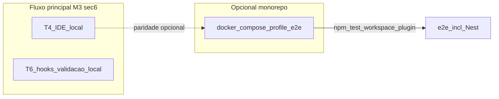

# M3-A3-03: Matriz §6 — e2e × Docker Compose (M3)

| Campo | Valor |
|-------|--------|
| parent_task | A3 |
| micro_id | M3-A3-03 |
| milestone | M3 |
| depends_on | M3-A3-01 |
| blocks | — |
| plan_requirements | `m3-sec6-matrix`, `m3-sec7-A3` |

## Objetivo

Cross-check da tabela **§6** do plano M3 (massa T1/Nest vs fixture hooks futura): confirmar que a documentação e os critérios da fixture não exigem perfil Compose onde o plano diz *N/A típico*.

## Definition of done

- Tabela ou bullets: linha §6 → estado documental → CI opcional/manual conforme plano; coerência com [`docker-compose.yml`](../../../../../docker-compose.yml) apenas onde relevante.

## Paths principais

- [`docs/distribution-milestones/m3-channel-t4-t6.md`](../../../m3-channel-t4-t6.md) §6

---

## Cross-check matriz §6 M3 × documentação × Docker Compose (entregável)

Âncora normativa: tabela **§6** em [`docs/distribution-milestones/m3-channel-t4-t6.md`](../../../m3-channel-t4-t6.md). Objetivo: confirmar que **nenhuma** das linhas que o plano marca com *N/A típico* para perfil Compose passou a exigir Docker/Compose na documentação entregue (T4, fixture T6).

### Tabela linha a linha

| Massa / trilha | O que §6 do plano M3 afirma | Estado na documentação do repositório | Relação com [`docker-compose.yml`](../../../../../docker-compose.yml) | CI (T3 vs opcional/manual §6) |
|----------------|----------------------------|----------------------------------------|--------------------------------------|--------------------------------|
| Mesma massa T1 / Nest — **T4** | *N/A típico* para perfil Compose; IDE local; sem serviço HTTP obrigatório no Compose; documentação. | Cross-check explícito em [`M3-A1-03-cross-check-massa-nest-handoff-t3.md`](M3-A1-03-cross-check-massa-nest-handoff-t3.md) (ligação à matriz §6); massa e reprodução em [`specs/e2e-fixture-nest.md`](../../../../../specs/e2e-fixture-nest.md). | **Não** é requisito do guia IDE: o fluxo T4 é local (VS Code / settings). O Compose entra só como **alternativa** para reproduzir o mesmo `npm test -w eslint-plugin-hardcode-detect` (inclui e2e Nest): perfil **`e2e`**, serviço `e2e` — ver secção *Alternativa via Docker Compose* em [`specs/e2e-fixture-nest.md`](../../../../../specs/e2e-fixture-nest.md) e semântica dos perfis em [`specs/agent-docker-compose.md`](../../../../../specs/agent-docker-compose.md). | O **normativo** para “o que o CI garante” continua a ser T3 ([`M3-A2-02`](M3-A2-02-alinhamento-cli-lint-ci-m2.md)): `npm run test:docs-m0`, `npm run lint`, `npm test -w eslint-plugin-hardcode-detect`. A coluna «Comando ou job CI» da §6 para esta linha é **documentação**, não obrigação de job dedicado a Compose. |
| Fixture hooks (futura) — **T6** | *N/A típico*; validação local; CI **opcional** ou documentado. | Critérios do futuro README em [`M3-A3-01-criterios-readme-fixture-git-hooks.md`](M3-A3-01-criterios-readme-fixture-git-hooks.md): reprodutibilidade **local**; **sem** serviço HTTP obrigatório; **não** exigir Docker nem perfil Compose para o fluxo **mínimo**; CI do README «opcional ou documentado». | Não existe serviço dedicado a hooks; apenas os perfis gerais do monorepo (`dev`, `e2e`, `prod`, `e2e-ops`). Uso de Compose, se houver, seria **opt-in** alinhado ao mesmo princípio «não barreira» da M3-A3-01. | Fecho normativo de T6 continua sujeito ao [gate §10](../../../m3-channel-t4-t6.md#gate-antes-de-merge-t6) (M4); a coluna §6 «Job manual ou documentado» não substitui o pipeline T3 como fonte de verdade. |

### Conclusão do cross-check

- **Coerência *N/A típico*:** a documentação analisada **não** contradiz o plano: T4 e a fixture T6 (critérios) não tratam perfil Compose como pré-requisito do fluxo principal.
- **Coerência com Compose só onde relevante:** quando o contribuidor **opta** por contentor, o perfil `e2e` espelha a sequência de testes do workspace do plugin (incluindo e2e Nest), em linha com [`specs/e2e-fixture-nest.md`](../../../../../specs/e2e-fixture-nest.md); o resto dos perfis descreve o monorepo ([`specs/agent-docker-compose.md`](../../../../../specs/agent-docker-compose.md)), não um serviço específico T4/T6.

### Diagrama (opcional)

*(Seta tracejada: o guia IDE não exige Compose; o mesmo comando de testes pode ser reproduzido no serviço `e2e` se desejado.)*
