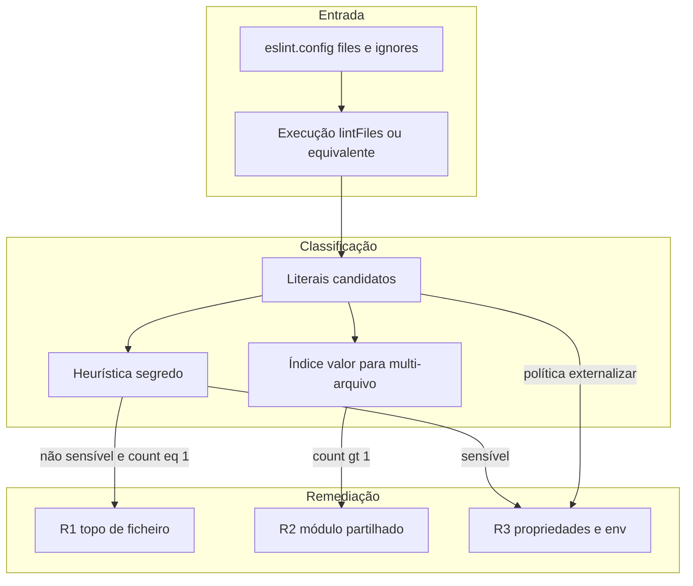
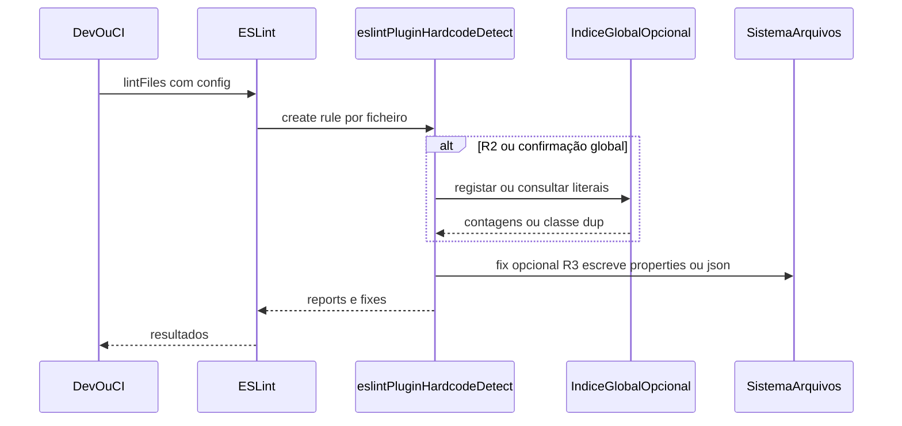
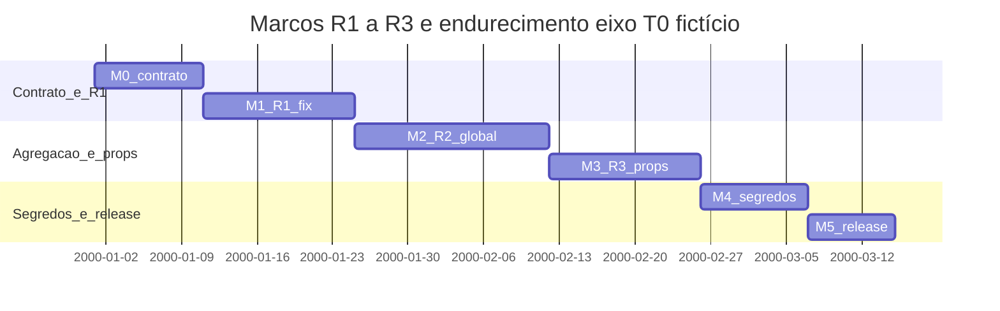

# Plano macro: remediação multi-nível de hardcode

Este documento é o **roadmap macro** para evoluir o plugin **eslint-plugin-hardcode-detect** de **detecção** para **remediação assistida** em três escalas: constantes **por arquivo**, **compartilhadas entre arquivos** e **externalizadas** para arquivos de propriedades (e variáveis de ambiente quando aplicável), com tratamento explícito de **dados sigilosos**, **valores padrão** (`process.env`, `??`, `||`) e **reconfirmação** do índice global em cada execução do motor ESLint sobre o âmbito configurado.

Não substitui o contrato das regras em [`specs/plugin-contract.md`](../specs/plugin-contract.md), a visão em [`specs/vision-hardcode-plugin.md`](../specs/vision-hardcode-plugin.md) nem a taxonomia em [`hardcoding-map.md`](hardcoding-map.md). Complementa o plano de operacionalização por canal em [`distribution-channels-macro-plan.md`](distribution-channels-macro-plan.md): aquele documento cobre **T1–T6** (distribuição e validação); este cobre **R1–R3** (estratégias de correção e auto-fix).

**Tempos de planeamento:** os marcos definem **durações** (`Xd`), **dependências** e **composição** do trabalho — **não** datas de calendário para início ou fim. Diagramas Gantt usam um **eixo fictício T0** só para proporção visual; o que é normativo está nas tabelas e nos números de duração.

**Planos detalhados por marco:** ver [`remediation-milestones/README.md`](remediation-milestones/README.md) (índice M0–M5, `milestone-template.md`, ficheiros `m0-contract-baseline.md` … `m5-remediation-release.md`, tarefas Camada A em `remediation-milestones/tasks/`), por analogia a [`distribution-milestones/README.md`](distribution-milestones/README.md). Este ficheiro permanece o **resumo** do roadmap; em caso de divergência entre planos por marco e implementação pretendida, prevalece o contrato normativo em [`specs/plugin-contract.md`](../specs/plugin-contract.md).

**Fontes técnicas:** decisões sobre API ESLint, `fix`, `suggest`, empacotamento npm e configuração flat devem alinhar-se a [`reference/Clippings/`](../reference/Clippings/) e [`specs/agent-reference-clippings.md`](../specs/agent-reference-clippings.md). Integrações externas (registries, segredos em plataforma) seguem [`specs/agent-integration-testing-policy.md`](../specs/agent-integration-testing-policy.md) — sem mocks de serviços externos no repositório.

## Princípios

1. **Contrato antes do código** — comportamento público em [`specs/plugin-contract.md`](../specs/plugin-contract.md); visão macro em [`specs/vision-hardcode-plugin.md`](../specs/vision-hardcode-plugin.md).
2. **`reference/`** — somente leitura para o pacote publicável; não importar Clippings em `packages/`.
3. **Mapa conceptual** — classificação HC-* e gravidade L1–L4 em [`hardcoding-map.md`](hardcoding-map.md); este plano não duplica a tabela mestra.
4. **Trilhas R1–R3** — remediação por arquivo (R1), por duplicação global no âmbito do lint (R2), por externalização para arquivos de dados e env (R3); podem corresponder a regras distintas ou modos da mesma família, conforme o contrato futuro.
5. **Durações sem datas fixas** — esforço em dias e dependências lógicas; calendário civil fica fora deste documento.
6. **Segredos** — nunca documentar nem fixar valores sensíveis em claro; auto-fix para candidatos a segredo é **restrito** ou **desativado** por defeito (ver secção [Dados sigilosos](#dados-sigilosos)).

## Trilhas de remediação (R1–R3)

| Trilha | Objetivo | Condição de disparo (resumo) | Sugestão ao usuário | Auto-fix (alvo) |
|--------|----------|------------------------------|---------------------|-----------------|
| **R1** — Por arquivo | Reduzir literais no mesmo módulo | Literal reportável no arquivo (após exclusões) | Criar **constante por valor** no **topo do arquivo**, conforme linguagem e convenções do projeto | Inserir declarações e substituir ocorrências no **mesmo** `SourceCode` |
| **R2** — Multi-arquivo | DRY entre arquivos | O **mesmo valor normalizado** ocorre em **mais do que um** arquivo do conjunto lintado | Criar constantes num **módulo compartilhado** (caminho/glob configurável por pacote ou diretório de política) e importar onde necessário | Gerar/atualizar módulo compartilhado e reescrever referências (imports + identificadores) |
| **R3** — Propriedades e ambiente | Parametrização e mudança sem redeploy | Literal em **zona de constantes compartilhadas** ou política que exige externalização; ou gravidade/config que exige arquivo de dados | Adicionar **entrada** em `.properties`, `.json`, `.toml`, `.yaml`/`.yml` (ou outro formato alinhado à stack) e carregar via **env** ou loader quando o valor deve mudar sem rebuild | Criar ou fazer merge de chaves nos arquivos de dados e gerar código de leitura (sem duplicar segredos) |

### Notas de implementação por trilha

- **R1** — Compatível com o modelo clássico de regra ESLint: `fix` com `fixer` sobre o AST do arquivo atual. Requer política de **nomes** (ex.: `UPPER_SNAKE_CASE`), ordem no topo, deduplicação **dentro** do arquivo, e `ignores`/`overrides` para testes, i18n ou strings de framework.
- **R2** — Exige **visão agregada** sobre todos os arquivos incluídos na execução. Estratégias possíveis: (a) estado compartilhado no módulo da regra no **mesmo processo** Node; (b) passagem prévia que constrói um índice e injeta dados via `settings` no flat config; (c) entrada **`bin`** ou script no pacote que executa duas fases. **Risco:** a API ESLint permite opção de **`concurrency`** (lint com **workers**); ver recorte em [`reference/Clippings/dev/javascript/eslint/reference/Node.js API Reference - ESLint - Pluggable JavaScript Linter.md`](../reference/Clippings/dev/javascript/eslint/reference/Node.js%20API%20Reference%20-%20ESLint%20-%20Pluggable%20JavaScript%20Linter.md). Execução paralela pode **invalidar** estado em memória entre arquivos. O desenho deve documentar uma decisão explícita: **desativar paralelismo** para regras que usem estado global, **segunda passagem** determinística, ou **arquivo de índice** gerado e lido de forma idempotente.
- **R3** — Auto-fix que escreve **não-JavaScript** implica regras de **merge** (ordenar chaves JSON, preservar comentários em YAML quando possível, conflitos de escrita), localização do arquivo (ex.: `config/app.properties`), e chaves estáveis. Valores classificados como **segredos** não devem ser escritos em claro (ver abaixo).

## Dados sigilosos

- **Classificação:** heurísticas e padrões (tokens tipo API, formatos JWT-like, prefixos de chaves cloud, alta entropia) alinhados ao nível **L1** em [`hardcoding-map.md`](hardcoding-map.md).
- **Sugestões ao utilizador:** orientar para **variáveis de ambiente**, cofres ou gestão de segredos da plataforma (referências normativas OWASP / documentação do fornecedor — **sem** simular fornecedores no repositório).
- **Auto-fix:** modo seguro por defeito — **só mensagem e `suggest`**, ou fix que introduz **placeholder** e nome de variável de ambiente **sem** copiar o valor sensível. Qualquer fix automático completo para segredos exige **opt-in** explícito no schema da regra.

## Defaults de variáveis de ambiente e constantes espelho

Expressões como `process.env.FOO || 'valor'`, `process.env.FOO ?? 'valor'`, ou constantes que apenas espelham o padrão de env tratam-se como **hardcoding da mesma classe** que o literal de default, sujeitos à matriz **R1/R2/R3** após classificação de contexto.

**Exceções políticas:** arquivos exclusivamente de exemplo (ex.: `.env.example`) podem ser excluídos por `ignores` ou `overrides` no `eslint.config`; o plano de implementação deve incluir testes que fixem estes limites.

## Verificação global a cada execução

**Interpretação:** em cada invocação do ESLint (CLI ou API `ESLint#lintFiles`) sobre o **conjunto de caminhos seleccionados** pela configuração (`files`, `ignores`), o plugin deve **reconstruir** (ou invalidar correctamente) o índice de literais usado para **R2** e para confirmação de duplicados — **não** assumir um cache stale entre execuções sem política de invalidação.

**Limites:** “Global” significa **âmbito do projeto conforme o `eslint.config`**, não o universo de todos os repositórios da organização. O plugin **não** substitui um **secret scanner** enterprise nem varre `node_modules` por padrão. Exclusões por `.eslintignore` / `ignores` reduzem o conjunto: inconformidades só são confirmadas nos arquivos realmente lintados.

## Diagrama de sequência (motor + agregação opcional)

## Composição temporal dos marcos (durações)

Durações planejadas por marco (**D** = dias de esforço sequencial dentro do marco, salvo nota). A soma linear do caminho abaixo é **74d**; não representa calendário civil.

| Marco | Duração (D) | Composição (resumo) |
|-------|-------------|---------------------|
| **M0** | 10 | Contrato e políticas: atualizar [`specs/plugin-contract.md`](../specs/plugin-contract.md) com opções públicas (caminhos compartilhados, formatos, modos de segredo, flags de env-default); ajustar [`specs/vision-hardcode-plugin.md`](../specs/vision-hardcode-plugin.md) se a visão mudar |
| **M1** | 14 | **R1** + auto-fix local; RuleTester; `suggest` onde o fix for arriscado |
| **M2** | 18 | **R2** + índice global no âmbito do lint; e2e multi-arquivo; decisão documentada sobre `concurrency` / workers |
| **M3** | 14 | **R3** + writers por formato; merge e conflitos; documentação de carregamento de env |
| **M4** | 10 | Segredos: afinar heurísticas; política de fix; documentação de boas práticas no pacote |
| **M5** | 8 | Preset `recommended` ou docs de adopção; notas de release; `bin` opcional se existir CLI de agregação |

### Gantt macro (eixo T0 fictício)

## Marco × entregável × risco × dependência

| Marco | Entregável principal | Risco | Depende de |
|-------|----------------------|-------|------------|
| M0 | Schema e mensagens estáveis no contrato | Opções a mais sem implementação | Alinhamento com visão e mapa HC-* |
| M1 | Fix R1 fiável | Falsos positivos em i18n/tests | M0 |
| M2 | Duplicados cross-file | Paralelismo ESLint vs estado | M1 |
| M3 | Ficheiros de dados correctos | Merge YAML/JSON; encoding | M2 |
| M4 | Segredos sem vazamento no fix | Utilizador espera fix agressivo | M1–M3 |
| M5 | Release e docs | Regressão e2e | M4 |

## e2e, fixtures e massas

- Reutilizar [`packages/e2e-fixture-nest/`](../packages/e2e-fixture-nest/) conforme [`specs/e2e-fixture-nest.md`](../specs/e2e-fixture-nest.md).
- Prever **fixtures adicionais** `packages/e2e-fixture-*` para cenários **R2** (dois ou mais arquivos com o mesmo literal) e **R3** (geração de `.json`/`.yml` de configuração), sem misturar com o pacote publicável do plugin.

## Multi-linguagem e falsos positivos

- A implementação atual do plugin é **centrada em JavaScript/TypeScript** (AST ESLint). Políticas R1–R3 podem ser **portáteis** em texto; suporte real a outras linguagens pode exigir **parsers** ou ferramentas complementares — marcar como **backlog** ou marcos posteriores, sem bloquear M0–M1.
- **Falsos positivos:** strings de UI com i18n, dados de teste, ou convenções de framework — mitigar com **opções** (`include`/`exclude` globs, comprimento mínimo, prefixos) e testes de regressão.

## Relação com o plano de distribuição

A validação **T1** (consumidor npm) e **T3** (CI) em [`distribution-channels-macro-plan.md`](distribution-channels-macro-plan.md) aplicam-se às entregas deste plano: cada marco que altere o pacote publicável deve manter `npm test` verde e, quando existir, fumaça e2e documentada.

## Versão do documento

- **1.1.0** — Remissão explícita aos planos por marco em [`remediation-milestones/README.md`](remediation-milestones/README.md).
- **1.0.0** — Plano macro inicial: trilhas R1–R3, segredos, env defaults, verificação global, marcos M0–M5, riscos de `concurrency` ESLint, e2e e multi-linguagem.
