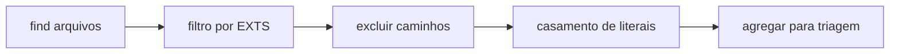

# Mapa de hardcoding: taxonomia, níveis e detecção

Este documento é a **fonte conceitual** para classificar ocorrências de valores fixos (literais, textos e constantes inadequadamente espalhados) e nivelar sua gravidade para priorização. Complementa a visão de produto em [`specs/vision-hardcode-plugin.md`](../specs/vision-hardcode-plugin.md), o contrato atual em [`specs/plugin-contract.md`](../specs/plugin-contract.md) e o escopo do ecossistema em [`limitations-and-scope.md`](limitations-and-scope.md).

## 1. Referência: fluxo conceitual “Ops Literal” (varredura por texto)

O desenho típico de uma action composite que **varre repositório** sem análise sintática segue esta lógica (nomes de passos ilustrativos):

1. **Validação de entrada** — Confirma token (se aplicável) e caminhos alvo existentes.
2. **Listagem de arquivos** — `find` em árvore, filtro por **extensões** (`EXTS` como regex alternativa: `ts|js|…`), exclusão de diretórios de build/cache (ex.: `node_modules`, `dist`, `.git`).
3. **Casamento de ocorrências** — Para cada arquivo listado, busca linhas que correspondam a um **padrão de literais entre aspas** (ex.: aspas duplas ou simples com comprimento mínimo dentro das aspas). Ferramentas comuns: `grep -HnE` ou equivalente.
4. **Agregação** — Resultados consolidados em lista (ex.: linhas `arquivo:linha:conteúdo`) para triagem posterior.

O objetivo deste mapa **não** é prescrever implementação de CI nem formato de relatório; é fornecer **como interpretar** qualquer lista de ocorrências produzida por varredura textual ou por outras camadas.

## 2. Sem AST: comportamento esperado e proposital

A ausência de **AST** (árvore sintática) **não** é tratada aqui como “defeito” do detector. Em uma pipeline de governança de hardcoding:

- **Toda ocorrência** retornada por grep/regex (ou por padrões complementares) é **candidata** a classificação e nivelamento — não é descartada automaticamente como “ruído”.
- O mesmo padrão que encontra código também encontra **comentários**, trechos visíveis de **template literals** (conforme o casamento por linha), grande parte de **JSON/YAML** (valores entre aspas), **atributos JSX** que caibam na linha, **strings em scripts shell**, etc. Isso é **útil**: a triagem decide o rótulo (configuração, produto, teste, documentação).
- Ocorrências que **não** entram em um padrão simples de aspas — **números mágicos**, literais booleanos, **identificadores de enum**, partes de template em **várias linhas**, conteúdo **binário**, arquivos **`.env`** com formatos heterogêneos, valores **montados em runtime** — devem aparecer no mapa como **categorias** com **meios de detecção complementares** (regex adicional, parser específico, AST, análise semântica, revisão humana). Isso **completa** o primeiro passo, não o invalida.

## 3. Cobertura de arquivos: ampliar `EXTS`

A lista de extensões define **o que entra na varredura**. O conjunto mínimo costuma incluir linguagens de aplicação e configuração (`ts`, `js`, `jsx`, `tsx`, `java`, `py`, `go`, `cs`, `php`, `sh`, `json`, `yaml`, `yml`). Para análise completa de hardcoding em repositórios reais, **recomenda-se ampliar** para cobrir, entre outros:

| Grupo | Extensões exemplificativas | Conteúdo típico |
|-------|---------------------------|-----------------|
| Documentação e conteúdo | `md`, `mdx` | Texto, exemplos de código embutidos, frontmatter |
| Dados e contratos | `xml`, `toml`, `ini`, `cfg`, `conf` | Configuração legada, feeds, manifests |
| JVM / enterprise | `properties`, `gradle`, `kts` (avaliar política do repo) | Chaves de mensagem, URLs, ambientes |
| Infraestrutura como código | `tf`, `tfvars`, `hcl` | Recursos, regiões, nomes fixos |
| Banco e migração | `sql` | DDL/DML, nomes de schema, seeds |
| Mobile / nativo (se aplicável) | `swift`, `kt`, `kts`, `gradle` | Strings de UI, deep links |
| Web front | `html`, `htm`, `vue`, `svelte` | Texto, meta, atributos |
| Estilo e pipeline | `css`, `scss`, `less`, `Dockerfile`, `containerfile` | Tokens visuais, imagens base |
| CI / automação | `yml`, `yaml` em `.github/`, `gitlab-ci` | Nomes de job, versões de action |

**Triagem:** presença em `json`/`yaml` de deploy **não** é “falso hardcode” por si só — é **contexto** (sistema externo, ambiente, produto) a classificar conforme as linhas deste mapa.

## 4. Camadas de detecção (meios de descoberta)

O uso de **AST** pelo ESLint **não impede** o uso de **outras ferramentas** no mesmo projeto: busca textual (`grep`, `ripgrep`), linters especializados, scanners de segredo, parsers por formato (SQL, Terraform), ou revisão assistida. A estratégia recomendada é **combinar camadas**:

| Camada | Exemplos | Quando favorecer |
|--------|----------|------------------|
| Texto / regex | grep de aspas, padrões de URL, IDs | Amplitude, rapidez, linguagens heterogêneas |
| AST / ESLint | Regras sobre `Literal`, `TemplateLiteral`, imports | Precisão em JS/TS, exclusões por contexto |
| Parser por formato | XML, `.tf`, SQL | Estrutura e chaves sem confundir com código |
| Revisão humana / semântica | Design de API, políticas de privacidade | Significado de negócio que regex não vê |

## 5. Eixos de severidade e níveis de negócio

Para evitar confundir **política da ferramenta** com **prioridade de correção**:

| Eixo | Valores | Uso |
|------|---------|-----|
| **Severidade de ferramenta (ESLint)** | `off`, `warn`, `error` | Política no `eslint.config` quando a regra se aplica. |
| **Gravidade de negócio** | **L1** a **L4** | Prioridade humana e de backlog (abaixo). |

**Gravidade de negócio (sugestão operacional):**

| Nível | Significado | Por que importa |
|-------|-------------|-----------------|
| **L1 — Crítico** | Segurança, compliance, vazamento de segredo, dados regulados | Risco direto; correção urgente; auditoria |
| **L2 — Alto** | Ambiente, implantação, integrações, URLs/credenciais não secretas mas voláteis | Portabilidade, incidentes de ops, custo de mudança |
| **L3 — Médio** | UX, i18n, consistência de produto, mensagens de erro de domínio | Qualidade percebida, suporte, DRY de produto |
| **L4 — Baixo** | Estilo, comentários, exemplos, documentação | Higiene; melhora manutenção e onboarding |

**Princípios:** **DRY** (evitar duplicação de valores semânticos), **Clean Code** (nomes e constantes explícitos), **escalabilidade** (mudar ambiente sem alterar código), **reusabilidade** (catálogos, i18n, config), **testabilidade** (substituir fixtures centralizadas).

## 6. Tabela mestra de possibilidades

Colunas: **ID**, **Domínio / subtipo**, **Onde aparece**, **Como detectar**, **Classificação**, **Nível típico**, **Notas / significado para o desenvolvimento**.

### 6.1 Artefatos e empacotamento

| ID | Domínio / subtipo | Onde aparece | Como detectar | Classificação | Nível | Notas |
|----|-------------------|--------------|---------------|---------------|-------|-------|
| HC-ART-01 | Nome e tag de imagem Docker / OCI | `Dockerfile`, compose, CI | Regex de imagens, aspas | Artefato de build | L2 | Versões fixas dificultam upgrades e varredura de CVE |
| HC-ART-02 | Versão de artefato publicado (npm, jar) | Manifestos, CI | Aspas em `package.json`, Gradle | Versão pinada | L2–L3 | Reprodutibilidade vs dever de atualizar dependências |
| HC-ART-03 | Nome de pacote / bundle / asset | Repositório de assets | grep em paths e imports | Identidade de entrega | L3 | Afeta branding e pipelines |

### 6.2 Configuração e parametrização

| ID | Domínio / subtipo | Onde aparece | Como detectar | Classificação | Nível | Notas |
|----|-------------------|--------------|---------------|---------------|-------|-------|
| HC-CFG-01 | Default de feature flag no código | Fonte | Literal em condicional | Parametrização | L2–L3 | Deve migrar para config remota ou por ambiente |
| HC-CFG-02 | Valores em JSON/YAML de deploy | `config/`, Helm, K8s | Varredura textual + parser | Config de ambiente | L2 | Centralizar e documentar por ambiente |
| HC-CFG-03 | Caminhos de arquivo e globs | Scripts, app | Aspas com `/` ou `\` | Config implícita | L2 | Quebra entre OS e deploys |
| HC-CFG-04 | Limites numéricos “mágicos” em config | Código, yaml | Regex numérica + revisão | Limite operacional | L2–L3 | Paginação, rate limit — impactam escala |

### 6.3 Preferências e perfil de usuário

| ID | Domínio / subtipo | Onde aparece | Como detectar | Classificação | Nível | Notas |
|----|-------------------|--------------|---------------|---------------|-------|-------|
| HC-PRF-01 | Defaults de UI (idioma, tema) | Cliente | Literais e defaults | Preferência embutida | L3 | Deve alinhar com persistência e conta |
| HC-PRF-02 | Valores de “settings” simulados | Código | Constantes em módulo | Estado inicial | L3 | Evitar divergência com backend |

### 6.4 Internacionalização e conteúdo

| ID | Domínio / subtipo | Onde aparece | Como detectar | Classificação | Nível | Notas |
|----|-------------------|--------------|---------------|---------------|-------|-------|
| HC-I18-01 | Strings de interface visíveis ao usuário | UI | Aspas + revisão de contexto | Texto de produto | L3 | Exige catálogo i18n para escala global |
| HC-I18-02 | Mensagens de validação | Forms, API | Literais em erros | Validação de domínio | L3 | Duplicação quebra consistência de UX |
| HC-I18-03 | Pluralização e gênero | i18n | Templates e libs | Gramática | L3 | Hardcode impede locales corretos |

### 6.5 Meta e SEO

| ID | Domínio / subtipo | Onde aparece | Como detectar | Classificação | Nível | Notas |
|----|-------------------|--------------|---------------|---------------|-------|-------|
| HC-SEO-01 | `<title>`, meta description | HTML, framework | Aspas em head | SEO | L3 | Conteúdo deve ser gerenciável |
| HC-SEO-02 | Open Graph / Twitter cards | Meta tags | Atributos `content` | Meta social | L3 | Marketing e compartilhamento |

### 6.6 Estrutura de conteúdo (CMS, frontmatter, slugs)

| ID | Domínio / subtipo | Onde aparece | Como detectar | Classificação | Nível | Notas |
|----|-------------------|--------------|---------------|---------------|-------|-------|
| HC-CMS-01 | Slug ou ID de conteúdo | Markdown, CMS | Strings em frontmatter | Conteúdo estruturado | L3–L4 | Acoplamento a CMS ou rotas |
| HC-CMS-02 | Campos de taxonomia fixos | Código | Constantes | Classificação | L3 | Mudança editorial exige deploy se fixo |

### 6.7 Variáveis, constantes e duplicação entre arquivos

| ID | Domínio / subtipo | Onde aparece | Como detectar | Classificação | Nível | Notas |
|----|-------------------|--------------|---------------|---------------|-------|-------|
| HC-VAR-01 | Mesmo literal em N módulos | Monorepo | Agregação / duplicação | DRY semântico | L3 | Aumenta custo de mudança coordenada |
| HC-VAR-02 | “Constante” não exportada duplicada | Código | AST + busca | Duplicação | L3 | Risco de divergência sutil |

### 6.8 Números e unidades

| ID | Domínio / subtipo | Onde aparece | Como detectar | Classificação | Nível | Notas |
|----|-------------------|--------------|---------------|---------------|-------|-------|
| HC-NUM-01 | Timeouts e retries | Rede, jobs | Dígitos, AST `Literal` | Política de resiliência | L2–L3 | Afeta confiabilidade e latência |
| HC-NUM-02 | Limites de paginação / tamanho | API | Números em código | Contrato implícito | L2–L3 | Escala e abuso |
| HC-NUM-03 | Dinheiro e precisão decimal | Pagamentos | Literais decimais | Regra de negócio | L1–L2 | Erros fiscais e financeiros |
| HC-NUM-04 | Versão numérica em protocolo | Serialização | Números | Compatibilidade | L2 | Migração de API |

### 6.9 Rede e identidade

| ID | Domínio / subtipo | Onde aparece | Como detectar | Classificação | Nível | Notas |
|----|-------------------|--------------|---------------|---------------|-------|-------|
| HC-NET-01 | URL base / host / porta | Cliente, servidor | Regex `https?://`, aspas | Endpoint | L2 | Ambientes e zero trust |
| HC-NET-02 | Path de API versionada | HTTP | Strings `/v1/` | Acoplamento | L2–L3 | Mudança coordenada com consumidores |
| HC-NET-03 | Cabeçalhos HTTP fixos | Código | Literais | Contrato de transporte | L2–L3 | Segurança e interoperabilidade |

### 6.10 Segredos e identificadores sensíveis

| ID | Domínio / subtipo | Onde aparece | Como detectar | Classificação | Nível | Notas |
|----|-------------------|--------------|---------------|---------------|-------|-------|
| HC-SEC-01 | Segredos e tokens (mesmo placeholder frágil) | Qualquer | Scanners + política | Segredo | **L1** | Nunca documentar valores reais neste repositório |
| HC-SEC-02 | IDs de tenant / conta em lógica | Código | Strings com padrão | Isolamento multi-tenant | L1–L2 | Vazamento de contexto entre clientes |
| HC-SEC-03 | Chaves de criptografia simbólicas (kid) | Config | Aspas | Cripto ops | L1–L2 | Rotação e KMS |

### 6.11 Persistência e consulta

| ID | Domínio / subtipo | Onde aparece | Como detectar | Classificação | Nível | Notas |
|----|-------------------|--------------|---------------|---------------|-------|-------|
| HC-SQL-01 | Fragmento SQL dinâmico | Repositórios | Strings SQL | Persistência | L1–L2 | SQL injection e migrações |
| HC-SQL-02 | Nome de tabela/coluna/index | ORM, SQL | Literais | Esquema | L2 | Acoplamento a DDL |
| HC-SQL-03 | Filtros e partições fixas | NoSQL | Strings | Dados | L2 | Hotspot e custo |

### 6.12 Contratos e serialização

| ID | Domínio / subtipo | Onde aparece | Como detectar | Classificação | Nível | Notas |
|----|-------------------|--------------|---------------|---------------|-------|-------|
| HC-SER-01 | Nome de campo JSON estável | API | Aspas em chaves/valores | Contrato | L2–L3 | Quebra de consumidores |
| HC-SER-02 | Enum como string em linguagem sem enum | TS/JS | Union de literais | Domínio | L3 | Alinhar com OpenAPI/Proto |
| HC-SER-03 | Código de erro de domínio | Camada de aplicação | Strings | API estável | L2–L3 | Suporte e clients |

### 6.13 Observabilidade

| ID | Domínio / subtipo | Onde aparece | Como detectar | Classificação | Nível | Notas |
|----|-------------------|--------------|---------------|---------------|-------|-------|
| HC-OBS-01 | Mensagem de log para correlação | Serviços | Literais | Log | L2–L3 | Cardinalidade e PII |
| HC-OBS-02 | Nome de métrica / trace | Instrumentação | Strings | Observabilidade | L2 | Padrões de naming e dashboards |

### 6.14 Testes e fixtures

| ID | Domínio / subtipo | Onde aparece | Como detectar | Classificação | Nível | Notas |
|----|-------------------|--------------|---------------|---------------|-------|-------|
| HC-TST-01 | Dados de teste idênticos à produção | `test/` | Duplicação | Fixture | L3–L4 | Risco de vazamento de formato real |
| HC-TST-02 | Snapshot com strings frágeis | Jest, etc. | Arquivos snapshot | Regressão | L4 | Manutenção de testes |

### 6.15 Comentários, anotações e pseudo-código

| ID | Domínio / subtipo | Onde aparece | Como detectar | Classificação | Nível | Notas |
|----|-------------------|--------------|---------------|---------------|-------|-------|
| HC-CMT-01 | Exemplo com host/URL real em comentário | Fonte | grep + revisão | Documentação | L3–L4 | Pode induzir cópia insegura |
| HC-CMT-02 | TODO com constante mágica | Comentário | Texto | Dívida técnica | L4 | Torna débito invisível ao compilador |
| HC-CMT-03 | Anotações (Decorator, JPA, etc.) com literal | Java, TS | AST + texto | Metadado | L2–L3 | Comportamento por reflexão |

### 6.16 Segurança de plataforma

| ID | Domínio / subtipo | Onde aparece | Como detectar | Classificação | Nível | Notas |
|----|-------------------|--------------|---------------|---------------|-------|-------|
| HC-PLT-01 | Política IAM / permissão como string | Infra, SDK | JSON/HCL/aspas | Autorização | L1–L2 | Excesso de privilégio |
| HC-PLT-02 | Regra de firewall / CIDR | Terraform, cloud | Literais | Rede | L1–L2 | Superfície de ataque |

### 6.17 Cores, temas e design tokens

| ID | Domínio / subtipo | Onde aparece | Como detectar | Classificação | Nível | Notas |
|----|-------------------|--------------|---------------|---------------|-------|-------|
| HC-DSG-01 | Cor hex/rgb em componente | CSS-in-JS, Vue | Regex de cor | Token visual | L3–L4 | Consistência de marca e acessibilidade |
| HC-DSG-02 | Espaçamento mágico repetido | UI | Números + contexto | Layout | L4 | Design system e responsividade |

## 7. Como usar este mapa

1. **Ingerir ocorrências** de qualquer ferramenta (texto, AST, híbrido).
2. Para cada ocorrência, atribuir **classificação** (coluna) e **nível** (L1–L4) conforme contexto.
3. **Ordenar** o backlog por nível e por custo de correção.
4. **Evoluir regras** do plugin ESLint e scanners conforme [`specs/vision-hardcode-plugin.md`](../specs/vision-hardcode-plugin.md), sem exigir que uma única tecnologia cubra todas as linhas da tabela.

## 8. Versão do documento

- **1.0.0** — Introdução do mapa conceitual alinhado à varredura textual proposital, extensões ampliadas, camadas de detecção e tabela mestre por domínio.
