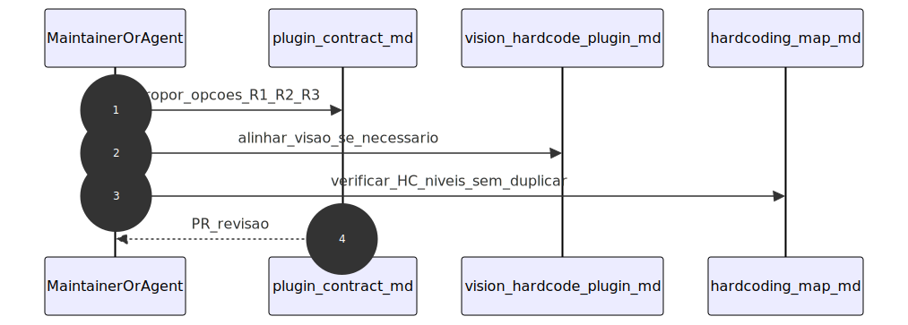
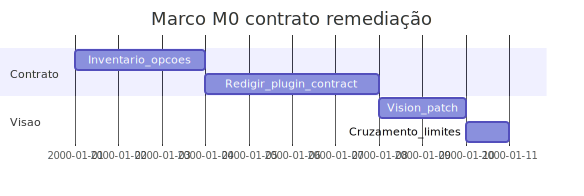

# Marco M0: contrato e políticas (`remediation-m0-contract`)

Plano detalhado alinhado a [`../hardcode-remediation-macro-plan.md`](../hardcode-remediation-macro-plan.md). A M0 **formaliza** no contrato as opções públicas e vocabulário das trilhas **R1–R3** (sem exigir implementação completa de remediação), preparando M1+.

**Milestone GitHub sugerido:** `remediation-m0-contract`  
**Labels:** `area/remediation-R1`, `type/docs`

---

## 1. Objetivo e escopo (trilhas R1–R3)

- **Foco:** atualizar [`specs/plugin-contract.md`](../../specs/plugin-contract.md) com opções públicas planejadas: caminhos para módulo partilhado (R2), formatos de ficheiros de dados (R3), modos de segredo e flags para literais de default (`process.env`, `??`, `||`); ajustar [`specs/vision-hardcode-plugin.md`](../../specs/vision-hardcode-plugin.md) se a visão de produto mudar.
- **Trilhas:** definição contratual transversal a R1, R2 e R3; nenhuma trilha encerrada como “implementada” na M0.
- **Mapa HC-*:** alinhamento com [`../hardcoding-map.md`](../hardcoding-map.md) sem duplicar a tabela mestra.

---

## 2. Dependências e handoff (cadeia M0→M5)

| | Conteúdo |
|---|-----------|
| **Entrada (consome)** | Estado actual do plugin, contrato e visão; macro-plan e [`../distribution-milestones/`](../distribution-milestones/) para coerência de release. |
| **Saída (entrega)** | Schema e mensagens estáveis no contrato; lista explícita de opções futuras com semântica acordada para M1 (R1). |
| **Risco se handoff falhar** | Opções a mais sem implementação nas fases seguintes; ambiguidade entre R1/R2/R3 no schema. |

---

## 3. Diagrama de sequência (Mermaid)

Contrato antes do código: especificação e revisão cruzada.



<details>
<summary>Fonte Mermaid</summary>

```text
sequenceDiagram
  autonumber
  participant Author as MaintainerOrAgent
  participant Contract as plugin_contract_md
  participant Vision as vision_hardcode_plugin_md
  participant Map as hardcoding_map_md
  Author->>Contract: propor_opcoes_R1_R2_R3
  Author->>Vision: alinhar_visao_se_necessario
  Author->>Map: verificar_HC_niveis_sem_duplicar
  Contract-->>Author: PR_revisao
```

</details>

---

## 4. Ordem, dependências e durações

| Ordem | Subtarefa | Duração estimada | Depende de | “Pronto para PR” quando |
|-------|-----------|------------------|------------|-------------------------|
| 1 | Inventariar opções públicas necessárias (shared path, formatos, segredo, env-default) | 3d | — | Lista no contrato ou ADR interno ao PR |
| 2 | Redigir secções no `plugin-contract.md` (mensagens, schema, compatibilidade) | 4d | 1 | Texto revisto e versionado no contrato |
| 3 | Ajustar `vision-hardcode-plugin.md` se o âmbito R1–R3 mudar | 2d | 2 | Sem contradição contrato × visão |
| 4 | Revisão cruzada com macro-plan e limites (`limitations-and-scope`) | 1d | 3 | Checklist ou notas no PR |

**Duração total do marco (sequencial):** 10d.

---

## 5. Composição temporal (durações)

Eixo **`2000-01-01` = T0 fictício**; só as durações são normativas.



<details>
<summary>Fonte Mermaid</summary>

```text
gantt
  title Marco M0 contrato remediação
  dateFormat YYYY-MM-DD
  section Contrato
  Inventario_opcoes :m0a, 2000-01-01, 3d
  Redigir_plugin_contract :m0b, after m0a, 4d
  section Visao
  Vision_patch :m0c, after m0b, 2d
  Cruzamento_limites :m0d, after m0c, 1d
```

</details>

---

## 6. Massas e2e, RuleTester e (quando aplicável) Compose/CI

| Massa / projeto | Trilha | RuleTester / e2e | Compose / CI |
|-----------------|--------|------------------|--------------|
| `packages/eslint-plugin-hardcode-detect/` | — | `npm test` deve permanecer verde; sem nova massa obrigatória na M0 | Paridade T3: [`docker-compose.yml`](../../docker-compose.yml) `prod` / workflow CI |

---

## 7. Camada A — Tarefas e orçamento de tokens (pré-execução de agentes)

| ID | Tarefa | Inputs | Outputs | Teto (tokens) estimado | Critério de conclusão | Ficheiro de tarefa |
|----|--------|--------|---------|------------------------|----------------------|-------------------|
| A1 | Actualizar `plugin-contract.md` com opções R1–R3 planeadas | Macro-plan, contrato actual | Secções novas ou amendadas | 28 000 | Versão do doc e lista de opções | [`tasks/m0-contract-baseline/A1-plugin-contract-remediation-options.md`](tasks/m0-contract-baseline/A1-plugin-contract-remediation-options.md) |
| A2 | Alinhar `vision-hardcode-plugin.md` | A1 | Patch de visão ou “sem alteração” explícita | 12 000 | Coerência com contrato | [`tasks/m0-contract-baseline/A2-vision-alignment.md`](tasks/m0-contract-baseline/A2-vision-alignment.md) |
| A3 | Cruzamento `limitations-and-scope` e `repository-tree` | A1 | Notas ou edits mínimos | 10 000 | Sem conflito de escopo | [`tasks/m0-contract-baseline/A3-limits-and-tree-crosscheck.md`](tasks/m0-contract-baseline/A3-limits-and-tree-crosscheck.md) |

---

## 8. Camada B — Execução de agentes por fase

| Fase | O que executar (agente) | Evidência / artefato | Ligação ao handoff |
|------|---------------------------|----------------------|--------------------|
| Desenvolvimento | Edits em `specs/`, opcionalmente `docs/` | Commits | Base para M1 |
| Testes | `npm test -w eslint-plugin-hardcode-detect` | Exit 0 | Sem regressão |
| Análise de resultados | Diff contrato vs implementação actual | Lista de gaps | Planeamento M1 |
| Logs e documentos | Versão e changelog do spec | Rodapé do contrato | Rastreabilidade |
| Deploy / releasing | N/A (specs apenas) | N/A | — |
| Validações | Revisão humana | Aprovação PR | Done M0 |
| Distribuições | N/A | N/A | — |

---

## 9. Plano GitHub (PR, branch, semver)

- **PR sugerida:** `docs(remediation): milestone M0 — contract baseline R1–R3`
- **Branch:** `milestone/remediation-m0-contract-baseline`
- **Semver:** bump do pacote apenas se o PR incluir alterações publicáveis em `packages/`; caso típico M0 = só `specs/` + `docs/`.
- **Referências:** [`../versioning-for-agents.md`](../versioning-for-agents.md), [`../../specs/agent-git-workflow.md`](../../specs/agent-git-workflow.md).

---

## 10. Riscos e critérios de “done”

- **Riscos:** opções a mais sem roadmap de implementação; desalinhamento com [`specs/plugin-contract.md`](../../specs/plugin-contract.md) como fonte normativa.
- **Done:** contrato e visão coerentes com o macro-plan; M1 pode iniciar com vocabulário estável; `npm test` verde; handoff explícito para [`m1-remediation-r1.md`](m1-remediation-r1.md).
