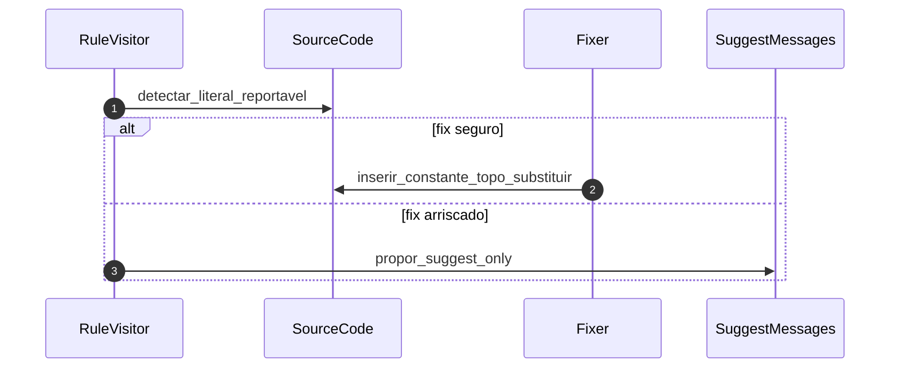
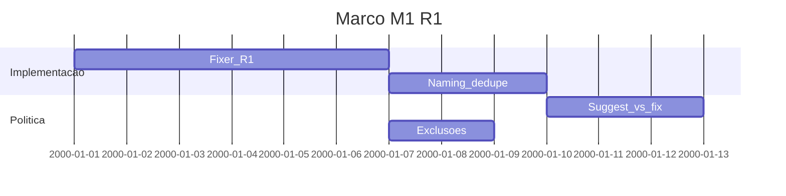

# Marco M1: R1 — remediação por ficheiro (`remediation-m1-r1`)

Plano detalhado alinhado a [`../hardcode-remediation-macro-plan.md`](../hardcode-remediation-macro-plan.md). **R1:** constantes no **topo do mesmo ficheiro**, `fix` com `fixer` sobre o AST actual; `suggest` onde o fix for arriscado (i18n, testes, frameworks).

**Milestone GitHub sugerido:** `remediation-m1-r1`  
**Labels:** `area/remediation-R1`, `type/feature`

---

## 1. Objetivo e escopo (trilhas R1–R3)

- **Foco:** implementar remediação **R1** fiável: política de nomes, ordem no topo, deduplicação **dentro** do ficheiro, `ignores`/`overrides` para exclusões (testes, i18n).
- **Trilhas:** apenas **R1**; R2/R3 fora de escopo excepto preparação indirecta (interfaces partilhadas no pacote).
- **Contrato:** comportamento público conforme M0 em [`specs/plugin-contract.md`](../../specs/plugin-contract.md).

---

## 2. Dependências e handoff (cadeia M0→M5)

| | Conteúdo |
|---|-----------|
| **Entrada (consome)** | **M0:** schema e mensagens estáveis; opções de exclusão e naming acordadas. |
| **Saída (entrega)** | Fix R1 fiável com cobertura **RuleTester**; política documentada para `suggest` vs `fix`. |
| **Risco se handoff falhar** | Falsos positivos em i18n/tests; utilizadores desconfiam do auto-fix. |

---

## 3. Diagrama de sequência (Mermaid)

---

## 4. Ordem, dependências e durações

| Ordem | Subtarefa | Duração estimada | Depende de | “Pronto para PR” quando |
|-------|-----------|------------------|------------|-------------------------|
| 1 | Implementar visitação + fixer R1 (mesmo `SourceCode`) | 6d | M0 | RuleTester verde para casos base |
| 2 | Política de naming e ordem no topo; dedupe intra-ficheiro | 3d | 1 | Casos de regressão |
| 3 | Matriz `suggest` vs `fix` (risco) | 3d | 2 | Documentado no contrato ou README da regra |
| 4 | Exclusões (`include`/`exclude`, comprimento mínimo, prefixos) | 2d | 1 | Testes que fixam limites |

**Duração total do marco (sequencial):** 14d.

---

## 5. Composição temporal (durações)

---

## 6. Massas e2e, RuleTester e (quando aplicável) Compose/CI

| Massa / projeto | Trilha | RuleTester / e2e | Compose / CI |
|-----------------|--------|------------------|--------------|
| `packages/eslint-plugin-hardcode-detect/tests/` | R1 | Cobertura obrigatória novos casos | — |
| `packages/eslint-plugin-hardcode-detect/e2e/` | R1 | Fumaça sem regressão | `npm test` no CI (T3) |
| `packages/e2e-fixture-nest/` | — | Opcional extensão cenários | [`specs/e2e-fixture-nest.md`](../../specs/e2e-fixture-nest.md) |

---

## 7. Camada A — Tarefas e orçamento de tokens (pré-execução de agentes)

| ID | Tarefa | Inputs | Outputs | Teto (tokens) estimado | Critério de conclusão | Ficheiro de tarefa |
|----|--------|--------|---------|------------------------|----------------------|-------------------|
| A1 | Suite RuleTester R1 (happy path + exclusões) | M0, Clippings ESLint fix | Ficheiros em `tests/` | 35 000 | Casos passam | Sub-micro-tarefas por papel: [`tasks/m1-remediation-r1/micro/README.md`](tasks/m1-remediation-r1/micro/README.md) (prefixo `M1-A1-*`) |
| A2 | Política suggest vs fix | Macro-plan secção segredos (antecipação) | Tabela no doc da regra | 15 000 | Comportamento reproduzível | Sub-micro-tarefas por papel: [`tasks/m1-remediation-r1/micro/README.md`](tasks/m1-remediation-r1/micro/README.md) (prefixo `M1-A2-*`) |
| A3 | Actualizar `plugin-contract.md` se comportamento divergir do rascunho M0 | A1 | Amend contrato | 18 000 | Versão contrato | [`tasks/m1-remediation-r1/A3-contract-sync-post-r1.md`](tasks/m1-remediation-r1/A3-contract-sync-post-r1.md) |

**A1 — entregável do arquiteto (CI, comando e ambiente):** [`tasks/m1-remediation-r1/A1-architect-ruletester-r1-ci-environment.md`](tasks/m1-remediation-r1/A1-architect-ruletester-r1-ci-environment.md).

---

## 8. Camada B — Execução de agentes por fase

| Fase | O que executar (agente) | Evidência / artefato | Ligação ao handoff |
|------|---------------------------|----------------------|--------------------|
| Desenvolvimento | Código em `packages/eslint-plugin-hardcode-detect/src/` | PR | R1 pronto |
| Testes | `npm test -w eslint-plugin-hardcode-detect` | Exit 0 | Base M2 |
| Análise de resultados | Falsos positivos residuais | Issues ou backlog | M4 segredos |
| Validações | Lint do pacote | Sem novos erros | Done M1 |

---

## 9. Plano GitHub (PR, branch, semver)

- **PR sugerida:** `feat(remediation): milestone M1 — R1 local fix + RuleTester`
- **Branch:** `milestone/remediation-m1-r1`
- **Semver:** minor ou patch conforme breaking changes no schema público.
- **Referências:** [`../versioning-for-agents.md`](../versioning-for-agents.md), [`../../specs/agent-git-workflow.md`](../../specs/agent-git-workflow.md).

---

## 10. Riscos e critérios de “done”

- **Riscos:** falsos positivos i18n/tests; interacção com `eslint --fix` em pipelines.
- **Done:** fix R1 fiável para casos acordados; RuleTester e e2e verdes; handoff para [`m2-remediation-r2-global.md`](m2-remediation-r2-global.md) com API estável para extensão de índice.
