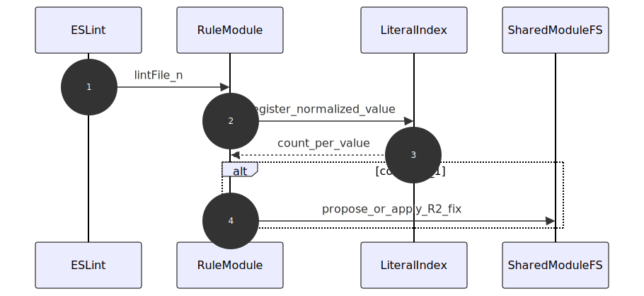
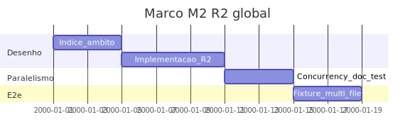

# Marco M2: R2 — índice global no âmbito do lint (`remediation-m2-r2-global`)

Plano detalhado alinhado a [`../hardcode-remediation-macro-plan.md`](../hardcode-remediation-macro-plan.md). **R2:** mesmo valor normalizado em **mais do que um** ficheiro do conjunto lintado; módulo partilhado configurável; **reconfirmação** do índice a cada execução ESLint.

**Milestone GitHub sugerido:** `remediation-m2-r2-global`  
**Labels:** `area/remediation-R2`, `type/feature`

---

## 1. Objetivo e escopo (trilhas R1–R3)

- **Foco:** visão agregada sobre ficheiros incluídos (`files` / `ignores`); estratégia documentada para estado (memória, `settings`, ou fases); **decisão explícita** sobre `concurrency` / workers ESLint vs estado global.
- **Trilhas:** **R2**; R1 mantém-se; R3 não é obrigatório neste marco.
- **Verificação global:** índice reconstruído ou invalidado por execução — sem cache stale entre corridas sem política (ver macro-plan).

---

## 2. Dependências e handoff (cadeia M0→M5)

| | Conteúdo |
|---|-----------|
| **Entrada (consome)** | **M1:** fix R1 e superfície de regra estável. |
| **Saída (entrega)** | Duplicados cross-file detectados e remediados conforme política; e2e multi-arquivo; ADR ou secção sobre paralelismo. |
| **Risco se handoff falhar** | Paralelismo ESLint invalida estado; resultados não determinísticos. |

---

## 3. Diagrama de sequência (Mermaid)



<details>
<summary>Fonte Mermaid</summary>

```text
sequenceDiagram
  autonumber
  participant ESLint as ESLint
  participant Rule as RuleModule
  participant Index as LiteralIndex
  participant FS as SharedModuleFS
  ESLint->>Rule: lintFile_n
  Rule->>Index: register_normalized_value
  Index-->>Rule: count_per_value
  alt count_gt_1
    Rule->>FS: propose_or_apply_R2_fix
  end
```

</details>

---

## 4. Ordem, dependências e durações

| Ordem | Subtarefa | Duração estimada | Depende de | “Pronto para PR” quando |
|-------|-----------|------------------|------------|-------------------------|
| 1 | Desenho do índice (normalização, âmbito, invalidação) | 4d | M1 | Documento no repo ou comentário normativo |
| 2 | Implementação registo + decisão dup → R2 | 6d | 1 | RuleTester multi-ficheiro ou simulação equivalente |
| 3 | Documentar e testar interacção `concurrency` / workers | 4d | 2 | Opção: desactivar paralelismo, segunda passagem, ou índice em ficheiro |
| 4 | e2e com dois ou mais ficheiros (fixture dedicada se necessário) | 4d | 3 | Runner e2e verde |

**Duração total do marco (sequencial):** 18d.

---

## 5. Composição temporal (durações)



<details>
<summary>Fonte Mermaid</summary>

```text
gantt
  title Marco M2 R2 global
  dateFormat YYYY-MM-DD
  section Desenho
  Indice_ambito :m2a, 2000-01-01, 4d
  Implementacao_R2 :m2b, after m2a, 6d
  section Paralelismo
  Concurrency_doc_test :m2c, after m2b, 4d
  section E2e
  Fixture_multi_file :m2d, after m2c, 4d
```

</details>

---

## 6. Massas e2e, RuleTester e (quando aplicável) Compose/CI

| Massa / projeto | Trilha | RuleTester / e2e | Compose / CI |
|-----------------|--------|------------------|--------------|
| `packages/eslint-plugin-hardcode-detect/tests/` | R2 | Casos com múltiplos `code` ou runner dedicado | — |
| Futuro `packages/e2e-fixture-*` (R2) | R2 | Dois ou mais ficheiros com o mesmo literal | Planeado no macro-plan |
| CI | T3 | `npm test` inclui e2e | [`../distribution-milestones/m2-channel-t3-ci.md`](../distribution-milestones/m2-channel-t3-ci.md) |

---

## 7. Camada A — Tarefas e orçamento de tokens (pré-execução de agentes)

| ID | Tarefa | Inputs | Outputs | Teto (tokens) estimado | Critério de conclusão | Ficheiro de tarefa |
|----|--------|--------|---------|------------------------|----------------------|-------------------|
| A1 | Especificar normalização de valor e chave de dup | Macro-plan | Secção em spec ou código comentado | 14 000 | Comportamento único | Sub-micro-tarefas por papel: [`tasks/m2-remediation-r2-global/micro/README.md`](tasks/m2-remediation-r2-global/micro/README.md) (prefixo `M2-A1-*`) |
| A2 | ADR `concurrency` vs estado | Clippings Node API ESLint | ADR ou `specs/` | 20 000 | Decisão registada | [`tasks/m2-remediation-r2-global/A2-concurrency-adr.md`](tasks/m2-remediation-r2-global/A2-concurrency-adr.md) |
| A3 | Fixture e2e multi-ficheiro | A1, A2 | Pasta fixture + runner | 40 000 | e2e verde | Sub-micro-tarefas por papel: [`tasks/m2-remediation-r2-global/micro/README.md`](tasks/m2-remediation-r2-global/micro/README.md) (prefixo `M2-A3-*`) |

---

## 8. Camada B — Execução de agentes por fase

| Fase | O que executar (agente) | Evidência / artefato | Ligação ao handoff |
|------|---------------------------|----------------------|--------------------|
| Desenvolvimento | Índice + integração regra | PR | Entrada M3 |
| Testes | Stress com lint paralelo (se aplicável) | Logs | Valida decisão |
| Validações | Revisão de determinismo | Checklist | Done M2 |

---

## 9. Plano GitHub (PR, branch, semver)

- **PR sugerida:** `feat(remediation): milestone M2 — R2 global index + concurrency decision`
- **Branch:** `milestone/remediation-m2-r2-global`
- **Semver:** minor esperado (novas opções e comportamento).
- **Referências:** [`../versioning-for-agents.md`](../versioning-for-agents.md), [`../../specs/agent-git-workflow.md`](../../specs/agent-git-workflow.md).

---

## 10. Riscos e critérios de “done”

- **Riscos:** workers ESLint; race conditions; performance em monorepos grandes.
- **Done:** R2 funcional no âmbito do lint; e2e multi-arquivo; documentação de `concurrency`; handoff para [`m3-remediation-r3-data-files.md`](m3-remediation-r3-data-files.md).
