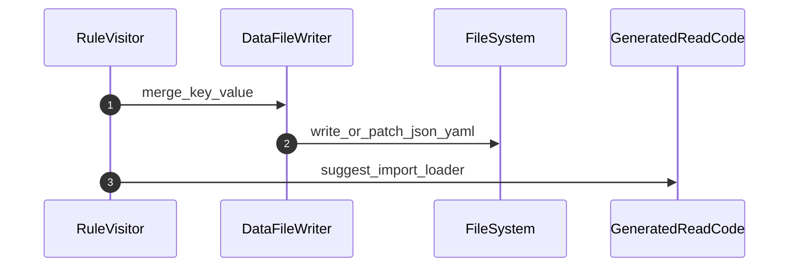
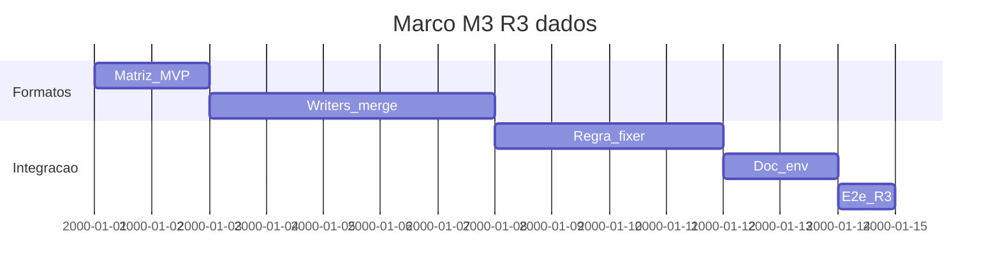

# Marco M3: R3 — propriedades, ficheiros de dados e env (`remediation-m3-r3-data`)

Plano detalhado alinhado a [`../hardcode-remediation-macro-plan.md`](../hardcode-remediation-macro-plan.md). **R3:** externalizar para `.properties`, `.json`, `.toml`, `.yaml`/`.yml` (ou formatos alinhados à stack); merge determinístico; código de leitura gerado ou sugerido; **sem** duplicar segredos em claro.

**Milestone GitHub sugerido:** `remediation-m3-r3-data`  
**Labels:** `area/remediation-R3`, `type/feature`

---

## 1. Objetivo e escopo (trilhas R1–R3)

- **Foco:** writers por formato; regras de merge (ordenar chaves JSON, preservar comentários YAML quando possível); localização de ficheiros (`config/`, etc.); documentação de carregamento via env ou loader.
- **Trilhas:** **R3**; depende de classificação e política de externalização (macro-plan, HC-*).
- **Limites:** valores classificados como segredos seguem política M4; M3 estabelece infraestrutura segura por defeito.

---

## 2. Dependências e handoff (cadeia M0→M5)

| | Conteúdo |
|---|-----------|
| **Entrada (consome)** | **M2:** índice e duplicados estáveis; R1 operacional. |
| **Saída (entrega)** | Ficheiros de dados correctos após fix; documentação de env/loader; testes de merge e encoding. |
| **Risco se handoff falhar** | Merge YAML/JSON corrupto; encoding errado; conflitos de escrita concorrente. |

---

## 3. Diagrama de sequência (Mermaid)

---

## 4. Ordem, dependências e durações

| Ordem | Subtarefa | Duração estimada | Depende de | “Pronto para PR” quando |
|-------|-----------|------------------|------------|-------------------------|
| 1 | Definir matriz de formatos suportados (MVP) | 2d | M2 | Tabela no contrato ou README |
| 2 | Implementar writers + merge (JSON mínimo; YAML incremental) | 5d | 1 | Testes unitários writers |
| 3 | Integração com regra + fixer que toca não-JS | 4d | 2 | RuleTester com ficheiros temporários ou vfs |
| 4 | Documentação carregamento env / dotenv / Nest config | 2d | 3 | Secção no pacote ou spec |
| 5 | e2e fixture R3 (geração `.json`/`.yml`) | 1d | 4 | e2e verde |

**Duração total do marco (sequencial):** 14d.

---

## 5. Composição temporal (durações)

---

## 6. Massas e2e, RuleTester e (quando aplicável) Compose/CI

| Massa / projeto | Trilha | RuleTester / e2e | Compose / CI |
|-----------------|--------|------------------|--------------|
| `packages/e2e-fixture-*` (R3) | R3 | Geração de ficheiros de configuração | Ver macro-plan «e2e, fixtures» |
| `packages/eslint-plugin-hardcode-detect/tests/` | R3 | Casos com ficheiros auxiliares | — |

---

## 7. Camada A — Tarefas e orçamento de tokens (pré-execução de agentes)

| ID | Tarefa | Inputs | Outputs | Teto (tokens) estimado | Critério de conclusão | Ficheiro de tarefa |
|----|--------|--------|---------|------------------------|----------------------|-------------------|
| A1 | Writers JSON/YAML (MVP) | Requisitos M3 | Módulo `src/` + testes | 45 000 | Cobertura mínima | Sub-micro-tarefas por papel: [`tasks/m3-remediation-r3-data-files/micro/README.md`](tasks/m3-remediation-r3-data-files/micro/README.md) (prefixo `M3-A1-*`) |
| A2 | Política de caminhos de ficheiro (globs) | Contrato | Opções públicas | 15 000 | Schema estável | [`tasks/m3-remediation-r3-data-files/A2-data-file-path-policy.md`](tasks/m3-remediation-r3-data-files/A2-data-file-path-policy.md) |
| A3 | e2e fixture R3 | A1 | Nova massa em `packages/` | 35 000 | Runner e2e | Sub-micro-tarefas por papel: [`tasks/m3-remediation-r3-data-files/micro/README.md`](tasks/m3-remediation-r3-data-files/micro/README.md) (prefixo `M3-A3-*`) |

---

## 8. Camada B — Execução de agentes por fase

| Fase | O que executar (agente) | Evidência / artefato | Ligação ao handoff |
|------|---------------------------|----------------------|--------------------|
| Desenvolvimento | Writers + regra | PR | Base M4 |
| Testes | Codificação UTF-8, CRLF se aplicável | Casos | Robustez |
| Validações | Revisão de segurança (sem segredos em claro) | Checklist | M4 |

---

## 9. Plano GitHub (PR, branch, semver)

- **PR sugerida:** `feat(remediation): milestone M3 — R3 data files + writers`
- **Branch:** `milestone/remediation-m3-r3-data-files`
- **Semver:** minor.
- **Referências:** [`../versioning-for-agents.md`](../versioning-for-agents.md), [`../../specs/agent-git-workflow.md`](../../specs/agent-git-workflow.md).

---

## 10. Riscos e critérios de “done”

- **Riscos:** merge destrutivo; comentários YAML perdidos; caminhos incorrectos em monorepos.
- **Done:** R3 MVP documentado e testado; handoff para [`m4-secrets-remediation.md`](m4-secrets-remediation.md) com fronteira clara «dados sensíveis».
