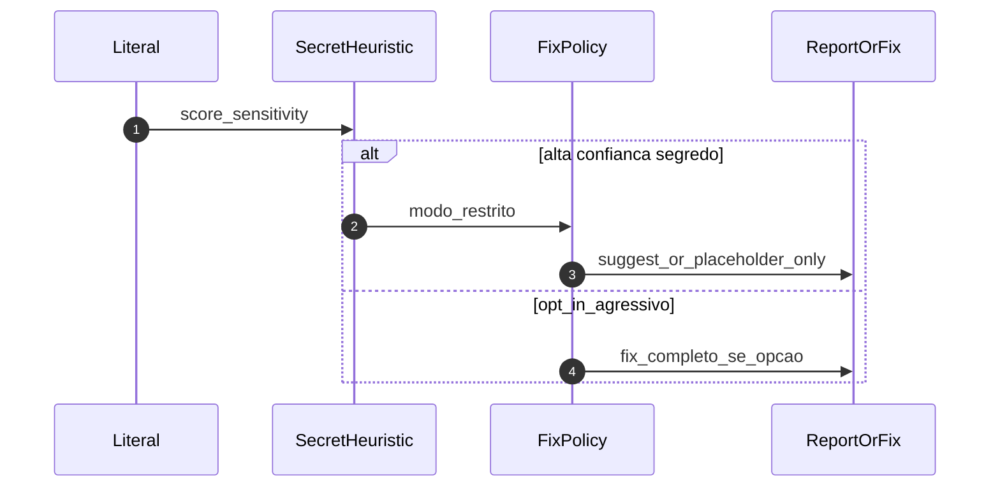
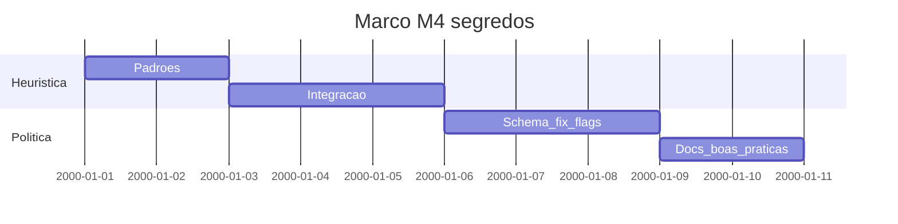

# Marco M4: segredos e política de fix (`remediation-m4-secrets`)

Plano detalhado alinhado a [`../hardcode-remediation-macro-plan.md`](../hardcode-remediation-macro-plan.md). Afinar **heurísticas** de candidatos a segredo (alinhadas a L1 em [`../hardcoding-map.md`](../hardcoding-map.md)); **política de fix** (só `suggest`, placeholder, opt-in para fix completo); documentação de boas práticas no pacote — **sem** simular fornecedores externos no repositório ([`specs/agent-integration-testing-policy.md`](../../specs/agent-integration-testing-policy.md)).

**Milestone GitHub sugerido:** `remediation-m4-secrets`  
**Labels:** `area/remediation-secrets`, `type/feature`

---

## 1. Objetivo e escopo (trilhas R1–R3)

- **Foco:** reduzir vazamento de valores sensíveis via auto-fix; orientar para env/cofres com mensagens estáveis; opt-in explícito no schema para qualquer fix agressivo.
- **Trilhas:** transversal a R1–R3; reforço de classificação `sens` no fluxo do macro-plan.
- **Entrada:** M1–M3 entregues (superfície de fix completa).

---

## 2. Dependências e handoff (cadeia M0→M5)

| | Conteúdo |
|---|-----------|
| **Entrada (consome)** | **M1–M3:** remediação base; writers R3. |
| **Saída (entrega)** | Heurísticas e opções de segredo documentadas; comportamento de fix seguro por defeito; guia no pacote. |
| **Risco se handoff falhar** | Utilizador espera fix agressivo; valores sensíveis ainda aparecem em diffs. |

---

## 3. Diagrama de sequência (Mermaid)

---

## 4. Ordem, dependências e durações

| Ordem | Subtarefa | Duração estimada | Depende de | “Pronto para PR” quando |
|-------|-----------|------------------|------------|-------------------------|
| 1 | Inventariar padrões (JWT-like, cloud keys, entropia) | 2d | M3 | Lista e testes negativos/positivos |
| 2 | Integrar heurística na pipeline de classificação | 3d | 1 | RuleTester dedicado segredos |
| 3 | Política de fix + flags no schema público | 3d | 2 | Contrato actualizado |
| 4 | Documentação OWASP/fornecedor (referências, sem mocks) | 2d | 3 | Secção README / `docs/rules/` |

**Duração total do marco (sequencial):** 10d.

---

## 5. Composição temporal (durações)

---

## 6. Massas e2e, RuleTester e (quando aplicável) Compose/CI

| Massa / projeto | Trilha | RuleTester / e2e | Compose / CI |
|-----------------|--------|------------------|--------------|
| `tests/` | Segredos | Casos com literais **não** reproduzidos em claro | — |
| Documentação | — | Exemplos com placeholders | Sem valores reais |

---

## 7. Camada A — Tarefas e orçamento de tokens (pré-execução de agentes)

| ID | Tarefa | Inputs | Outputs | Teto (tokens) estimado | Critério de conclusão | Ficheiro de tarefa |
|----|--------|--------|---------|------------------------|----------------------|-------------------|
| A1 | Bateria RuleTester segredos (safe defaults) | hardcoding-map L1 | Ficheiros teste | 30 000 | Nenhum segredo em output fix | [`tasks/m4-secrets-remediation/A1-ruletester-secrets-safe-defaults.md`](tasks/m4-secrets-remediation/A1-ruletester-secrets-safe-defaults.md) |
| A2 | Opt-in schema fix agressivo | A1 | Opções em `plugin-contract` | 12 000 | Documentado | [`tasks/m4-secrets-remediation/A2-opt-in-aggressive-fix-schema.md`](tasks/m4-secrets-remediation/A2-opt-in-aggressive-fix-schema.md) |
| A3 | Guia consumidor (env, cofre) | Macro-plan | Markdown pacote | 18 000 | Links externos só documentação oficial | [`tasks/m4-secrets-remediation/A3-consumer-guide-secrets.md`](tasks/m4-secrets-remediation/A3-consumer-guide-secrets.md) |

---

## 8. Camada B — Execução de agentes por fase

| Fase | O que executar (agente) | Evidência / artefato | Ligação ao handoff |
|------|---------------------------|----------------------|--------------------|
| Desenvolvimento | Heurísticas + opções | PR | Entrada M5 |
| Testes | Verificar diffs não contêm tokens | Script ou revisão | Segurança |
| Validações | Sign-off segurança leve | Checklist | Release |

---

## 9. Plano GitHub (PR, branch, semver)

- **PR sugerida:** `feat(remediation): milestone M4 — secrets heuristics + safe fix policy`
- **Branch:** `milestone/remediation-m4-secrets`
- **Semver:** minor se novas opções; patch se só docs.
- **Referências:** [`../versioning-for-agents.md`](../versioning-for-agents.md), [`../../specs/agent-git-workflow.md`](../../specs/agent-git-workflow.md).

---

## 10. Riscos e critérios de “done”

- **Riscos:** falsos negativos/positivos na heurística; pressão para gravar segredos em ficheiros R3.
- **Done:** política de fix segura por defeito; opt-in explícito documentado; handoff para [`m5-remediation-release.md`](m5-remediation-release.md).
