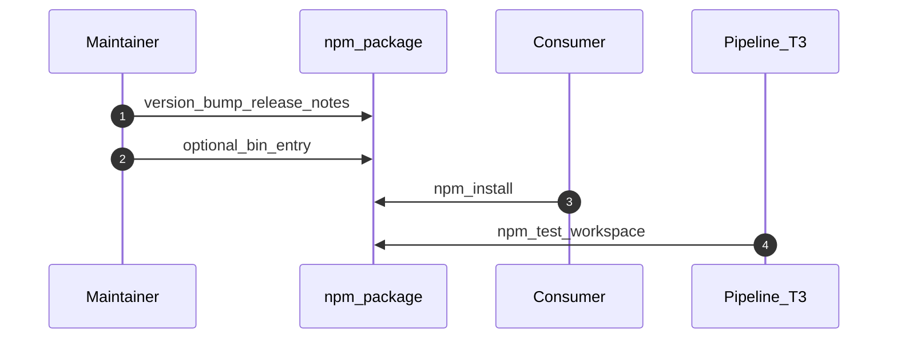
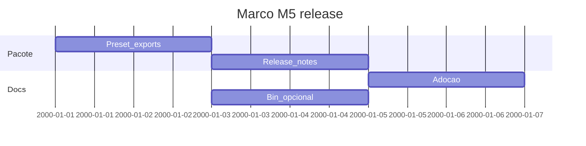

# Marco M5: release, adoção e `bin` opcional (`remediation-m5-release`)

Plano detalhado alinhado a [`../hardcode-remediation-macro-plan.md`](../hardcode-remediation-macro-plan.md). **Preset** `recommended` ou documentação de adoção; **notas de release**; entrada **`bin`** opcional se existir CLI de agregação em duas fases (alinhado ao desenho R2 do macro-plan).

**Milestone GitHub sugerido:** `remediation-m5-release`  
**Labels:** `area/remediation-release`, `type/docs` / `type/feature`

---

## 1. Objetivo e escopo (trilhas R1–R3)

- **Foco:** empacotamento npm coerente; exemplos de config flat; comunicação de breaking changes; ferramenta CLI opcional apenas se suportada pelo desenho (sem mocks de integração externa).
- **Trilhas:** consolidação de R1–R3 para utilizadores finais.
- **Validação:** T1/T3 em [`../distribution-channels-macro-plan.md`](../distribution-channels-macro-plan.md).

---

## 2. Dependências e handoff (cadeia M0→M5)

| | Conteúdo |
|---|-----------|
| **Entrada (consome)** | **M4:** segredos e política de fix estáveis. |
| **Saída (entrega)** | Versão publicável com notas; docs de adoção; `npm test` e e2e verdes; `bin` opcional documentado. |
| **Risco se handoff falhar** | Regressão e2e; utilizadores sem guia de migração. |

---

## 3. Diagrama de sequência (Mermaid)

---

## 4. Ordem, dependências e durações

| Ordem | Subtarefa | Duração estimada | Depende de | “Pronto para PR” quando |
|-------|-----------|------------------|------------|-------------------------|
| 1 | Consolidar preset `recommended` / exports públicos | 2d | M4 | Exemplo em README |
| 2 | Rascunho notas de release (semver) | 2d | 1 | `CHANGELOG` ou GitHub Release draft |
| 3 | Documentação de adoção (flat config, opções) | 2d | 2 | Links relativos correctos |
| 4 | `bin` opcional (agregação) ou decisão explícita «não» | 2d | 1 | Documentado |

**Duração total do marco (sequencial):** 8d.

---

## 5. Composição temporal (durações)

---

## 6. Massas e2e, RuleTester e (quando aplicável) Compose/CI

| Massa / projeto | Trilha | RuleTester / e2e | Compose / CI |
|-----------------|--------|------------------|--------------|
| `packages/eslint-plugin-hardcode-detect` | Release | Suite completa | [`ci.yml`](../../.github/workflows/ci.yml) |
| `packages/e2e-fixture-nest/` | T1 | Fumaça Nest | Compose `e2e` / `prod` |

---

## 7. Camada A — Tarefas e orçamento de tokens (pré-execução de agentes)

| ID | Tarefa | Inputs | Outputs | Teto (tokens) estimado | Critério de conclusão | Ficheiro de tarefa |
|----|--------|--------|---------|------------------------|----------------------|-------------------|
| A1 | Semver e notas (major/minor/patch) | M0–M4 | Decisão + texto release | 15 000 | Alinhado a [`../distribution-milestones/m5-release-candidate.md`](../distribution-milestones/m5-release-candidate.md) | [`tasks/m5-remediation-release/A1-semver-release-notes.md`](tasks/m5-remediation-release/A1-semver-release-notes.md) |
| A2 | Guia de adopção remediação | Contrato | Secção README / docs pacote | 22 000 | Passos reproduzíveis | [`tasks/m5-remediation-release/A2-adoption-guide.md`](tasks/m5-remediation-release/A2-adoption-guide.md) |
| A3 | Decisão `bin` CLI | Macro-plan R2 | ADR ou entrada package.json | 18 000 | Caminho suportado ou «fora de escopo» | [`tasks/m5-remediation-release/A3-bin-cli-decision.md`](tasks/m5-remediation-release/A3-bin-cli-decision.md) |

---

## 8. Camada B — Execução de agentes por fase

| Fase | O que executar (agente) | Evidência / artefato | Ligação ao handoff |
|------|---------------------------|----------------------|--------------------|
| Desenvolvimento | package.json, exports | PR | Artefacto npm |
| Testes | `npm test` completo | Exit 0 | T3 |
| Deploy / releasing | `npm publish` (processo do maintainer) | Tarball | T1 |
| Validações | Smoke pós-publish opcional | Notas | Encerramento |

---

## 9. Plano GitHub (PR, branch, semver)

- **PR sugerida:** `chore(remediation): milestone M5 — release + adoption + optional bin`
- **Branch:** `milestone/remediation-m5-release`
- **Semver:** conforme A1 (provável **major** se R1–R3 introduziram breaking changes acumulados).
- **Referências:** [`../versioning-for-agents.md`](../versioning-for-agents.md), [`../../specs/agent-git-workflow.md`](../../specs/agent-git-workflow.md).

---

## 10. Riscos e critérios de “done”

- **Riscos:** regressão e2e; documentação desactualizada vs comportamento.
- **Done:** release com notas; adopção documentada; validação T1/T3 satisfeita; marco encerra o epic de remediação do macro-plan até nova revisão.
