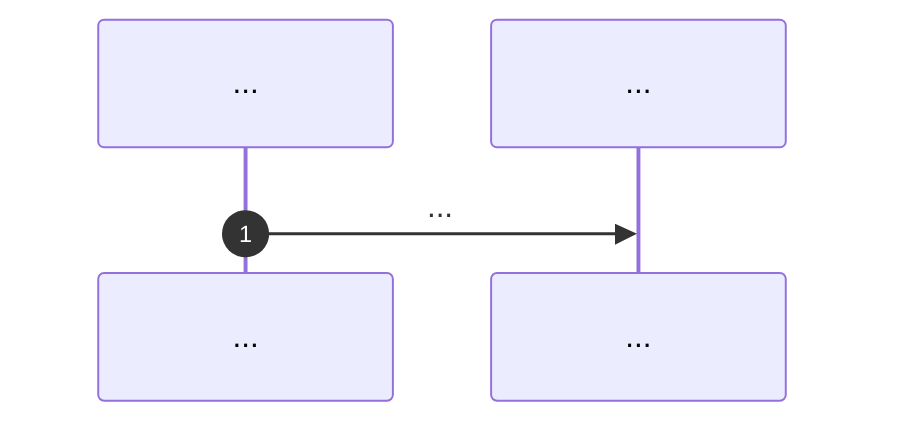
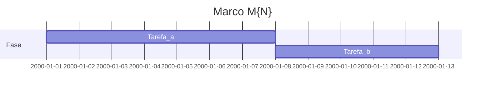

# Marco M{N}: {título}

Plano detalhado alinhado a [`../hardcode-remediation-macro-plan.md`](../hardcode-remediation-macro-plan.md), às **trilhas R1–R3** e ao **handoff M0→M5**. Normas: [`../../specs/plugin-contract.md`](../../specs/plugin-contract.md), [`../../specs/vision-hardcode-plugin.md`](../../specs/vision-hardcode-plugin.md), [`../hardcoding-map.md`](../hardcoding-map.md), [`../../specs/e2e-fixture-nest.md`](../../specs/e2e-fixture-nest.md), [`../../specs/agent-reference-clippings.md`](../../specs/agent-reference-clippings.md), [`../../specs/agent-integration-testing-policy.md`](../../specs/agent-integration-testing-policy.md), [`../../specs/agent-git-workflow.md`](../../specs/agent-git-workflow.md), [`../../specs/agent-session-workflow.md`](../../specs/agent-session-workflow.md). Validação por canal (T1/T3) quando o pacote mudar: [`../distribution-channels-macro-plan.md`](../distribution-channels-macro-plan.md) e [`../distribution-milestones/README.md`](../distribution-milestones/README.md).

**Milestone GitHub sugerido:** `{nome-milestone}`  
**Labels:** `area/remediation-R*` ou `type/docs` / `type/feature` conforme entrega.

---

## 1. Objetivo e escopo (trilhas R1–R3)

- Trilhas em foco (R1 por arquivo, R2 multi-arquivo, R3 propriedades/env):
- Remissão às tabelas do macro-plan em `hardcode-remediation-macro-plan.md` (trilhas, marcos, riscos).

---

## 2. Dependências e handoff (cadeia M0→M5)

| | Conteúdo |
|---|-----------|
| **Entrada (consome)** | Entregáveis do marco anterior e/ou estado do repositório |
| **Saída (entrega)** | O que fica congelado para o marco seguinte |
| **Risco se handoff falhar** | |

---

## 3. Diagrama de sequência (Mermaid)

---

## 4. Ordem, dependências e durações

| Ordem | Subtarefa | Duração estimada | Depende de | Dono (opcional) | “Pronto para PR” quando |
|-------|-----------|------------------|------------|-----------------|-------------------------|
| 1 | | *ex.: 7d* | | | |

**Duração total do marco (soma sequencial das subtarefas, salvo paralelismo explícito):** *preencher (ex.: 14d).*

---

## 5. Composição temporal (durações)

Diagrama opcional: eixo **`2000-01-01` = T0 fictício** (Mermaid); **só as durações (`Xd`) e dependências `after` são normativas**, não o calendário civil.

---

## 6. Massas e2e, RuleTester e (quando aplicável) Compose/CI

| Massa / projeto | Trilha | RuleTester / e2e | Compose / CI (opcional) |
|-----------------|--------|-------------------|-------------------------|
| `packages/eslint-plugin-hardcode-detect/tests/` | R* | Casos por regra | — |
| `packages/eslint-plugin-hardcode-detect/e2e/` | R* | Fumaça API ESLint | Paridade com [`../../docker-compose.yml`](../../docker-compose.yml) `prod`/`e2e` quando validar T3 |
| `packages/e2e-fixture-nest/` | e2e | Massa Nest documentada em [`../../specs/e2e-fixture-nest.md`](../../specs/e2e-fixture-nest.md) | — |
| Futuros `packages/e2e-fixture-*` | R2/R3 | Cenários multi-arquivo / ficheiros de dados | — |

Cada marco que altere o pacote publicável deve manter `npm test` verde no workspace do plugin (T1/T3).

---

## 7. Camada A — Tarefas e orçamento de tokens (pré-execução de agentes)

*Antes de invocar agentes de IA para cada entrega, preencher. “Teto (tokens)” é estimativa ou limite máximo acordado; ultrapassar exige nova linha ou revisão documentada.*

| ID | Tarefa | Inputs (incl. handoff) | Outputs | Teto (tokens) estimado | Critério de conclusão | Ficheiro de tarefa |
|----|--------|------------------------|---------|------------------------|----------------------|-------------------|
| A1 | | | | | | |

**Gate:** só avançar para a Camada B com todas as linhas necessárias preenchidas ou marcadas N/A com justificativa.

*Ficheiros de tarefa (um `.md` por linha Camada A, opcional mas recomendado):* pasta `tasks/<slug-do-marco>/` com modelo em [`tasks/TASK_FILE_TEMPLATE.md`](tasks/TASK_FILE_TEMPLATE.md) e convenções em [`tasks/README.md`](tasks/README.md).

---

## 8. Camada B — Execução de agentes por fase

| Fase | O que executar (agente) | Evidência / artefato | Ligação ao handoff |
|------|---------------------------|----------------------|--------------------|
| Desenvolvimento | | | |
| Testes | | | |
| Análise de resultados | | | |
| Logs e documentos | | | |
| Correções | | | |
| Deploy / releasing | | | |
| Validações | | | |
| Distribuições | | | |

---

## 9. Plano GitHub (PR, branch, semver)

- **PR principal:** uma PR por marco quando possível; título sugerido: `feat(remediation): milestone M{N} — …` ou `docs(remediation): milestone M{N} — …`
- **Branch sugerida:** `milestone/remediation-m{N}-{slug}`
- **Semver / artefatos:** indicar se o marco altera `packages/eslint-plugin-hardcode-detect` (bump), entradas opcionais `bin/`, ou apenas docs/fixtures.
- **Referências:** [`../versioning-for-agents.md`](../versioning-for-agents.md), [`../../specs/agent-git-workflow.md`](../../specs/agent-git-workflow.md).

---

## 10. Riscos e critérios de “done”

- Riscos:
- **Done** do marco quando:
