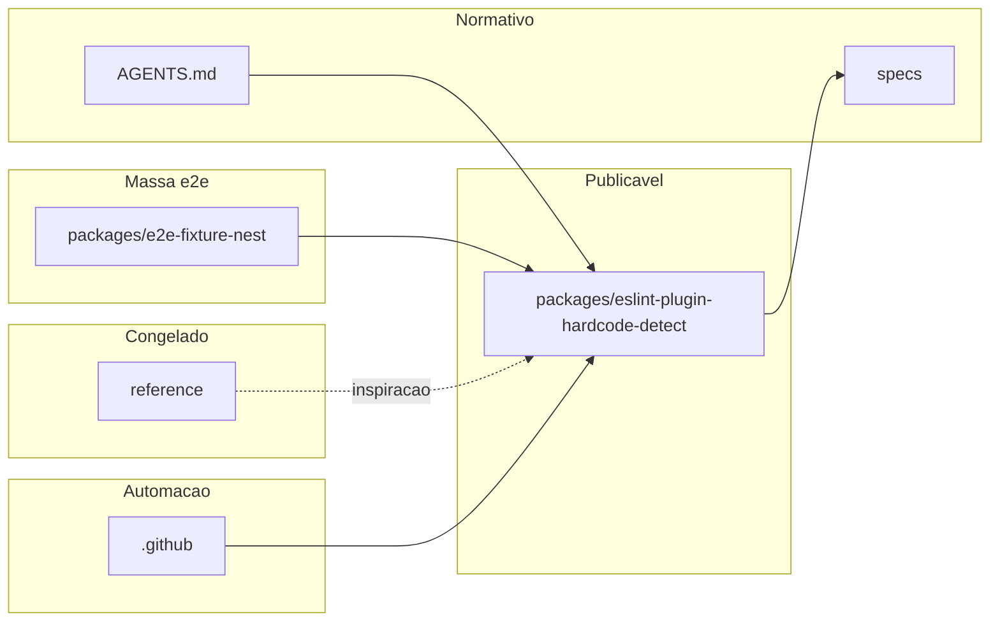

# Grafo de arquivos e diretórios

Documentação da organização do repositório. **Atualize este arquivo quando criar, mover ou remover diretórios ou documentos normativos.**

```text
.
├── AGENTS.md                 # Instruções para agentes de IA e prioridades do repo
├── CONTRIBUTING.md           # Como contribuir (humanos e agentes)
├── LICENSE                   # Licença do projeto
├── README.md                 # Entrada principal no GitHub
├── package.json              # Monorepo npm (workspaces)
├── scripts/                  # Scripts auxiliares na raiz (ex.: validação cobertura plano M0)
│   └── validate-m0-plan-coverage.mjs
├── docker-compose.yml        # Perfis dev / e2e / prod (ver specs/agent-docker-compose.md)
├── .dockerignore             # Contexto de build da imagem ops-eslint
├── .docker/
│   └── Dockerfile            # Imagem ESLint para Composite Action ops-eslint
├── .gitignore
├── .cursor/
│   ├── commands/             # Comandos Cursor (/abrir-prompt-agente, /fechar-prompt-agente, /fechar-e2e-nest-fixture)
│   ├── rules/                # Regras Cursor (alwaysApply conforme cada arquivo)
│   │   ├── agent-error-messaging-triple.mdc
│   │   ├── agent-ia-governance.mdc
│   │   ├── agent-integration-testing-policy.mdc
│   │   ├── agent-reference-agents.mdc
│   │   ├── agent-session.mdc
│   │   ├── clippings-official-docs.mdc
│   │   ├── documentation.mdc
│   │   ├── docker-compose-tooling.mdc
│   │   ├── e2e-nest-fixture.mdc
│   │   ├── git-versioning.mdc
│   │   ├── repo-layout.mdc
│   │   └── repo-relative-paths.mdc
│   └── skills/               # Skills reutilizáveis pelos agentes
│       ├── agent-error-messaging-triple/
│       ├── docker-compose-workflow/
│       ├── eslint-plugin-workflow/
│       ├── git-agent-workflow/
│       ├── github-markdown-docs/
│       ├── reference-agents-portfolio/
│       └── reference-clippings-workflow/
├── .github/
│   ├── agents/               # Agentes GitHub Copilot (pontes: plugin, docker-tooling)
│   ├── instructions/         # Instruções Copilot (applyTo: pacote do plugin, docker-compose)
│   ├── actions/ops-eslint/   # Composite Action (action.yml + assets/run.sh)
│   └── workflows/            # CI (ex.: ci.yml)
├── docs/                     # Documentação complementar
│   ├── README.md             # Índice dos guias em docs/
│   ├── architecture.md
│   ├── documentation-policy.md
│   ├── hardcoding-map.md     # Taxonomia e níveis de hardcoding (mapa conceitual)
│   ├── solution-distribution-channels.md  # Canais npm/CI/Docker/IDE/agentes
│   ├── distribution-channels-macro-plan.md  # Plano macro e2e por trilha, diagramas, marcos, durações
│   ├── distribution-milestones/  # Planos M0–M5 (durações relativas, template, handoff T1→T6, Camada A/B)
│   │   ├── README.md
│   │   ├── milestone-template.md
│   │   ├── m0-baseline.md
│   │   ├── m1-channel-t1-t2.md
│   │   ├── m2-channel-t3-ci.md
│   │   ├── m3-channel-t4-t6.md
│   │   ├── m4-channel-t5-agents.md
│   │   ├── m5-release-candidate.md
│   │   └── tasks/                # Ficheiros Camada A por marco (modelo + M0)
│   │       ├── README.md
│   │       ├── TASK_FILE_TEMPLATE.md
│   │       └── m0-baseline/      # Tarefas M0 Camada A (âncoras + micro + evidence + manifesto)
│   │           ├── README.md
│   │           ├── A1-index-milestones-readme.md
│   │           ├── A2-macro-plan-index.md
│   │           ├── A3-repository-tree.md
│   │           ├── A4-plugin-contract-vs-readme.md
│   │           ├── A5-nest-massa-e2e-documentada.md
│   │           ├── coverage-manifest.json
│   │           ├── evidence/
│   │           │   └── A4-plugin-contract-gap-matrix.md
│   │           └── micro/
│   │               ├── README.md
│   │               └── M0-A*-*.md            # 15 micro-tarefas (M0-A1-01 … M0-A5-03)
│   ├── limitations-and-scope.md
│   ├── repository-tree.md    # Este arquivo
│   └── versioning-for-agents.md
├── packages/
│   ├── e2e-fixture-nest/               # Workspace NestJS: massa e2e (não publicável como plugin)
│   │   ├── src/fixture-hardcodes/      # Literais fixos com contagens no e2e
│   │   └── eslint.config.mjs           # Flat config + plugin via dist do pacote irmão
│   └── eslint-plugin-hardcode-detect/  # Pacote npm do plugin (implementação oficial)
│       ├── docs/rules/                 # Uma página por regra do contrato (hello-world, no-hardcoded-strings, standardize-error-messages)
│       ├── e2e/                        # Fumaça e2e (ESLint API + fixtures consumidor)
│       │   ├── fixtures/hello-world/   # Flat config mínimo + amostra
│       │   ├── hello-world.e2e.mjs
│       │   └── nest-workspace.e2e.mjs  # Massa Nest (cwd no workspace irmão)
│       ├── src/rules/                  # Implementação das regras ESLint
│       ├── tests/                      # RuleTester + node:test
│       └── eslint.config.mjs           # Lint do próprio plugin (flat config)
├── reference/                # Somente referência; não é dependência do pacote
│   ├── README.md
│   ├── agents-ref/           # Portfólio de referência de instruções para agentes (mapear via specs/agent-reference-agents.md)
│   ├── Clippings/            # Trechos da documentação oficial (ESLint, npm, etc.)
│   │   ├── README.md
│   │   ├── dev/
│   │   │   └── javascript/
│   │   │       ├── eslint/   # Recortes ESLint (API, regras, plugins, etc.)
│   │   │       └── npm/      # Recortes npm
│   │   └── standards/        # Padrões (ex.: Conventional Commits)
│   ├── hardcoded-check.yml   # Workflow de exemplo (referência; não em .github/workflows/)
│   └── legacy-snapshot/      # Snapshot histórico (ESLint local, action de exemplo)
└── specs/                    # Contratos e visão
    ├── agent-docker-compose.md         # Docker Compose, .docker/ e action ops-eslint
    ├── agent-error-messaging-triple.md # Falhas relatadas em três partes (agentes de IA)
    ├── agent-documentation-workflow.md
    ├── agent-git-workflow.md
    ├── agent-ia-governance.md
    ├── agent-integration-testing-policy.md  # Integrações: sandboxes; sem mocks no repo
    ├── agent-reference-agents.md
    ├── agent-reference-clippings.md
    ├── agent-session-workflow.md
    ├── agent-tooling-ecosystem-map.md  # Copilot/Awesome vs Cursor; precedência; pontes .github/
    ├── e2e-fixture-nest.md     # Massa e2e NestJS (workspace auxiliar)
    ├── plugin-contract.md
    └── vision-hardcode-plugin.md
```

## Relações

- **Implementação**: `packages/eslint-plugin-hardcode-detect/`.
- **Massa e2e Nest**: `packages/e2e-fixture-nest/` (ver [`specs/e2e-fixture-nest.md`](../specs/e2e-fixture-nest.md)).
- **Normas de produto e agente**: `specs/` + `AGENTS.md` + `.cursor/rules/`; pontes opcionais GitHub Copilot em `.github/agents/` e `.github/instructions/` (ver [`specs/agent-tooling-ecosystem-map.md`](../specs/agent-tooling-ecosystem-map.md)).
- **Referência**: `reference/Clippings/` (documentação oficial espelhada), `reference/legacy-snapshot/` (histórico); somente leitura para código em `packages/`.

## Diagrama (visão lógica)


