# File and directory graph

Documentation of repository layout. **Update this file when you create, move, or remove directories or normative documents.**

```text
.
├── AGENTS.md                 # Instructions for AI agents and repo priorities
├── CODE_OF_CONDUCT.md        # Community behavior standards
├── CONTRIBUTING.md           # How to contribute (humans and agents)
├── LICENSE                   # Project license
├── README.md                 # Main GitHub entry point
├── SECURITY.md               # Vulnerability reporting policy
├── SUPPORT.md                # Support channels and triage guidance
├── package.json              # npm monorepo (workspaces)
├── scripts/                  # Root helper scripts (npm release, Mermaid→SVG via Kroki, Cursor/Codex HCD-ERR hook smoke, Cursor headless M1 micro sequence)
│   ├── fixtures/             # Smoke fixtures (e.g. invalid HCD-ERR body for the hook)
│   │   └── smoke-hcd-err-violation-body.md
│   ├── generate-mermaid-svgs.mjs  # Extract Mermaid blocks from docs, POST to kroki.io, write docs/assets/diagrams/generated/*.svg
│   ├── npm-release.mjs       # Orchestrates precheck/auth/check-version/publish/smoke with NPM_ACCESS_TOKEN
│   ├── run-m1-remediation-micro-cursor-headless.sh  # Headless M1 micro sequence (Cursor CLI agent -p)
│   ├── smoke-cursor-hcd-err-hook.sh
│   └── smoke-codex-hcd-err-hooks.sh
├── docker-compose.yml        # dev / e2e / prod / e2e-ops profiles (see specs/agent-docker-compose.md)
├── .dockerignore             # Build context for ops-eslint image
├── .docker/
│   └── Dockerfile            # ESLint image for Composite Action ops-eslint
├── .gitignore
├── .log/                     # e.g. hooks/YYYYMMDD-hcd-err-audit.md (versionable); hooks/.state/ gitignored
├── .codex/
│   ├── config.toml           # Per-project local config (hooks + local MCP server)
│   ├── hooks.json            # Codex hooks (UserPromptSubmit, PreToolUse, PostToolUse, Stop)
│   ├── hooks/                # Python scripts for Codex automation (gate, HCD-ERR audit, snapshots)
│   └── mcp/                  # Local MCP STDIO server (hcd-err-local)
├── .cursor/
│   ├── hooks.json            # Cursor hooks (HCD-ERR audit after Write + stop; see .cursor/hooks/)
│   ├── hooks/                # Scripts invoked from hooks.json (e.g. hcd-err-triple-audit.sh)
│   ├── commands/             # Cursor commands (/abrir-prompt-agente, /fechar-prompt-agente, /fechar-e2e-nest-fixture)
│   ├── rules/                # Cursor rules (alwaysApply per file)
│   │   ├── agent-error-messaging-triple.mdc
│   │   ├── agent-ia-governance.mdc
│   │   ├── agent-integration-testing-policy.mdc
│   │   ├── agent-reference-agents.mdc
│   │   ├── agent-remediation-micro-roles.mdc
│   │   ├── agent-session.mdc
│   │   ├── clippings-official-docs.mdc
│   │   ├── documentation.mdc
│   │   ├── docker-compose-tooling.mdc
│   │   ├── e2e-nest-fixture.mdc
│   │   ├── git-versioning.mdc
│   │   ├── repo-layout.mdc
│   │   └── repo-relative-paths.mdc
│   └── skills/               # Reusable agent skills
│       ├── agent-error-messaging-triple/
│       ├── docker-compose-workflow/
│       ├── eslint-plugin-workflow/
│       ├── git-agent-workflow/
│       ├── github-markdown-docs/
│       ├── reference-agents-portfolio/
│       ├── reference-clippings-workflow/
│       └── remediation-micro-roles-workflow/
├── .github/
│   ├── agents/               # GitHub Copilot agents (bridges: eslint-hardcode-plugin, docker-tooling, hcd-err-messaging)
│   ├── instructions/         # Copilot instructions (applyTo: package, docker-compose, *-milestones)
│   ├── ISSUE_TEMPLATE/       # Community intake templates (bug, feature, docs, config)
│   ├── pull_request_template.md  # Default PR checklist and validation prompts
│   ├── actions/ops-eslint/   # Composite Action (action.yml + assets/run.sh)
│   └── workflows/            # CI workflows (e.g. ci.yml)
├── docs/                     # Supplementary documentation
│   ├── README.md             # Index of guides under docs/
│   ├── assets/               # Versioned images (social preview; Mermaid SVG exports)
│   │   ├── diagrams/
│   │   │   └── generated/    # SVG diagrams (Kroki); regenerate: node scripts/generate-mermaid-svgs.mjs
│   │   ├── social-preview.svg
│   │   └── social-preview.png
│   ├── social-preview-image.md  # Social preview GitHub: 1280×640, SVG→PNG, upload
│   ├── cursor-vps-cli-parity.md  # IDE vs CLI/VPS, hook verification and smoke
│   ├── codex-cli-hooks-equivalence.md  # Cursor -> Codex CLI equivalence (hooks + local MCP)
│   ├── architecture.md
│   ├── documentation-policy.md
│   ├── hardcoding-map.md     # Hardcoding taxonomy and levels (conceptual map)
│   ├── architecture-r2-global-index.md  # R2 index, CI, settings (M2 milestone)
│   ├── adr-eslint-concurrency-r2.md  # ADR: ESLint parallelism vs R2 state
│   ├── adr-hardcode-bin-r2-aggregation.md  # ADR: no bin; R2 in-process aggregation vs two-phase CLI (M5)
│   ├── solution-distribution-channels.md  # npm/CI/Docker/IDE/agent channels
│   ├── hardcode-remediation-macro-plan.md  # Macro remediation plan R1–R3, secrets, env, M0–M5 milestones
│   ├── distribution-channels-macro-plan.md  # Macro e2e plan by track, diagrams, milestones, durations
│   ├── distribution-milestones/  # M0–M5 plans (relative durations, template, T1→T6 handoff, Layer A/B)
│   │   ├── README.md
│   │   ├── milestone-template.md
│   │   ├── m0-baseline.md
│   │   ├── m1-channel-t1-t2.md
│   │   ├── m2-channel-t3-ci.md
│   │   ├── m3-channel-t4-t6.md
│   │   ├── m4-channel-t5-agents.md
│   │   ├── m5-release-candidate.md
│   │   └── tasks/                # Layer A files per milestone (template + M0–M5; M0–M3 with micro/manifest)
│   │       ├── README.md
│   │       ├── TASK_FILE_TEMPLATE.md
│   │       ├── m0-baseline/      # M0 Layer A tasks (anchors + micro + evidence + manifest)
│   │       │   ├── README.md
│   │       │   ├── A1-index-milestones-readme.md
│   │       │   ├── A2-macro-plan-index.md
│   │       │   ├── A3-repository-tree.md
│   │       │   ├── A4-plugin-contract-vs-readme.md
│   │       │   ├── A5-nest-massa-e2e-documentada.md
│   │       │   ├── coverage-manifest.json
│   │       │   ├── evidence/
│   │       │   │   └── A4-plugin-contract-gap-matrix.md
│   │       │   └── micro/
│   │       │       ├── README.md
│   │       │       └── M0-A*-*.md            # 15 micro-tasks (M0-A1-01 … M0-A5-03)
│   │       └── m1-channel-t1-t2/   # M1 Layer A tasks (T1/T2 + micro + manifest)
│   │           ├── README.md
│   │           ├── A1-npm-matrix-t1.md
│   │           ├── A2-smoke-ops-eslint-image.md
│   │           ├── A3-docker-compose-e2e-ops-draft.md
│   │           ├── coverage-manifest.json
│   │           ├── evidence/
│   │           │   └── T1-t2-parity-gap-matrix.md
│   │           └── micro/
│   │               ├── README.md
│   │               └── M1-A*-*.md            # 9 micro-tasks (M1-A1-01 … M1-A3-03)
│   │       └── m2-channel-t3-ci/   # M2 Layer A tasks (T3 CI + micro + manifest)
│   │           ├── README.md
│   │           ├── A1-audit-ci-yml-vs-compose-prod.md
│   │           ├── A2-ci-artifacts-logs-policy.md
│   │           ├── A3-contributing-ci-handoff.md
│   │           ├── coverage-manifest.json
│   │           ├── evidence/
│   │           │   └── T3-ci-prod-parity-gap-matrix.md
│   │           └── micro/
│   │               ├── README.md
│   │               └── M2-A*-*.md            # 9 micro-tasks (M2-A1-01 … M2-A3-03)
│   │       └── m3-channel-t4-t6/   # M3 Layer A tasks (T4 IDE + T6 prep + micro + manifest)
│   │           ├── README.md
│   │           ├── A1-guia-ide-eslint-flat-config.md
│   │           ├── A2-esboco-politica-git-hooks.md
│   │           ├── A3-fixture-e2e-git-hooks-sample-pos-m4.md
│   │           ├── coverage-manifest.json
│   │           └── micro/
│   │               ├── README.md
│   │               └── M3-A*-*.md            # 8 micro-tasks (M3-A1-01 … M3-A3-03)
│   │       └── m4-channel-t5-agents/   # M4 Layer A tasks (T5 agents; no micro/manifest this iteration)
│   │           ├── README.md
│   │           ├── evidence/
│   │           │   └── T5-normative-files-inventory.md
│   │           ├── A1-inventario-cursor-github-agentes-checklist.md
│   │           ├── A2-propor-job-verify-agent-files.md
│   │           └── A3-docs-limites-mcp-clippings.md
│   │       └── m5-release-candidate/   # M5 Layer A tasks (release; no micro/manifest this iteration)
│   │           ├── README.md
│   │           ├── evidence/
│   │           │   ├── M5-semver-decision.md
│   │           │   ├── M5-release-notes-draft.md
│   │           │   └── M5-smoke-post-publish.md
│   │           ├── A1-definir-semver-major-minor-patch.md
│   │           ├── A2-rascunho-notas-release.md
│   │           └── A3-plano-smoke-pos-publish.md
│   ├── remediation-milestones/  # M0–M5 remediation plans R1–R3 (M0→M5 handoff, template, Layer A/B)
│   │   ├── README.md
│   │   ├── milestone-template.md
│   │   ├── m0-contract-baseline.md
│   │   ├── m1-remediation-r1.md
│   │   ├── m2-remediation-r2-global.md
│   │   ├── m3-remediation-r3-data-files.md
│   │   ├── m4-secrets-remediation.md
│   │   ├── m5-remediation-release.md
│   │   └── tasks/                # Layer A per milestone (template + M0–M5 folders)
│   │       ├── README.md
│   │       ├── TASK_FILE_TEMPLATE.md
│   │       ├── m0-contract-baseline/   # M0 Layer A (single files; no micro/)
│   │       │   ├── README.md
│   │       │   ├── A1-plugin-contract-remediation-options.md
│   │       │   ├── A2-vision-alignment.md
│   │       │   └── A3-limits-and-tree-crosscheck.md
│   │       ├── m1-remediation-r1/    # coverage-manifest.json; micro/ (M1-A1, M1-A2); A1-architect-…; A2 suggest-vs-fix policy suite; A1 RuleTester R1 acceptance/signoff; A3 contract sync…
│   │       ├── m2-remediation-r2-global/  # coverage-manifest.json; micro/ (M2-A1, M2-A3); A2 concurrency ADR…
│   │       ├── m3-remediation-r3-data-files/  # coverage-manifest.json; micro/ (M3-A1, M3-A3); A2 data-file path policy…
│   │       ├── m4-secrets-remediation/  # coverage-manifest.json; micro/ (M4-A1); A2/A3…
│   │       └── m5-remediation-release/   # M5 Layer A (semver, adoption, bin decision)
│   │           ├── README.md
│   │           ├── A1-semver-release-notes.md
│   │           ├── A2-adoption-guide.md
│   │           ├── A3-bin-cli-decision.md
│   │           └── evidence/
│   │               ├── M5-semver-decision.md
│   │               └── M5-release-notes-draft.md
│   ├── limitations-and-scope.md
│   ├── repository-tree.md    # This file
│   └── versioning-for-agents.md
├── packages/
│   ├── chatbot/                        # Git subtree from https://github.com/tookyn/chatboot.git (main)
│   │   ├── ESLINT.md                   # Build + lint execution report for subtree integration
│   │   ├── package.json                # Wrapper scripts (`build`/`lint`) delegating to api/
│   │   └── api/                        # Imported backend service (NestJS-based)
│   │       ├── eslint.config.mjs       # Flat ESLint config (ESLint 9 + hardcode-detect)
│   │       └── package.json            # Scripts/deps updated for ESLint 9 migration
│   ├── e2e-fixture-nest/               # NestJS workspace: e2e fixture (not publishable as the plugin)
│   │   ├── src/fixture-hardcodes/      # Fixed literals with e2e counts
│   │   └── eslint.config.mjs           # Flat config + plugin via sibling package dist
│   └── eslint-plugin-hardcode-detect/  # npm plugin package (official implementation)
│       ├── CHANGELOG.md                # Semver history of publishable package
│       ├── docs/rules/                 # One page per contract rule (`no-hardcoded-strings`, `standardize-error-messages`)
│       ├── e2e/                        # e2e smoke (ESLint API + consumer fixtures)
│       │   ├── helpers/                # copy-dir-recursive.mjs, temp-fixture.mjs (sandbox temp copies)
│       │   ├── fixtures/r2-dup/        # Two .mjs files, same literal (R2 track)
│       │   ├── fixtures/call-site-exceptions/   # callSiteExceptions (mixed cases)
│       │   ├── fixtures/call-site-baseline/     # Same shape, no callSiteExceptions
│       │   ├── fixtures/call-site-exceptions-r2/ # R2 + callSiteExceptions (index)
│       │   ├── fixtures/r3-data/      # R3 track: JSON/YAML merge (e2e runs on temp copy; r3-out may exist locally)
│       │   ├── fixtures/options-matrix/ # Matrix e2e: remediationMode auto, env policy, globs, secretRemediationMode
│       │   ├── fixtures/r3-fail-conflict/ # R3 conflict fixture (fail-on-conflict)
│       │   ├── r2-multi-file.e2e.mjs   # Cross-file duplicates (R2)
│       │   ├── r3-data-files.e2e.mjs   # R3 data files
│       │   ├── call-site-exceptions.e2e.mjs  # callSiteExceptions deep smoke
│       │   ├── options-matrix.e2e.mjs  # Integration matrix for mode/options coverage gaps
│       │   ├── r3-fail-conflict.e2e.mjs # R3 fail-on-conflict does not overwrite conflicting target
│       │   └── nest-workspace.e2e.mjs  # Nest fixture (cwd on sibling workspace)
│       ├── src/rules/                  # ESLint rule implementations (incl. no-hardcoded-strings.messages.json)
│       ├── src/utils/                  # Utilities (e.g. r2-literal-index.ts, r3-data-file-writers.ts)
│       ├── tests/                      # RuleTester + node:test
│       │   ├── index.test.mjs          # no-hardcoded-strings base assertions
│       │   ├── no-hardcoded-strings-r1.test.mjs  # R1 remediation (M1 milestone / S-R1-*)
│       │   ├── no-hardcoded-strings-call-sites.test.mjs  # callSiteExceptions (issue #6)
│       │   ├── no-hardcoded-strings-secrets.test.mjs  # M4 / secretRemediationMode (safe defaults)
│       │   ├── no-hardcoded-strings-r2.test.mjs  # R2 index / lintFiles multi-file
│       │   └── r3-data-file-writers.test.mjs  # Deterministic JSON/YAML merge (R3)
│       └── eslint.config.mjs           # Lint of the plugin itself (flat config)
├── reference/                # Reference only; not a package dependency
│   ├── README.md
│   ├── agents-ref/           # Reference portfolio of agent instructions (map via specs/agent-reference-agents.md)
│   ├── Clippings/            # Official documentation excerpts (ESLint, npm, etc.)
│   │   ├── README.md
│   │   ├── dev/
│   │   │   └── javascript/
│   │   │       ├── eslint/   # ESLint clippings (API, rules, plugins, etc.)
│   │   │       └── npm/      # npm clippings
│   │   └── standards/        # Standards (e.g. Conventional Commits)
│   ├── hardcoded-check.yml   # Example workflow (reference; not under .github/workflows/)
│   └── legacy-snapshot/      # Historical snapshot (local ESLint, example action)
└── specs/                    # Contracts and vision
    ├── agent-docker-compose.md         # Docker Compose, .docker/, and ops-eslint action
    ├── agent-error-messaging-triple.md # Failures reported in three parts (AI agents)
    ├── agent-documentation-workflow.md
    ├── agent-git-workflow.md
    ├── agent-ia-governance.md
    ├── agent-integration-testing-policy.md  # Integrations: sandboxes; no mocks in repo
    ├── agent-remediation-micro-roles.md  # Sub-micro-tasks by role (single focus)
    ├── agent-reference-agents.md
    ├── agent-reference-clippings.md
    ├── agent-session-workflow.md
    ├── agent-tooling-ecosystem-map.md  # Copilot/Awesome vs Cursor; precedence; .github/ bridges
    ├── e2e-fixture-nest.md     # NestJS e2e fixture (auxiliary workspace)
    ├── plugin-contract.md
    └── vision-hardcode-plugin.md
```

## Relationships

- **Implementation**: `packages/eslint-plugin-hardcode-detect/`.
- **Nest e2e fixture**: `packages/e2e-fixture-nest/` (see [`specs/e2e-fixture-nest.md`](../specs/e2e-fixture-nest.md)).
- **Product and agent norms**: `specs/` + `AGENTS.md` + `.cursor/rules/`; optional GitHub Copilot bridges under `.github/agents/` and `.github/instructions/` (see [`specs/agent-tooling-ecosystem-map.md`](../specs/agent-tooling-ecosystem-map.md)).
- **Local Codex automation**: `.codex/hooks.json` + `.codex/hooks/` + `.codex/mcp/` (Cursor flow equivalence in [`docs/codex-cli-hooks-equivalence.md`](codex-cli-hooks-equivalence.md)).
- **Reference**: `reference/Clippings/` (mirrored official documentation), `reference/legacy-snapshot/` (history); read-only for code under `packages/`.

## Diagram (logical view)



<details>
<summary>Fonte Mermaid</summary>

```text
flowchart LR
  subgraph publishableArea [Publishable]
    pkg[packages/eslint-plugin-hardcode-detect]
  end
  subgraph e2eNest [E2e fixture]
    nest[packages/e2e-fixture-nest]
  end
  subgraph norms [Normative]
    sp[specs]
    agents[AGENTS.md]
  end
  subgraph frozen [Frozen]
    ref[reference]
  end
  subgraph ci [Automation]
    gh[.github]
  end
  pkg --> sp
  agents --> pkg
  nest --> pkg
  ref -.->|inspiration| pkg
  gh --> pkg
```

</details>
