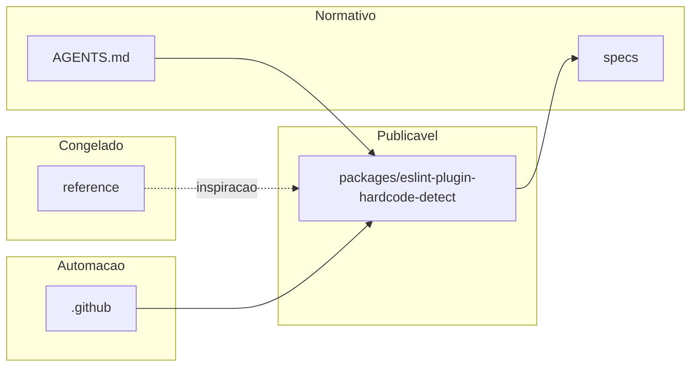

# Grafo de arquivos e diretórios

Documentação da organização do repositório. **Atualize este arquivo quando criar, mover ou remover diretórios ou documentos normativos.**

```text
.
├── AGENTS.md                 # Instruções para agentes de IA e prioridades do repo
├── CONTRIBUTING.md           # Como contribuir (humanos e agentes)
├── LICENSE                   # Licença do projeto
├── README.md                 # Entrada principal no GitHub
├── package.json              # Monorepo npm (workspaces)
├── .gitignore
├── .cursor/
│   ├── commands/             # Comandos Cursor (/abrir-prompt-agente, /fechar-prompt-agente)
│   ├── rules/                # Regras Cursor (alwaysApply conforme cada arquivo)
│   │   ├── agent-ia-governance.mdc
│   │   ├── agent-session.mdc
│   │   ├── clippings-official-docs.mdc
│   │   ├── documentation.mdc
│   │   ├── git-versioning.mdc
│   │   └── repo-layout.mdc
│   └── skills/               # Skills reutilizáveis pelos agentes
│       ├── eslint-plugin-workflow/
│       ├── git-agent-workflow/
│       ├── github-markdown-docs/
│       └── reference-clippings-workflow/
├── .github/
│   ├── actions/ops-eslint/   # Composite Action (action.yml + assets/run.sh)
│   └── workflows/            # CI (ex.: ci.yml)
├── docs/                     # Documentação complementar
│   ├── README.md             # Índice dos guias em docs/
│   ├── architecture.md
│   ├── documentation-policy.md
│   ├── limitations-and-scope.md
│   ├── repository-tree.md    # Este arquivo
│   └── versioning-for-agents.md
├── packages/
│   └── eslint-plugin-hardcode-detect/  # Pacote npm do plugin (implementação oficial)
│       ├── docs/rules/                 # Documentação de regras (ex.: hello-world)
│       ├── e2e/                        # Fumaça e2e (ESLint API + fixtures consumidor)
│       │   └── fixtures/hello-world/   # Flat config mínimo + amostra
│       ├── src/rules/                  # Implementação das regras ESLint
│       ├── tests/                      # RuleTester + node:test
│       └── eslint.config.mjs           # Lint do próprio plugin (flat config)
├── reference/                # Somente referência; não é dependência do pacote
│   ├── README.md
│   ├── Clippings/            # Trechos da documentação oficial (ESLint, npm, etc.)
│   │   ├── README.md
│   │   ├── dev/
│   │   │   └── javascript/
│   │   │       ├── eslint/   # Recortes ESLint (API, regras, plugins, etc.)
│   │   │       └── npm/      # Recortes npm
│   │   └── standards/        # Padrões (ex.: Conventional Commits)
│   ├── hardcoded-check.yml   # Workflow de exemplo (referência; não em .github/workflows/)
│   └── legacy-snapshot/      # Snapshot histórico (ESLint local, action de exemplo)
└── specs/                    # Contratos e visão
    ├── agent-documentation-workflow.md
    ├── agent-git-workflow.md
    ├── agent-ia-governance.md
    ├── agent-reference-clippings.md
    ├── agent-session-workflow.md
    ├── plugin-contract.md
    └── vision-hardcode-plugin.md
```

## Relações

- **Implementação**: `packages/eslint-plugin-hardcode-detect/`.
- **Normas de produto e agente**: `specs/` + `AGENTS.md` + `.cursor/rules/`.
- **Referência**: `reference/Clippings/` (documentação oficial espelhada), `reference/legacy-snapshot/` (histórico); somente leitura para código em `packages/`.

## Diagrama (visão lógica)


