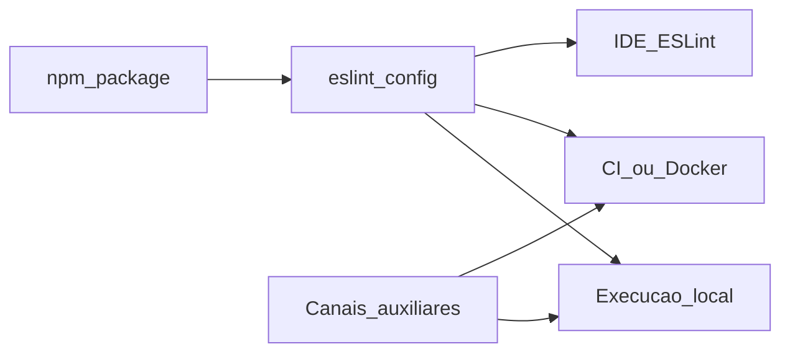

# Canais de distribuição e operacionalização da solução

Este documento lista **como** a solução de detecção de hardcoding (plugin ESLint, configuração, ferramentas complementares e governança) pode ser **entregue e acionada** em projetos e pipelines. Não duplica a taxonomia de *tipos* de hardcode nem os níveis de gravidade: isso está em [`hardcoding-map.md`](hardcoding-map.md). O contrato das regras permanece em [`../specs/plugin-contract.md`](../specs/plugin-contract.md).

## Relação com o mapa de hardcoding

| Documento | Foco |
|-----------|------|
| [`hardcoding-map.md`](hardcoding-map.md) | **O quê** classificar (HC-*), níveis L1–L4, camadas de detecção (texto, AST, parsers). |
| Este documento | **Por onde** a solução circula (npm, CI, Docker, IDE, agentes, protocolos auxiliares). |

## Tabela mestre de canais

Cada linha descreve um **canal de distribuição ou execução**: onde vive o artefato, como o consumidor o obtém e como se relaciona com o plugin ESLint **eslint-plugin-hardcode-detect** (direto = dependência npm + `eslint.config`; indireto = automatiza ou contextualiza o fluxo sem substituir o pacote).

| Canal | Onde vive | Como se obtém / atualiza | Plugin ESLint | Notas |
|-------|-----------|---------------------------|----------------|-------|
| **npm (projeto)** | `package.json` do consumidor; `node_modules/` | `npm install` / `npm ci`; versão fixa ou range no manifesto | **Direto** | Forma usual: `devDependencies` com o scoped package do plugin e referência em flat config. Ver empacotamento em [`../packages/eslint-plugin-hardcode-detect/`](../packages/eslint-plugin-hardcode-detect/). |
| **npm workspaces / monorepo** | Raiz do workspace + pacotes filhos | Instalação na raiz liga pacotes internos | **Direto** | Symlinks entre workspaces; alinhar ao campo `workspaces` no manifesto. Recorte: [`../reference/Clippings/dev/javascript/npm/npm Docs.md`](../reference/Clippings/dev/javascript/npm/npm Docs.md). |
| **npm global + `bin`** | PATH global; link para CLI do pacote | `npm install -g` quando o pacote define `bin` | **Direto** (se o pacote expuser CLI que invoque ESLint) ou **indireto** | Útil para ferramentas de linha de comando corporativas. Recorte sobre `bin` e instalação global: mesmo ficheiro npm Docs. |
| **`npm exec` / `npx`** | Execução pontual | `npm exec <pkg>` / `npx` sem instalação permanente | **Direto** | Adequado a scripts pontuais e CI efêmero. |
| **Registries privados / `publishConfig`** | Registry interno; credenciais no cliente CI | `npm publish` com `publishConfig`; consumo com `.npmrc` | **Direto** | Distribuição corporativa do pacote. Recorte: [`../reference/Clippings/dev/javascript/npm/npm Docs.md`](../reference/Clippings/dev/javascript/npm/npm Docs.md). |
| **Docker / OCI** | Imagem com Node + ESLint | `docker pull` / build a partir de [`../.docker/Dockerfile`](../.docker/Dockerfile); Compose com perfis | **Direto** (montagem de volume + comando `eslint`) | Alinhado a [`../specs/agent-docker-compose.md`](../specs/agent-docker-compose.md) e à action `ops-eslint`. |
| **CI/CD (GitHub Actions, GitLab CI, etc.)** | Workflow YAML; runners | Trigger em push/PR; cache de `node_modules` | **Direto** | Canal de **execução** agregada (lint na pipeline), não substitui o pacote npm. |
| **Git hooks** | `.git/hooks` ou ferramenta (Husky, Lefthook) | Instalação local do dev; commit aciona `npm run lint` / `eslint` | **Indireto** | Garante feedback antes do push; política normativa pode exigir recorte em `reference/Clippings/` conforme [`../specs/agent-reference-clippings.md`](../specs/agent-reference-clippings.md). |
| **Cursor: regras e skills no repositório** | [`.cursor/rules/`](../.cursor/rules/), [`.cursor/skills/`](../.cursor/skills/) | Versionados no Git; o IDE carrega por projeto | **Indireto** | Documentam fluxo e não empacotam o plugin; precedência vs Copilot em [`../specs/agent-tooling-ecosystem-map.md`](../specs/agent-tooling-ecosystem-map.md). |
| **Cursor: hooks** | `.cursor/hooks.json`; scripts no repo | Cursor carrega hooks conforme documentação | **Indireto** | Estendem o loop do agente (formato, analytics, gates). Recorte: [`../reference/Clippings/dev/cursor/docs/Cursor Docs.md`](../reference/Clippings/dev/cursor/docs/Cursor%20Docs.md). Cloud/self-hosted mencionam hooks de projeto: [`../reference/Clippings/dev/cursor/cloud/Cloud Agents  Cursor Docs.md`](../reference/Clippings/dev/cursor/cloud/Cloud%20Agents%20%20Cursor%20Docs.md), [`../reference/Clippings/dev/cursor/cloud/Self-Hosted Pool  Cursor Docs.md`](../reference/Clippings/dev/cursor/cloud/Self-Hosted%20Pool%20%20Cursor%20Docs.md). |
| **Cursor: Marketplace Plugin** | Repositório submetido ao marketplace | Revisão Cursor; distribuição pela loja | **Indireto** | O marketplace declara distribuir *skills, subagents, MCPs, hooks, and rules* para a comunidade Cursor — canal para **ecossistema de agente**, não para substituir o tarball npm do plugin. Recorte: [`../reference/Clippings/dev/cursor/plugins/Publish a Cursor Marketplace Plugin.md`](../reference/Clippings/dev/cursor/plugins/Publish%20a%20Cursor%20Marketplace%20Plugin.md). |
| **Cursor CLI / headless** | Máquina com CLI instalada | Documentação em CLI | **Indireto** | Execução de fluxos de agente/automação; pode chamar scripts que rodem ESLint. Índice: [`../reference/Clippings/dev/cursor/cli/README.md`](../reference/Clippings/dev/cursor/cli/README.md). |
| **MCP (Model Context Protocol)** | Servidor MCP (stdio/SSE/etc.) | Configuração do cliente (Cursor, outros) | **Indireto** | Servidores expõem *tools*, *resources* e *prompts* por protocolo — complementam contexto e automação; **não** são o canal primário de instalação do plugin ESLint. A **validação normativa** das regras do pacote permanece nas trilhas **T1** (npm + ESLint no projeto) e **T3** (CI), não no protocolo MCP (trilha **T5**). Recorte: [`../reference/Clippings/dev/mcp/Understanding MCP servers.md`](../reference/Clippings/dev/mcp/Understanding%20MCP%20servers.md). Ancoragem: [`limitations-and-scope.md`](limitations-and-scope.md#mcp-t5-npm-t1-e-ci-t3). |
| **GitHub Copilot (agents / instructions / skills)** | `.github/agents/`, `.github/instructions/`, opcionalmente `.github/skills/` | Repositório + produto Copilot | **Indireto** | Equivalências com `.cursor/` em [`../specs/agent-tooling-ecosystem-map.md`](../specs/agent-tooling-ecosystem-map.md). |
| **Editores com ESLint / LSP** | Workspace do IDE | Extensão ESLint + `eslint.config` | **Direto** | Execução local ao guardar ou painel de problemas; âncora de plugins: [`../reference/Clippings/dev/javascript/eslint/guides/Create Plugins - ESLint - Pluggable JavaScript Linter.md`](../reference/Clippings/dev/javascript/eslint/guides/Create%20Plugins%20-%20ESLint%20-%20Pluggable%20JavaScript%20Linter.md). |

## Fluxo conceitual (opcional)

*Canais auxiliares*: Cursor/Copilot (regras, skills, hooks), MCP, hooks Git — orquestram ou enriquecem o trabalho; o **artefato normativo** do lint continua sendo o pacote npm + configuração ESLint.

## Roadmap e validação por trilha

O planejamento macro (trilhas T1–T6, rastreabilidade canal a canal, propostas de massa e2e, perfis Docker, diagramas e marcos em PRs no GitHub) está em [`distribution-channels-macro-plan.md`](distribution-channels-macro-plan.md). Os tempos são expressos em **durações e composição** (sem datas de calendário normativas); detalhe por marco em [`distribution-milestones/README.md`](distribution-milestones/README.md).

## Limitações

- O plugin **não** empacota por si só todos os canais da tabela: muitos são **política de projeto** (hooks, CI, Docker).
- Restrições de escopo do repositório e do produto: [`limitations-and-scope.md`](limitations-and-scope.md).
- `reference/Clippings/` é **somente referência**; não é importada por `packages/` (ver mesmas limitações).
- Integrações com serviços externos (registry, MCP, publicação): sem mocks ad hoc no repositório; seguir [`specs/agent-integration-testing-policy.md`](../specs/agent-integration-testing-policy.md).

## Referências

| Recurso | Ligação |
|---------|---------|
| Plano macro (e2e, trilhas, marcos GitHub) | [`distribution-channels-macro-plan.md`](distribution-channels-macro-plan.md) |
| Mapa conceitual de hardcoding | [`hardcoding-map.md`](hardcoding-map.md) |
| Visão do produto | [`../specs/vision-hardcode-plugin.md`](../specs/vision-hardcode-plugin.md) |
| Contrato das regras | [`../specs/plugin-contract.md`](../specs/plugin-contract.md) |
| Ecossistema Copilot / Cursor | [`../specs/agent-tooling-ecosystem-map.md`](../specs/agent-tooling-ecosystem-map.md) |
| Docker Compose e ops-eslint | [`../specs/agent-docker-compose.md`](../specs/agent-docker-compose.md) |
| Manutenção de Clippings | [`../specs/agent-reference-clippings.md`](../specs/agent-reference-clippings.md) |
| Instruções para agentes | [`../AGENTS.md`](../AGENTS.md) |
| Política de integração (sandboxes; sem mocks) | [`../specs/agent-integration-testing-policy.md`](../specs/agent-integration-testing-policy.md) |
| Recortes npm (workspaces, `bin`, publish) | [`../reference/Clippings/dev/javascript/npm/npm Docs.md`](../reference/Clippings/dev/javascript/npm/npm%20Docs.md) |
| Cursor Marketplace (plugin) | [`../reference/Clippings/dev/cursor/plugins/Publish a Cursor Marketplace Plugin.md`](../reference/Clippings/dev/cursor/plugins/Publish%20a%20Cursor%20Marketplace%20Plugin.md) |
| Cursor Hooks | [`../reference/Clippings/dev/cursor/docs/Cursor Docs.md`](../reference/Clippings/dev/cursor/docs/Cursor%20Docs.md) |
| MCP — servidores | [`../reference/Clippings/dev/mcp/Understanding MCP servers.md`](../reference/Clippings/dev/mcp/Understanding%20MCP%20servers.md) |
| ESLint — criar plugins | [`../reference/Clippings/dev/javascript/eslint/guides/Create Plugins - ESLint - Pluggable JavaScript Linter.md`](../reference/Clippings/dev/javascript/eslint/guides/Create%20Plugins%20-%20ESLint%20-%20Pluggable%20JavaScript%20Linter.md) |

## Versão do documento

- **1.2.0** — Linha MCP: validação normativa do plugin em **T1 + T3** (não MCP/T5); remissão a `limitations-and-scope.md`.
- **1.1.0** — Secção “Roadmap e validação por trilha” com ligação a `distribution-channels-macro-plan.md`.
- **1.0.0** — Lista inicial de canais de distribuição e operacionalização, alinhada ao plano e a `reference/Clippings/`.
