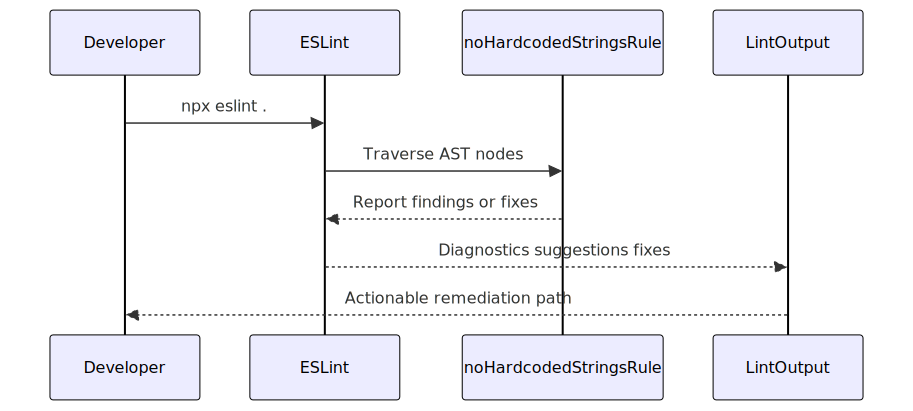

# eslint-plugin-hardcode-detect

<p align="center">
  Find hardcoded strings early, then remediate with pragmatic tracks (R1, R2, R3).
</p>

<p align="center">
  <a href="https://www.npmjs.com/package/eslint-plugin-hardcode-detect"></a>
  <a href="https://www.npmjs.com/package/eslint-plugin-hardcode-detect"></a>
  <a href="https://github.com/malnati/eslint-hardcode-detect-plugin/actions/workflows/ci.yml"></a>
  <a href="../../LICENSE"></a>
</p>

Rule contract: [`specs/plugin-contract.md`](../../specs/plugin-contract.md). Product vision: [`specs/vision-hardcode-plugin.md`](../../specs/vision-hardcode-plugin.md).

## Install

```bash
npm i -D eslint eslint-plugin-hardcode-detect
```

## Requirements

- Node.js `>=22`
- ESLint `>=9` (flat config)

## Quickstart

```js
// eslint.config.js
import { defineConfig } from "eslint/config";
import hardcodeDetect from "eslint-plugin-hardcode-detect";

export default defineConfig([
  {
    plugins: { "hardcode-detect": hardcodeDetect },
    extends: ["hardcode-detect/recommended"],
  },
]);
```

Run:

```bash
npx eslint .
```

## Adoption flow



<details>
<summary>Fonte Mermaid</summary>

```text
flowchart TD
  installNode[Install package] --> configNode[Enable recommended preset]
  configNode --> lintNode[Run lint]
  lintNode --> findingsNode{Any findings?}
  findingsNode -->|No| baselineNode[Keep guardrail in CI]
  findingsNode -->|Yes| modeNode[Pick remediation mode]
  modeNode --> r1Node[R1 same-file constants]
  modeNode --> r2Node[R2 cross-file duplicates]
  modeNode --> r3Node[R3 JSON YAML data files]
  r1Node --> reviewNode[Review changes and suggestions]
  r2Node --> reviewNode
  r3Node --> reviewNode
  reviewNode --> baselineNode
```

</details>

## Lint execution sequence



<details>
<summary>Fonte Mermaid</summary>

```text
sequenceDiagram
  participant Dev as Developer
  participant ESL as ESLint
  participant Rule as noHardcodedStringsRule
  participant Out as LintOutput
  Dev->>ESL: npx eslint .
  ESL->>Rule: Traverse AST nodes
  Rule-->>ESL: Report findings or fixes
  ESL-->>Out: Diagnostics suggestions fixes
  Out-->>Dev: Actionable remediation path
```

</details>

## Roadmap timeline


<details>
<summary>Fonte Mermaid</summary>

```text
flowchart LR
  v010["0.1.0 baseline"] --> v011["0.1.1 coverage"]
  v011 --> v012["0.1.2 remediation tracks"]
  v012 --> v013["0.1.3 Nest e2e"]
  v013 --> v014["0.1.4 OSS onboarding"]
  v014 --> nextRel["Next: standardize-error-messages"]
```

</details>

## Contributor journey



<details>
<summary>Fonte Mermaid</summary>

```text
flowchart TD
  subgraph discover [Discover]
    d1[Ler README e quickstart]
    d2[Executar primeiro lint no projeto local]
  end
  subgraph improve [Improve]
    i1[Abrir issue com reprodução]
    i2[Pull request focado]
  end
  subgraph maintain [Maintain]
    m1[Iterar após review]
    m2[Notas de release e release]
  end
  d1 --> d2
  d1 --> i1
  d2 --> i1
  i1 --> i2
  i2 --> m1
  m1 --> m2
```

</details>

## Rules and maturity

The contract defines two current tracks: implemented `no-hardcoded-strings` and planned `standardize-error-messages`.

| Rule | Status | In `recommended` | Description |
|------|--------|------------------|-------------|
| `no-hardcoded-strings` | Stable | Yes | Detects hardcoded literals and supports R1/R2/R3 modes. |
| `standardize-error-messages` | Planned export | No | Contract documented, not exported in current artifact. |

## Remediation modes

### R1 (`remediationMode: "r1"`)

Same-file constant extraction when fix context is safe.

```js
"hardcode-detect/no-hardcoded-strings": ["warn", { remediationMode: "r1" }]
```

### R2 (`remediationMode: "r2"`)

Cross-file duplicate detection in the same `lintFiles` run. Current release focuses on detection; shared-module autofix is not implemented.

```js
"hardcode-detect/no-hardcoded-strings": ["warn", { remediationMode: "r2" }]
```

### R3 (`remediationMode: "r3"`)

Optional write/merge to data files listed in `dataFileTargets`.

```js
"hardcode-detect/no-hardcoded-strings": [
  "warn",
  {
    remediationMode: "r3",
    dataFileTargets: ["config/strings.json", "config/strings.yml"],
    dataFileFormats: ["json", "yaml", "yml"],
    dataFileMergeStrategy: "merge-keys"
  }
]
```

## Call site exceptions

To allow literals in logging or debug calls without turning off the rule globally, set **`callSiteExceptions`** to a list of callees (`object.method` or a single identifier, same shape as the planned `loggers` option for `standardize-error-messages`). Only the **first** string argument of the call is ignored.

```js
"hardcode-detect/no-hardcoded-strings": [
  "warn",
  {
    callSiteExceptions: ["console.log", "console.debug", "logger.warn", "debug"],
  },
]
```

See [`specs/plugin-contract.md`](../../specs/plugin-contract.md) and [`docs/rules/no-hardcoded-strings.md`](docs/rules/no-hardcoded-strings.md).

## Secrets and safe defaults

Sensitive-looking literals should not be committed as plaintext. Use environment variables and your platform secret manager.

- Default `secretRemediationMode` is `suggest-only`.
- More detail in [`docs/rules/no-hardcoded-strings.md`](docs/rules/no-hardcoded-strings.md) and [`specs/plugin-contract.md`](../../specs/plugin-contract.md).
- External reference: [OWASP Secrets Management Cheat Sheet](https://cheatsheetseries.owasp.org/cheatsheets/Secrets_Management_Cheat_Sheet.html).

## Troubleshooting

- **No findings appear:** ensure the target files are included by your ESLint config and run `npx eslint .` from the expected project root.
- **R2 seems incomplete:** check parallel lint settings; see [`docs/adr-eslint-concurrency-r2.md`](../../docs/adr-eslint-concurrency-r2.md).
- **R3 did not write files:** confirm `dataFileTargets` is not empty and paths are relative to ESLint `cwd`.
- **Version mismatch:** verify Node `>=22` and ESLint `>=9`.

## Development and testing

- `npm run build` — compile `src/` into `dist/`.
- `npm run lint` — lint package source.
- `npm test` — build + RuleTester + e2e smoke.

From monorepo root:

```bash
npm test -w eslint-plugin-hardcode-detect
```

Nest fixture smoke details: [`specs/e2e-fixture-nest.md`](../../specs/e2e-fixture-nest.md) and [`e2e/nest-workspace.e2e.mjs`](e2e/nest-workspace.e2e.mjs).

## Community and support

- Contributing: [`CONTRIBUTING.md`](../../CONTRIBUTING.md)
- Security: [`SECURITY.md`](../../SECURITY.md)
- Support: [`SUPPORT.md`](../../SUPPORT.md)
- Bug template: [open bug report](https://github.com/malnati/eslint-hardcode-detect-plugin/issues/new?template=bug_report.yml)
- Feature template: [open feature request](https://github.com/malnati/eslint-hardcode-detect-plugin/issues/new?template=feature_request.yml)
